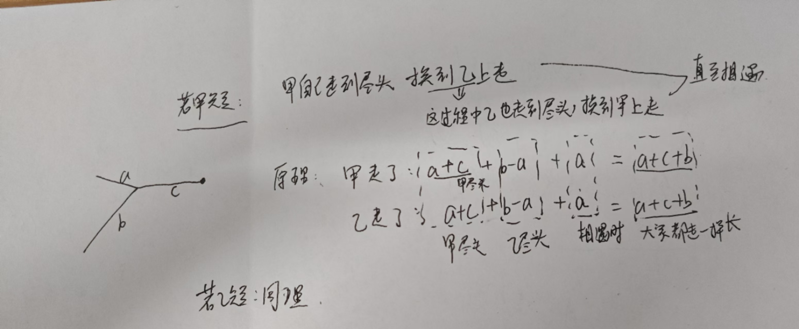

# 1.哈希

**当我们遇到了要快速判断一个元素是否出现集合里的时候，就要考虑哈希法**。但是哈希法也是**牺牲了空间换取了时间**，因为我们要使用额外的数组，set或者是map来存放数据，才能实现快速的查找。如果在做面试题目的时候遇到需要判断一个元素是否出现过的场景也应该第一时间想到哈希法！

①哈希表怎么建表，unordered_map(key类型,value类型)，未初始化，value默认为0 

  最常用（元素大小nums[i]，频率出现次数） 

  很少用（元素大小nums[i]，对应下标i）会有重复的覆盖下标，为了防止重复，建表和查找在一个循环里（1.两数之和）

```C++
for(int i=0;i<nums.size();i++){
            mymap[nums[i]]++;
}
for(int i=0;i<nums.size();i++){//（元素大小nums[i]，对应下标i）,仅适用无重复元素，因为key不能重复，这样会覆盖下标
            mymap[nums[i]]=i;
}
```

② 查找key,可以不用初始化进行下标操作，

**★★★要找的key一定存在，用A，不一定存在用B**

A：mymap[key] 就是value –这种查找若key不存在，会增加无意义的条目，修改哈希表

B.find(key)返回迭代器  if (mymap.find(complement) != mymap.end())  

查找value只能遍历  用pair:

```C++
for (const auto& pair : myMap) {
        if (pair.second == targetValue) 
```

③删除键值对，几乎不用，注意键值对插入之后，只能用erase删除了，size才会变

④错误：if(mymap.find(nums[i]-1)==mymap.end())  是= = 不是 ！=,find查到末尾才是不存在，

然后你必须用一个currnum保存nums[i],防止修改nums[i]；

int maxlen=0;//空数组长度为0，注意特殊情况max初始值

## 1.两数之和:X

2024.11.22

本质是查找问题，两次查找，凑起来等于target,一个是nums[i]，另个nums[j]=target-nums[i]，

坑就在：不准下标重复元素   i!=j

★★★而且这道题不能一次性把所有数组元素和下标存到map里，会有重复元素，key又是唯一，会覆盖下标

★★★而且可以一次遍历，因为先查第一个找不到第二个，但是后面查到第二个的时候，第一个肯定存在

★★★另一个数不一定存在，所以用find查找，下标查找会增加新条目

重复元素覆盖也无所谓，因为只有他找不到，才会被覆盖，覆盖了也不会干嘛，后面也不会再找他了


## 49.字母异位词分组X

2024.11.23

关键是怎么检查 单词是否属于同一个分组的异位词—

1. **排序字符**：将每个字符串按字母顺序排序后，相同字母异位词会变成相同的字符串。例如，`"eat"` 和 `"tea"` 排序后都变为 `"aet"`。
2. **哈希表存储**：将排序后的字符串作为键，将原字符串作为值存储在哈希表中，最终哈希表中相同键的字符串就是字母异位词。
3. 这里map的key是排序好的字符串，value就是字符串数组了他的异味词，然后遍历map收集答案


不用加判断是否为不为空，反正是分类，直接塞进去就是了

移除无效判断：`if(mymap[copy]>0)`再mymap[copy].push_back(str);不用去查找

注意 `unordered_map` 的下标操作会自动初始化键。不存在的会新建键值对，哈希表！

```C++
    vector<vector<string>> groupAnagrams(vector<string>& strs) {
        unordered_map<string,vector<string>>mymap;
        for(string str :strs){
            string copy=str;
            sort(copy.begin(),copy.end());
            mymap[copy].push_back(str);
            
            
        }
        vector<vector<string>> ans;
        for(auto pair :mymap){
            ans.push_back(pair.second);
        }
        return ans;
        
    }
};
```


## 128.最长连续序XXXX

2024.11.23

我的代码错的有些离谱了，看注释

```c++
        map<int,int>mymap;
        for(int num :nums){
            mymap[num]++;
        }
        int maxlen=-1,currlen=0;
//比如数组[3,2,1,200] //map就是1,2,3,200, value都是1
        for(auto pair:mymap){
            if(pair.second>0){//一直满足，currlen一直增加，都修改不了maxlen的值，而且不连续也算进去了，错的很离谱
                currlen++;
            }
            if(pair.second==0){
                maxlen=max(maxlen,currlen);
                currlen=0;
            }
        }
        return maxlen;

    }
```

这道题关键在于num在的话，查找num+1在不在无序map即可，因为要求On，用无序map,也用不着有序map

2024.11.24

不能用if(mymap[nums[i]]>0)，因为你下标操作找不到会自动插入新的键值对，

这里可以把value设置当前数字为起点能达到的最大长度，这样后续又找到这个数字的时候不用再循环查找了，比如先计算了100后面可以连续到5的长度，后面从99开始，找到100，直接加上100的长度即可，相当于记忆化搜索

我的代码又错了，直接修改了原数组的值：nums[i]++，导致后面会出错，数都变了

```C++
class Solution {
public:
    int longestConsecutive(vector<int>& nums) {
        //遍历数组，然后查哈希表中是否一直存在下一个元素
        unordered_map<int,int>mymap;
        for(int num:nums){
            mymap[num]++;
        }
        int maxlen=-1;
        for(int i=0;i<nums.size();i++){
            int currlen=0;
            while(mymap.find(nums[i])!=mymap.end()){
                currlen+=mymap[nums[i]];
                nums[i]++;
            }
            mymap[nums[i]]=currlen;
            maxlen=max(maxlen,currlen);
        }
        return maxlen;
    }
};
```

然后我又用个now去存nums[i]，完全没必要，又导致出错了，因为你重复计算，你的本意是currlen+=nums[i],nums[i]存的是他的最终最大长度，可是你初始化的时候nums[i]不是最终的长度，对于大元素你还的重新找，这样小元素才能用到它，如果你非得那样做，要从大往小找，而且得连续数字，很混乱的做法，看题解吧

★只有当前数字是序列的开头时才计算长度

2024.11.25

★这里复杂度的计算我还是出错了，以为是O(n2)，每个数字最多被访问两次（一次作为序列起点，一次在序列中）。


这里//新起点才要计算if(mymap.find(nums[i]-1)==mymap.end())  是= = 不是 ！=,find查到末尾才是不存在，

然后你必须用一个currnum保存nums[i],防止修改nums[i]；

```C++
    int longestConsecutive(vector<int>& nums) {
        unordered_map<int,int>mymap;
        for(int num:nums){
            mymap[num]++;
        }
        int maxlen=0;//空数组长度为0，注意特殊情况max初始值
        for(int i=0;i<nums.size();i++){
            
            if(mymap.find(nums[i]-1)==mymap.end()){//新起点才要计算
                int  currlen=0;
                int currnum=nums[i];
                while(mymap.find(currnum)!=mymap.end()){
                    currlen++;
                    currnum++;
                }
                maxlen=max(maxlen,currlen);
            }
            
        }
        return maxlen;
    }
```

int maxlen=0;//空数组长度为0，注意特殊情况max初始值

这里可以用set改进，下次来

# 2.双指针

注意要用的是nums[i]还是i，别弄错了，还有i,j什么时候移动 

## 283.移动零√

核心就是把非零数字放前面，管他是什么，非零就占一个位置，用个指针j记录下一个可以放的位置，覆盖也无所谓，然后放完了所有非零元素，然后从j开始填充0

```C++
    void moveZeroes(vector<int>& nums) {
        int j=0;
    for(int i=0;i<nums.size();i++){
        if(nums[i]!=0){
            nums[j]=nums[i];
            j++;
        }
    }
    for(;j<nums.size();j++){
        nums[j]=0;
    }
    
    }
```

每遇到一个0和第一个非0交换位置，双重循环，复杂度高

## 11.盛最多水的容器XX

2024.11.24

思维混乱，以为是接雨水的了


2024.11.25

1.还是做错了，高度是min(height[i],height[j])   而不是min(i,j)

2.一开始还直接while(i<j){  i--,j++  }    这明显移动错了啊，这样一直夹逼，并没有把所有的矩形都计算到

3.然后想着用双重for循环，但是你把int定义写在循坏外面，这样内层j的值并不是每次都重置从最后开始

```C++
    int maxArea(vector<int>& height) {
        int i=0,j=height.size()-1;
        int maxS=-1;
        for(;i<height.size();i++){
            for(;j>i;j--){//内层循环中的 j 是从右向左递减，但在内层循环结束后，j 的值不会重置，这会导致外层循环的后续计算出现问题。实际上，在内层循环完成一次后，j 的值将保持为 i + 1，无法正确计算新的区域。
                maxS=max(min(height[i],height[j])*(j-i),maxS);
            }
        }

        return maxS;
    }
```

题解：https://leetcode.cn/problems/container-with-most-water/solutions/94102/on-shuang-zhi-zhen-jie-fa-li-jie-zheng-que-xing-tu

用一句话概括双指针解法的要点：**每一次移动矮柱子指针，都意味着排除掉了一个柱子**。

每次排除掉矮的柱子，移动那根指针，因为保留高柱子才能创造更大的面积，能接受更多可能的矮柱子组合，有点贪心思想

**移动较小的指针**：

- 如果左侧高度较小，则左指针右移。
- 如果右侧高度较小，则右指针左移。

双指针法通过**只移动较小的高度的指针**，在保证所有可能的面积都被考虑到的同时，减少了不必要的重复计算。

## 15.三数之和XXXXX

2024.11.25感觉就是暴力，然后想了想，用map存下标，然后还是没思路，和两数之和不同，无法存下标，因为这里三个数

题解：**升序排序后，先固定一个数nums[i]（从头开始，算一层循环），然后找剩下nums[i]右边的部分的头和尾用两个指针l,r逼近，两个数之和=负的nums[i]=target，三个数和前一个数相等都可以跳过**

**i的移动：**

因为是升序排列，所以当nums[i]>0跳出循环,=0可以继续，如[0，0，0], 

因为是升序排列，nums[i]=nums[i-1]可以跳过循环了

**l,r的移动：**

nums[l]+nums[r]==target,记录结果 

因为是升序排列，nums[l]=nums[l-1]可以跳过了

因为是升序排列，nums[r]=nums[r-1]可以跳过了

因为是升序排列，nums[l]+nums[r]<target,说明两数之和小了，要增大两数之和，右移i,i++

因为是升序排列，nums[l]+nums[r]>target,说明两数之和大了，要缩小两数之和，左移j.j–

2024.11.26

今天写了一下还是错了，

在for循环里，i,l,r都越界了，没控制好边界，而且压入当前答案的时候也错了

```C++
 //错误代码
 vector<vector<int>> threeSum(vector<int>& nums) {
        vector<vector<int>> ans;
        sort(nums.begin(),nums.end());
        for(int i=0;i<nums.size();i++){
            if(nums[i]==nums[i+1]) continue;//这里i会越界，因为i遍历到size-1
            int target=-nums[i],l=i+1,r=nums.size()-1;
            
            while(l<r){
                while(nums[l]==nums[l+1])l++;//这里面的两个循环也要时刻检查，虽然一进来的时候检查了l<r，但是后面l一直递增，可能越界
                while(nums[r]==nums[r-1])r--;//可能越界同理
                if(nums[l]+nums[r]==target){//应该把这个压入答案放到循环的最开始的地方
                    ans.push_back({nums[i],nums[l],nums[r]});
                }
                //<target,>target,指针怎么移动已没有写，只写了值相同的时候指针怎么移动
            }
        }
        return ans;
    }
```

关键，1.排序，2.固定i，nums[i]有重复怎么不越界的移动i，3.剩下部分l/r找负的nums[i]，移动指针有两部分，①重复的nums[l]，nums[r]，②两数之和等于目标的时候l,r的移动，移动到下次不重复的③两数之和大于小于目标的时候l,r的移动

```c++
vector<vector<int>> threeSum(vector<int>& nums) {
        vector<vector<int>> result;
        if (nums.size() < 3) return result;
        sort(nums.begin(), nums.end());
        for (int i = 0; i < nums.size() - 2; i++) {
            if (i > 0 && nums[i] == nums[i - 1]) continue;
            int left = i + 1, right = nums.size() - 1;
            while (left < right) {
                int sum = nums[i] + nums[left] + nums[right];
                if (sum == 0) {
                    result.push_back({nums[i], nums[left], nums[right]});
                    while (left < right && nums[left] == nums[left + 1]) left++;
                    while (left < right && nums[right] == nums[right - 1]) right--;
                    left++;
                    right--;
                } else if (sum < 0) {
                    left++;
                } else {
                    right--;
                }
            }
        }
        return result;
    }
```

因为要三个数i只能到nums.size()-3,也就是说i<nums.size()-2

## 42.接雨水hard没做

# 3.滑动窗口/子串

如何向窗口中添加新元素，如何缩小窗口，在窗口滑动的哪个阶段更新结果。

滑动窗口模板

```C++
/* 滑动窗口算法框架 */
void slidingWindow(string s, string t) {
    unordered_map<char, int> need, window;
    for (char c : t) need[c]++;
    
    int left = 0, right = 0;
    int valid = 0; 
    while (right < s.size()) {
        // c 是将移入窗口的字符
        char c = s[right];
        // 右移窗口
        right++;
        // 进行窗口内数据的一系列更新
        ...

        /*** debug 输出的位置 ***/
        printf("window: [%d, %d)\n", left, right);
        /********************/
        
        // 判断左侧窗口是否要收缩
        while (window needs shrink) {
            // d 是将移出窗口的字符
            char d = s[left];
            // 左移窗口
            left++;
            // 进行窗口内数据的一系列更新
            ...
        }
    }
}

作者：labuladong
链接：https://leetcode.cn/problems/find-all-anagrams-in-a-string/solutions/9749/hua-dong-chuang-kou-tong-yong-si-xiang-jie-jue-zi-/
来源：力扣（LeetCode）
著作权归作者所有。商业转载请联系作者获得授权，非商业转载请注明出处。
```


## 3. 无重复字符的最长子串X

2024.11.29

我想着用l遍历每个位置开始，然后r从l开始检查，把每个字母加入哈希表，直至他重复了，更新长度，然后检查下一个l，这个l回退到上次l+1，不过我一开始写反了，要先检查是否出现，然后再把出现次数+1，反了先把出现次数+1，再检查是否出现，那肯定出现了呀

```C++
  //我的代码
int lengthOfLongestSubstring(string s) {
        int l=0,r=0,maxlen=0;
        while(l<s.size()){
            unordered_map<char,int>mymap;
            for(;r<s.size();r++){

                if(mymap[s[r]]>0){//两个if位置不能写反
                    break;
                }
                if(mymap[s[r]]==0){
                    mymap[s[r]]++;
                }
            }
            maxlen=max(r-l,maxlen);
            l++;
            r=l;
        }
        return maxlen;
    }
```

题解两种方法  ：

 **①哈希表  ，**—–哈希表储存下次重复字符可以出现的位置，l左指针不回退取max

题解也用了哈希表，不过我的哈希表是回退到上次l+1，都是右指针 `r` 遇到重复字符时，我们需要调整左指针 `l`

而题解的哈希表记录最后一次字符出现过的位置+1（下标），表示mymap[s[r]] = r + 1;//r + 1 表示的是字符 s[r] 下一次可以出现的位置，

题解这个l回退到上次重复字符（也就是当前字符）出现过的地方+1，左指针 `l` 应该跳到重复字符 **上次出现位置的下一个位置**。这样滑动窗口里始终没有重复的字符       

然**而，在调整 `l` 时，可能会遇到以下两种情况：为什么 l = max(mymap[s[r]], l);确保 `l` 不会回退**

1. `l` 已经在重复字符的右侧—————abba扫描到abb的第二个b

   ：如果 `l` 已经在重复字符的右侧，那么我们无需改变 `l`，`l` 仍然应该保持在当前位置。

2. `l` 在重复字符的左侧—————abba扫描到abba的第二个a

   ：如果 `l` 在重复字符的左侧，说明我们需要将 `l` 移动到重复字符的下一个位置，以确保窗口内没有重复字符。

```C++
   int lengthOfLongestSubstring(string s) {
        int l = 0, r = 0, maxlen = 0;
        unordered_map<char, int> mymap;  // 移到外部，避免重复创建哈希表
        // 遍历字符串
        while (r < s.size()) {
            // 如果字符已经出现过，调整左指针
            if (mymap[s[r]] > 0) {
                // 移动左指针，直到去掉重复的字符
                l = max(mymap[s[r]], l);
            }
            mymap[s[r]] = r + 1;//r + 1 表示的是字符 s[r] 下一次可以出现的位置，确保当遇到重复字符时，能够正确地调整左指针 l，避免重复字符的影响。
            maxlen = max(maxlen, r - l + 1);
            r++;
        }
        return maxlen;
    }
```

 ②动态规划方法，下次试试

**定义 `dp[i]` 为以 `s[i]` 结尾的最长无重复字符的子串的长度。**

理解这里的  以 `s[i]` 结尾的     最长无重复字符的子串

具体来说：

- 如果 `s[i]` 在之前的位置 `j` 出现过，那么当前子串的起始位置应该为 `j + 1`，即 `dp[i] = i - j`，其中 `j` 是字符 `s[i]` 上次出现的位置。
- 如果 `s[i]` 在之前的位置没有出现过，那么 `dp[i] = dp[i-1] + 1`。

#### 边界条件：

- 初始时，`dp[0] = 1`，表示以第一个字符结尾的子串长度为 1。

#### 额外空间：

我们可以使用一个哈希表 `last_seen` 来记录每个字符最后一次出现的索引。

## 438. 找到字符串中所有字母异位词XXX

2024.11.30

想着和49字母异位词分组一样，把他排一下序再检查，不过这样会超时

```C++
    vector<int> findAnagrams(string s, string p) {
        vector<int> ans;
        sort(p.begin(),p.end());
        for(int i=0;i<s.size();i++){
            if(p.find(s[i])!= string::npos){   //字符串里找某一个字符
                string curr=s.substr(i,p.size()); //字符串截取一段字符substr(起始，长度)
                sort(curr.begin(),curr.end());
                if(curr==p) ans.push_back(i);
            }
        }
        return ans;
    }
```

题解滑动窗口

**频率计数法（优化）**：

- 我们可以用字符频率计数的方法，利用滑动窗口技巧，只需比较字符频率即可判断两个字符串是否是字母异位词。
- 用一个长度为 26 的数组来存储 `p` 的字符频率，再用一个滑动窗口来遍历 `s` 中每个长度为 `p` 的子串，并更新窗口中的字符频率。
- 如果窗口中的字符频率和 `p` 中的字符频率一致，则说明该窗口是 `p` 的字母异位词。

维护两个数组：

```C++
vector<int> p_count(26, 0);  // 存储 p 中每个字符的频率    
vector<int> window_count(26, 0);  // 滑动窗口中的字符频率

left=right - p.size() + 1
```

先把right字符加入（频率+1），left字符移出（频率-1），检查窗口里的所有出现频率==p出现频率 

```c++
if (window_count == p_count) result.push_back(left);
```

**可以使用 `if (window_count == p_count)` 来检查两个数组是否相等**，前提是容器支持 `==` 操作

2024.12.01

我错在没有删除多余字符：用map来存储频率这里，要删除无用字符。因为map会插入了其他字母的，还不能消除掉，保证map的大小始终=p.size()

```C++
    vector<int> findAnagrams(string s, string p) {
        vector<int> ans;
        unordered_map<char,int>mymap;
        unordered_map<char,int>targetmap;
        for(char c :p){
            mymap[c]++;
        }
        int l=0,r=0;
        while(r<s.size()){
            
            targetmap[s[r]]++;
            if(targetmap==mymap) ans.push_back(l);
            r++;
            if(r-l>p.size()-1){targetmap[s[l]]--;l++;}
        }

        return ans;
    }
//改进之后的代码：只有长度为==p.size()的时候才会要比较，然后移除左边字符
    vector<int> findAnagrams(string s, string p) {
        vector<int> ans;
        unordered_map<char,int>mymap;
        unordered_map<char,int>targetmap;
        for(char c :p){
            mymap[c]++;
        }
        int l=0,r=0;
        while(r<s.size()){
            
            targetmap[s[r]]++;
            if(r-l+1==p.size()){
                if(targetmap==mymap) ans.push_back(l);
                //移除左边字母
                targetmap[s[l]]--;
                if (targetmap[s[l]] == 0) {
                    targetmap.erase(s[l]);  // 如果字符计数为 0，则从 map 中删除该字符
                }
                l++;  // 移动左指针
            }
            r++;
            
        }

        return ans;
    }
```

继续优化可以使用vector来记录，而不是map还要手动删除频率为的字母

### 为什么 `vector` 不需要删除字符？

1. **固定大小**：

   - `vector<int>` 的大小是固定的，例如：26（表示字母 'a' 到 'z'）。
   - 每个字符对应一个固定的索引（例如：`'a'` 对应索引 0，`'b'` 对应索引 1，依此类推）。
   - 因为 `vector` 的大小是固定的，我们不会删除元素，而是通过增加或减少某个字符的频率来管理窗口中的字符。这使得我们不需要像 `unordered_map` 那样删除元素。

2. **不需要删除**：

   - 对于 `unordered_map`，如果某个字符的频率为 0，且不再出现在窗口中，我们需要通过 `erase()` 来删除该字符，以减少内存占用。而 `vector<int>` 中的每个索引（对应字符）都始终存在，不会因为某个字符频率为 0 就被移除。
   - 所以在使用 `vector<int>` 时，我们只需要简单地减小频率计数，而不需要删除字符。

3. **空间管理**：

   - `unordered_map` 会在内部根据需要扩展或缩小哈希表的大小，因此会存在一些额外的内存管理开销。而 `vector<int>` 的大小是固定的，因此不需要进行动态内存管理。我们只通过修改某个索引的值来更新频率，而不需要删除或添加键。

   ```C++
   vector<int> findAnagrams(string s, string p) {
       vector<int> result;
       if (s.size() < p.size()) return result;  // 如果 s 的长度小于 p，直接返回空
   
       vector<int> p_count(26, 0);  // p 字符频率
       vector<int> s_count(26, 0);  // 滑动窗口字符频率
   
       // 构建 p 的字符频率
       for (char c : p) {
           p_count[c - 'a']++;
       }
   
       int l = 0;  // 左指针
       for (int r = 0; r < s.size(); r++) {  // 右指针滑动
           s_count[s[r] - 'a']++;  // 将当前字符加入滑动窗口
   
           // 当窗口的大小等于 p 的长度时，开始比较
           if (r - l + 1 == p.size()) {
               // 比较窗口内的字符频率与 p 的字符频率是否一致
               if (s_count == p_count) {
                   result.push_back(l);  // 如果相同，记录起始位置
               }
               // 移动左指针，缩小窗口
               s_count[s[l] - 'a']--;
               l++;  // 移动左指针
           }
       }
   
       return result;
   }
   ```

   


## 滑动窗口最大值hard没做

## 最小覆盖子串hard没做


# 4.前缀和


## 560: 和为 K 的子数组XX

2024.11.30

滑动窗口不适用，和三数之和那里也不一样，因为这里的不允许排序，必须是原来的数组，

这里背包问题也不实用，背包一般用于间断的，而不是说连续的，

题解：前缀和+哈希表，也是一次遍历，同两数之和

每计算到一个位置 i 的前缀和sum[i]，检查（查找）之前计算过的前缀和sum[x]是否有==sum[j]-k,的

这样 sum[i]-sum[x]=k，  **用一个哈希表记录已经计算过的前缀和——用来查找**

2024.12.01

思路对的代码写错了

1.vector没初始化不能下标操作

2.不能直接对map下标访问，先确保存不存在，否则会插入不必要的键值对，if (mymap.find(目标值) != mymap.end()) {操作}

3.没必要使用prefixsum数组，因为map记录了所有的sum

4.必须初始mymap[0] = 1;  // 处理从数组开头就满足条件的情况，前缀和为0的出现次数为1


#### 举个例子：

假设 `nums = [1, 2, 3]`，`k = 3`：

- 初始时，`mymap = {0: 1}`。
- 当遍历到 `nums[0] = 1` 时，`sum = 1`。此时，`sum - k = 1 - 3 = -2`，在哈希表中并没有 `-2`，所以什么都不做。
- 当遍历到 `nums[1] = 2` 时，`sum = 1 + 2 = 3`。此时，`sum - k = 3 - 3 = 0`，在哈希表中找到了 `0`，所以我们找到了一个符合条件的子数组：`[1, 2]`，结果 `ans += 1`。
- 当遍历到 `nums[2] = 3` 时，`sum = 3 + 3 = 6`。此时，`sum - k = 6 - 3 = 3`，在哈希表中找到了 `3`，说明从位置 `0` 到位置 `2` 之间的子数组和为 `3`，结果 `ans += 1`。

5.哈希表更新顺序，应该 **先检查当前的 `sum - k` 是否存在于哈希表中**，然后 **再更新哈希表**。原因是我们想要找到当前前缀和与目标差值 `k` 的差是否已出现在之前的某个前缀和中。这样可以确保我们能够计算从某个之前的位置到当前位置的子数组和。 **若先更新哈希表，当前前缀和若满足条件岂不是多+1了，我们是要找之前的**


```C++
    //我的错误代码
int subarraySum(vector<int>& nums, int k) {
        //前缀和数组，遍历到prefixsum[i]，查找去前面有没有prefixsum[x]=prefixsum[i]-k,用umap记录prefixsum[x]的个数
        //这样prefixsum[i]-prefixsum[x]=k，而且一次遍历即可
        //算到prefixsum[i]的时候你无法知道后面的，所以只能往前查而不是往后，一次遍历
        vector<int>prefixsum;
        int sum=0;
        unordered_map<int,int>mymap;
        int ans=0;
        for(int i=0;i<nums.size();i++){
            sum+=nums[i];
            prefixsum[i]=sum;
            mymap[prefixsum[i]]++;
            ans += mymap[sum - k];  // 如果找到前缀和为 sum - k 的情况，说明有一个子数组的和为 k
              
        }
        return ans;
    }


                  //题解：
int subarraySum(vector<int>& nums, int k) {
        int sum=0,ans=0;
        unordered_map<int,int>mymap;
        mymap[0] = 1;  // 处理从数组开头就满足条件的情况，前缀和为0的出现次数为1
        for(int i=0;i<nums.size();i++){
            sum+=nums[i];
            if (mymap.find(sum - k) != mymap.end()) {
                ans += mymap[sum - k];  // 如果找到前缀和为 sum - k 的情况，说明有一个子数组的和为 k
            }
            mymap[sum]++;
        }            
        return ans;
    }
```

## X53. 最大子数组和

这里min_prefixsum=0,初始为0，这样第一次ans才是第一个数，然后是先更新ans再去更新min_prefixsum

```C++
    int maxSubArray(vector<int>& nums) {
        
        //记录最小的前缀和，然后用当前前缀和-最小的前缀和 ，来更新ans
        int sum=0,ans=INT_MIN,min_prefixsum=0;
        for(int num : nums){
            sum+=num;
            ans=max(ans,sum-min_prefixsum);
            min_prefixsum=min(min_prefixsum,sum);
            
        }
        return ans;
    }
```

# 5.区间问题

## XX56.合并区间

1.合并区间问题的前提是区间已经按照左边界排序过。如果不对输入区间进行排序，代码可能无法正确合并重叠的区间。sort(intervals.begin(), intervals.end());

2.什么时候合并区间当前:[i] [0] <=right

3.在2的合并区间的基础上，右边界什么时候更新，当前[i] [1] >right

4.什么时候输出一对答案：停止合并的时候  [i] [0] >right 

```C++
    vector<vector<int>> merge(vector<vector<int>>& intervals) {
        vector<vector<int>>ans;
        sort(intervals.begin(),intervals.end());
        int i=0;
        while(i<intervals.size()){
            int left=intervals[i][0],right=intervals[i][1];
            while(i+1<intervals.size()&&intervals[i][1]>=intervals[i+1][0]){
                if(intervals[i+1][1]>right){
                    right=intervals[i+1][1];
                }
                i++;
            }
            ans.push_back({left,right});
        }
        return ans;
    }
//改进后
vector<vector<int>> merge(vector<vector<int>>& intervals) {
    vector<vector<int>> ans;
    
    // 先对区间按左边界进行排序
    sort(intervals.begin(), intervals.end());
    
    int i = 0;
    while (i < intervals.size()) {
        int left = intervals[i][0], right = intervals[i][1];
        
        // 内部循环，用来合并与当前区间重叠的区间
        //只跟right比，不用拿[i][1]和[i + 1][1]比
        while (i + 1 < intervals.size() && intervals[i + 1][0] <= right) {
            right = max(right, intervals[i + 1][1]);  // 合并重叠区间
            i++;  // 跳到下一个区间
        }
        
        // 将合并后的区间加入结果集
        ans.push_back({left, right});
        // 继续处理下一个区间
        i++;
    }
    return ans;
}
//题解
vector<vector<int>> merge(vector<vector<int>>& intervals) {
    vector<vector<int>> ans;
    // 如果区间为空，直接返回空结果
    if (intervals.empty()) return ans;
    // 先对区间按左边界进行排序
    sort(intervals.begin(), intervals.end());
    // 初始化合并区间的起始位置
    int left = intervals[0][0], right = intervals[0][1];
    // 从第二个区间开始遍历
    for (int i = 1; i < intervals.size(); i++) {
        // 如果当前区间的左边界小于等于已合并区间的右边界，说明有重叠
        if (intervals[i][0] <= right) {
            // 合并当前区间，更新右边界
            right = max(right, intervals[i][1]);
        } else {
            // 没有重叠，当前区间结束，保存结果
            ans.push_back({left, right});
            // 更新新的区间
            left = intervals[i][0];
            right = intervals[i][1];
        }
    }

    // 最后不要忘了把最后的合并区间加入结果
    //因为只有else里有push
    ans.push_back({left, right});

    return ans;
}
```


# 数组杂项

## 238.除自身以外数组的乘积

一开始想着分别用两个数组存左累积和右累积，然后再遍历一次来算答案

```C++
    vector<int> productExceptSelf(vector<int>& nums) {
        //分别用两个数组来存左累积和右累积，因为每个位置i的结果=i-1左累积*i+1右累积
        int len=nums.size();
        int left[len];
        int right[len];
        left[0]=1;
        right[len-1]=1;
        int l=1,r=len-2;
        while(l<len && r>=0){
            left[l]=left[l-1]*nums[l-1];
            right[r]=right[r+1]*nums[r+1];
            l++;
            r--;
        }
        vector<int>ans;
        for(int i=0;i<len;i++){
            ans.push_back(left[i]*right[i]);
        }
        return ans;
    }
```

其实计算左右累积和计算答案可以一次性操作

```C++
    vector<int> productExceptSelf(vector<int>& nums) {
        //分别用两个数组来存左累积和右累积，因为每个位置i的结果=i-1左累积*i+1右累积
        int len=nums.size();
        int left[len];
        int right[len];
        //数组初始化
        left[0]=1;
        right[len-1]=1;
        //起始
        int l=1,r=len-2;
        vector<int>ans(len,1);
        while(l<len && r>=0){
            left[l]=left[l-1]*nums[l-1];
            right[r]=right[r+1]*nums[r+1];
            ans[l]*=left[l];
            ans[r]*=right[r];
            l++;
            r--;
        }
        return ans;
    }
```

还能进一步优化，不要left数组，因为left[l]=left[l-1]*nums[l-1]; 可以用left * = nums[l-1] ;right 同理

空间复杂度进一步降低   空间复杂度降为 `O(1)`

两次遍历

```C++
vector<int> productExceptSelf(vector<int>& nums) {
    int len = nums.size();
    vector<int> ans(len, 1);
    // 计算左侧累积
    int left = 1;
    for (int i = 0; i < len; i++) {
        ans[i] = left;
        left *= nums[i];
    }
    // 计算右侧累积并更新答案
    int right = 1;
    for (int i = len - 1; i >= 0; i--) {
        ans[i] *= right;
        right *= nums[i];
    }
    return ans;
}
```

## X189.轮转数组

用了一个数组复制空间O（n），下标i的数字放到下标(i+k)%nums.size()位置上，直接覆盖，因为有copy

```C++
void rotate(vector<int>& nums, int k) {
        vector<int>copy;
        for(int num:nums){
            copy.push_back(num);
        }
        for(int i=0;i<nums.size();i++){
            nums[(i+k)%nums.size()]=copy[i];
        }
    }
```

题解：翻转三次数组


背下来就行：反转整个，反转前k个，反转剩余部分

```C++
 void rotate(vector<int>& nums, int k) {
        int n = nums.size();
        k = k % n;  // 如果k大于数组长度，使用k % n来处理
        // 反转整个数组
        reverse(nums.begin(), nums.end());
        // 反转前k个元素
        reverse(nums.begin(), nums.begin() + k);
        // 反转剩余的元素
        reverse(nums.begin() + k, nums.end());
    }
```

## XX41.缺失的第一个正整数Hard

一开始想着分情况：

1.全是负数或者0，答案是1 ，也就是最大值<=0   

2.最大值>0，

2.1此时若最小正整数>1 ，那就返回1 ，

2.2若最小正整数=1，那就从1开始检查数组就行了，看数组中存不存在这个数，

注意一开始要找最大值 max_num 和最小正整数min_positive

   int max_num=INT_MIN,min_positive=INT_MAX;

所有正整数放入哈希表，便于检查

我的错误代码错在一开始忽略了最大值是负数或0的情况，然后从1 开始检查的时候，不是去遍历数组。而是遍历数字，查这个数字是不是在哈希表里

因为数组的数字无序，所以从数字1 开始遍历所有正整数，而不是遍历数组

```C++
    
int firstMissingPositive(vector<int>& nums) {
        if(nums.size()==1&&nums[0]==1) return 2;
        //先找数组里的最小正整数>1 还是=1
        int max_num=INT_MIN,min_positive=INT_MAX;
        unordered_map<int,int>mymap;
        for(int num:nums){
            if(num>0){
                mymap[num]++;
                min_positive=min(min_positive,num);
            }
            max_num=max(max_num,num);
        }
        if(max_num<=0)return 1;

        if(min_positive>1) return 1;

        //下面min_positive=1情况，1-1=0肯定也不在这个表，然后还有数组只有1个1的时候，不能直接continue，所以为了避免，把数组只有1个1的情况写在最前面；
        for(int num:nums){
            if(num==1) continue;
            if(mymap.find(num-1)==mymap.end()){//34678
                return num-1;
            }
            if(mymap.find(num+1)==mymap.end()){//34567
                return num+1;
            }
        }
    //上面我这个检查完全是没有必要的，错的，因为数组的数字无序，所以从数字1 开始遍历所有正整数，而不是遍历数组
```

我的正确代码：

```C++
    int firstMissingPositive(vector<int>& nums) {
        if(nums.size()==1&&nums[0]==1) return 2;
        //先找数组里的最小正整数>1 还是=1
        int max_num=INT_MIN,min_positive=INT_MAX;
        unordered_map<int,int>mymap;
        for(int num:nums){
            if(num>0){
                mymap[num]++;
                min_positive=min(min_positive,num);
            }
            max_num=max(max_num,num);
        }
        if(max_num<=0)return 1;

        if(min_positive>1) return 1;

        //下面min_positive=1情况，检查所有正整数
        for(int i=2;i<2^31 - 1;i++){
            if(mymap.find(i)==mymap.end()){
                return i;
            }
        }

        return 0;
    }
```

题解：这里n是数组长度    ，  正整数K存在，把下标K-1的数变成负数   ， K最大是n，所以对应最大下标n-1


```C++
int firstMissingPositive(vector<int>& nums) {
    int n = nums.size();

    // Step 1: 如果数组为空，则返回 1
    if (n == 0) return 1;

    // Step 2: 将所有小于等于 0 或大于数组长度的数设置为一个无效值，比如 n+1
    for (int i = 0; i < n; i++) {
        if (nums[i] <= 0 || nums[i] > n) {
            nums[i] = n + 1;
        }
    }

    // Step 3: 对数组进行标记，把存在的数的对应索引位置设置为负值
    for (int i = 0; i < n; i++) {
        int val = abs(nums[i]);
        // 如果 val <= n，并且该位置还没被标记（值大于 0），则标记
        if (val <= n && nums[val - 1] > 0) {
            nums[val - 1] = -nums[val - 1];  // 标记该位置为负值
        }
    }

    // Step 4: 找到第一个值为正的索引，即为缺失的第一个正整数
    for (int i = 0; i < n; i++) {
        if (nums[i] > 0) {
            return i + 1;
        }
    }

    // Step 5: 如果所有值都被标记了，那么缺失的数字就是 n + 1
    return n + 1;
}
```


# 6.矩阵问题

矩阵是多个一维数组的数组

行数是matrix.size()  , 列数是 matrix.[0].size()

## X73.矩阵置零

2024.12.08

我的代码，是想把数组里所有0的行号，列号分别用额外2个数组存起来，再根据行号，列号，2次遍历数组修改所在行，所在列元素为0，

```C++
    void setZeroes(vector<vector<int>>& matrix) {
        vector<int>hang,lie;
        for(int i=0;i<matrix.size();i++){
            for(int j=0;j<matrix[0].size();j++){
                if(matrix[i][j]==0){
                    hang.push_back(i);
                    lie.push_back(j);
                }
            }
        }
        for(int num :hang){
            for(int j=0;j<matrix[0].size();j++){
                matrix[num][j]=0;
            }
        }
        for(int num :lie){
            for(int i=0;i<matrix.size();i++){
                matrix[i][num]=0;
            }
        }
    }
```

题解思路，

1.先检查第一列和第一行是否有0， 因为不借用额外数组，用第一行和第一列来存储，

2.然后从第二行，第二列开始，若碰到0，把他所在的matrix[i] [0]=0;matrix[0] [j]=0

3.然后根据第一行和第一列的标记   清零矩阵   （注意还是从[1] [1] 开始，因为第一行和第一列有标记最后来修改）

4.修改第一行

5.修改第一列

```C++
void setZeroes(vector<vector<int>>& matrix) {
    int m = matrix.size();
    int n = matrix[0].size();
    
    // Step 1: 检查第一行和第一列是否有零
    bool firstRowZero = false, firstColZero = false;
    
    // 检查第一行是否有零
    for (int j = 0; j < n; j++) {
        if (matrix[0][j] == 0) {
            firstRowZero = true;
            break;
        }
    }
    
    // 检查第一列是否有零
    for (int i = 0; i < m; i++) {
        if (matrix[i][0] == 0) {
            firstColZero = true;
            break;
        }
    }
    
    // Step 2: 使用第一行和第一列作为标记数组
    for (int i = 1; i < m; i++) {
        for (int j = 1; j < n; j++) {
            if (matrix[i][j] == 0) {
                matrix[i][0] = 0;  // 将第一列标记为零
                matrix[0][j] = 0;  // 将第一行标记为零
            }
        }
    }
    
    // Step 3: 根据标记清零矩阵
    for (int i = 1; i < m; i++) {
        for (int j = 1; j < n; j++) {
            if (matrix[i][0] == 0 || matrix[0][j] == 0) {
                matrix[i][j] = 0;
            }
        }
    }
    
    // Step 4: 处理第一行，第一行有0全为0
    if (firstRowZero) {
        for (int j = 0; j < n; j++) {
            matrix[0][j] = 0;
        }
    }
    
    // Step 5: 处理第一列，第一列有0全为0
    if (firstColZero) {
        for (int i = 0; i < m; i++) {
            matrix[i][0] = 0;
        }
    }
}
```


## XX54.螺旋矩阵

2024.12.08

有印象上下左右边界，可就是写不出


```C++
//                                移动方向     要push加入的值
//往右 for(int i = l; i <= r; ++i) l->r        matrix[u][i]  //固定行 u 因为在上边界 
//往下 for(int i = u; i <= d; ++i) u->d        matrix[i][r]  //固定列 r 因为在右边界
//往左 for(int i = r; i >= l; --i) r->l        matrix[d][i]  //固定行 d 因为在下边界
//往上 for(int i = d; i >= u; --i) d->u        matrix[i][l]  //固定列 l 因为在做边界
class Solution {
public:
    vector<int> spiralOrder(vector<vector<int>>& matrix) {
        vector <int> ans;
        if(matrix.empty()) return ans; //若数组为空，直接返回答案
        int u = 0; //赋值上下左右边界
        int d = matrix.size() - 1;
        int l = 0;
        int r = matrix[0].size() - 1;
        while(true)
        {
            for(int i = l; i <= r; ++i) ans.push_back(matrix[u][i]); //向右移动直到最右
            if(++ u > d) break; //重新设定上边界，若上边界大于下边界，则遍历遍历完成，下同
            for(int i = u; i <= d; ++i) ans.push_back(matrix[i][r]); //向下
            if(-- r < l) break; //重新设定有边界
            for(int i = r; i >= l; --i) ans.push_back(matrix[d][i]); //向左
            if(-- d < u) break; //重新设定下边界
            for(int i = d; i >= u; --i) ans.push_back(matrix[i][l]); //向上
            if(++ l > r) break; //重新设定左边界
        }
        return ans;
    }
};
```

2024.12.13

没有加 边界跳出break

我的代码：

```C++
vector<int> spiralOrder(vector<vector<int>>& matrix) {
        int u = 0, d = matrix.size() - 1, l = 0, r = matrix[0].size()-1;
        vector<int> ans;
        while (u <= d && l <= r) {
            //在上边界向右
            for (int i = l; i <= r; i++) {
                ans.push_back(matrix[u][i]);
            }
            u++;
            //在右边界向下
            for (int i = u; i <= d; i++) {
                ans.push_back(matrix[i][r]);
            }
            r--;
            //在下边界向左
            for (int i = r; i >= l; i--) {
                ans.push_back(matrix[d][i]);
            }
            d--;
            //在左边界向上
            for (int i = d; i >= u; i--) {
                ans.push_back(matrix[i][l]);
            }
            l++;
        }
        return ans;
    }
```


## X48.旋转矩阵

 2024.12.09

记得90度旋转是：先转置矩阵，然后每行逆序，做的时候出错了，在转置矩阵这一步

转置矩阵是交换两个元素的值，然而只要交换一次即可对上三角进行操作，并不是每个位置，注意是位置，都交换一次，这样相当于转置两次，还是自己

行数是matrix.size()   列数是matrix[0].size()

**j从i开始，不是从0开始！！！！！**

```C++
//转置矩阵
for(int i=0;i<matrix.size();i++){
            for(int j=i;j<matrix[0].size();j++){//j从i开始，不是从0开始！！！！！
                swap(matrix[i][j],matrix[j][i]);
            }
        }
//再每行元素逆序
for(int i=0;i<matrix.size();i++){
            reverse(matrix[i].begin(),matrix[i].end());
        }
```

旋转90度=矩阵转置+每一行逆序（可reverse,因为二维数组每一行底层都是向量）

## 没做240.搜索二维矩阵 II

还没做

# 7.链表问题

**使用p->next之前，判断 p是否空指针  ，确保p不可能是空指针才能用**

**定义多个指针 要用*号    ： ListNode *  pre=nullptr, *next, *curr=head;**

  ListNode* slow=head,*fast=head;

快慢指针要确保fast->next也不为空：

```C++
//链表中点两种：奇数个节点slow都指向中点，但是偶数个时slow指向后半部分第一个还是前半部分最后一个
//1.偶数个节点 后半部分第一个
while(fast && fast->next){
            slow=slow->next;
            fast=fast->next->next;
        }
//中间节点slow , 123，指向2 ，  1234,指向3（后半部分第一个）

//★★★2.偶数个节点 前半部分最后一个（推荐背这个，因为既能前半部分最后一个又好找后半部分第一个，归并切割链表还是判断回文链表都好用）
        while (fast->next && fast->next->next) {
            slow = slow->next;
            fast = fast->next->next;
        }
return slow;

```

背下一些链表的基本套路和解法，链表中点，逆序链表，合并两个有序链表，

技巧：1.快慢指针， 使用带头节点的空链表来构建新链表

while(curr){

curr=curr=>next;//先写好，免得忘了，小错误

}

2.自定义链表节点数据结构

```C++
struct ListNode {
    int val;
    ListNode* next;
    ListNode(int x) : val(x), next(nullptr) {}//初始化列表的写法要学会
};
class ListNode{
    public:
    ListNode():Lkey(-1),Lvalue(-1),next(nullptr);
    private:
    int Lkey,Lvalue;
    ListNode* next;
    } 
```

3.使用头结点dummy

```C++
ListNode* dummy=new ListNode(0);
ListNode* curr= dummy;
```

4.c++自带的双链表list使用

```C++
list<pair<int, int>> mylist;
```

5.栈和哈希表存数据类型是节点指针（地址）大胆的写 

```C++
stack<ListNode*> mystack
unoredered_map<ListNode*,int>mymap;
```


## 160.相交链表（背）

我错在，没有先判断相遇在移动指针，

```C++
 ListNode* getIntersectionNode(ListNode* headA, ListNode* headB) {
        ListNode* p=headA,*q=headB;

        while(p&&q){
            //把这个判断先放前面，而不是先移动指针，因为可能以来同一案件就符合了，这是个经验！！！
            //直至相遇为交点（相同长度），包含了没有交点，同时走完为空
            if(p==q){
                return p;
            }
            p=p->next;
            q=q->next;
            
        }

        //如果甲先走完自己的，甲去乙上走
        if(!p){
            p=headB;
            while(p&&q){
              p=p->next;
              q=q->next;
            }
            //此时乙走完自己的，去甲上走
            q=headA;
            while(p&&q){
              //直至相遇为交点
              if(p==q){
                return p;
              }
              p=p->next;
              q=q->next;
              
            }
            //没有相遇
            return NULL;
        }
        if(!q){
            q=headA;
            while(p&&q){
              p=p->next;
              q=q->next;
            }
            p=headB;
            while(p&&q){
              if(p==q){
                return q;
              }
              p=p->next;
              q=q->next;
            }
            return NULL;
        }
        return NULL;
    }
```

题解优化简短代码：

```C++
ListNode* getIntersectionNode(ListNode* headA, ListNode* headB) {
    ListNode* p = headA;
    ListNode* q = headB;

    // 只用一次遍历，两指针交替指向两个链表
    while (p != q) {
        // 如果p走到链表A的末尾，就从链表B的头开始
        p = (p == nullptr) ? headB : p->next;
        // 如果q走到链表B的末尾，就从链表A的头开始
        q = (q == nullptr) ? headA : q->next;
    }

    return p;  // p和q相遇的位置就是交点，或者都为nullptr
}

```



## X206.反转链表（背）

2024.12.10  记起来了使用三指针 ，前世 今生 现在 ，  这里不用单独考虑空链表和一个结点情况，因为while循环里会判断，

因为你要注意你返回的是pre，始终指向逆转的链表头节点，

但他初始值要设为nullptr ， 因为这样空链表也能返回

然后注意写法第一句肯定是保存curr->next  ，   next=curr->next;    **然后斜杠方向移动保存了立马修改** 

**定义多个指针 要用*号    ： ListNode *  pre=nullptr, *next, *curr=head;**


```C++
    ListNode* reverseList(ListNode* head) {
        //if(!head) return head;//空链表
        //if(!head->next) return head;//包含一个结点情况，不能包含空链表情况，因为空指针不能next
        ListNode* pre=nullptr,*next,*curr=head;
        while(curr){
            next=curr->next;
            curr->next=pre;
            pre=curr;
            curr=next;
        }
        
        return pre;
    }
```

还可以试试题解的递归法（背）

2024.12.24

```c++
ListNode* recur(ListNode* cur, ListNode* pre) {
        if (cur == nullptr) return pre;        // 终止条件
    //类似树的前序遍历
    //先走到尽头 1 2 3 4 5， 到尽头5  再 5指向4  5 4  ，4再指向3  5 4  3
        ListNode* res = recur(cur->next, cur); // 递归后继节点
        cur->next = pre;                       // 修改节点引用指向 到尽头5
        return res;                            // 返回反转链表的头节点 5指向4 
    }
};
//主函数
ListNode* reverseList(ListNode* head) {
        return recur(head, nullptr);           // 调用递归并返回
    }
```


## X234.回文链表（背）

2024.12.13

我错在：1.考虑了切断链表，其实不用切断，让他继续保持一条链表也可以的  2.考虑了节点数奇数和偶数，slow停下的位置，起始不用管，因为你反转后半部分，即使slow指向中间节点，但是你反转链表的头指针指向原来的尾部，和solw没关系，

**不论奇偶从slow开始反转（记下来）**


```C++
    ListNode* reverse_list(ListNode*& head) {
       ListNode* pre=nullptr,*curr=head,*next;
       while(curr){
        next=curr->next;
        curr->next=pre;
        pre=curr;
        curr=next;
       }
       return pre;
    }
    bool isPalindrome(ListNode* head) {
        if(!head) return true;//0个节点
        if(!head->next) return true;//1个节点
        if(!head->next->next) {//2个节点
            if(head->val==head->next->val) return true;
            else return false;
        }
        //找到中点，反转链表后半部分(因为没有指针指向前半部分的最后一个，不好切断)，再一起比较
        ListNode* slow=head,*fast=head;
        while(fast && fast->next){
            slow=slow->next;
            fast=fast->next->next;
        }
        ListNode *newhead=reverse_list(slow);
        while(newhead){
            if(head->val!=newhead->val) return false;
            head=head->next;
            newhead=newhead->next;
        }
        return true;
    }
```

2024.12.15

晨鹏说可以 以head为循环条件  用一个curr=newhead去遍历后半部分的反转链表，head和newhead相遇循环终止，下次可以试试，while(head！=newhead)


## 141.环形链表

2024.12.13

我的代码里，fast一下子走两步， fast=fast->next->next;//fast->next可能为空，发生传入空指针报错

```C++
    bool hasCycle(ListNode *head) {
        if(!head) return false;//空链表
        if(!head->next) return false;//一个结点无环
        if(head->next==head) return true;//一个结点有环
        ListNode *slow=head,*fast=head->next;//两个节点以上
        while(fast){
            if(slow==fast) return true;
            slow=slow->next;
            fast=fast->next->next;//fast->next可能为空，发生传入空指针报错
        }
        return false;
    }
```

前面加一句判断if(!fast->next) return false;

```C++
    bool hasCycle(ListNode *head) {
        if(!head) return false;
        if(!head->next) return false;
        if(head->next==head) return true;
        ListNode *slow=head,*fast=head->next;
        while(fast){
            if(slow==fast) return true;
            slow=slow->next;
            if(!fast->next) return false;
            fast=fast->next->next;
        }
        return false;
    }
```

## 142.环形链表2，环起点位置（背）

2024.12.15

在有环无环的基础上，当有环的时候，快慢指针相遇，此时fast从头开始和slow保持同样速度，都每次走一步，再相遇就是头 ，背下来和相交链表一样！

```C++
ListNode *detectCycle(ListNode *head) {
    if (!head || !head->next) return nullptr;  // 链表为空或只有一个节点
    ListNode *slow = head, *fast = head;
    // 第一步：快慢指针判断是否有环
    while (fast && fast->next) {
        slow = slow->next;          // 慢指针每次走一步
        fast = fast->next->next;    // 快指针每次走两步
        
        if (slow == fast) {         // 快慢指针相遇，说明有环
            // 第二步：找到环的起始节点
            ListNode *entry = head;
            while (entry != slow) {   // entry从头开始，slow从相遇点开始
                entry = entry->next;
                slow = slow->next;
            }
            return entry;  // 返回环的起始节点
        }
    }
    return nullptr;  // 如果没有环，返回NULL
}
```

## XX21.合并两个有序链表（背）

2024.12.15

我的想法是对的，新建一个空链表把，两条链表中节点值小的节点插到新链表之后；

不过有3	个问题：1.新链表要有一个头结点，这样返回答案的时候才知道返回newhead->next；

2.插入新节点到新链表后，自己curr也要移动一步，这样才是新的插入位置

3.循环条件是两个链表一直遍历直至某个到末尾，如果链表1到末尾就把剩下链表2的所有节点接到新链表末尾，如果链表1到末尾,同理

```C++
ListNode* mergeTwoLists(ListNode* l1, ListNode* l2) {
    ListNode* dummy = new ListNode(0);  // 创建一个哑节点，用来简化操作
    ListNode* current = dummy;
    while (l1 != nullptr && l2 != nullptr) {
        if (l1->val < l2->val) {
            current->next = l1;  // 将较小的节点连接到结果链表
            l1 = l1->next;       // 移动 l1   !!!
        } else {
            current->next = l2;  // 将较小的节点连接到结果链表
            l2 = l2->next;       // 移动 l2   !!!
        }
        current = current->next;  // 移动 current 指针!!!!!
    }
    // 如果还有剩余节点，直接连接到结果链表
    if (l1 != nullptr) {
        current->next = l1;
    } else {
        current->next = l2;
    }
    return dummy->next;  // 返回合并后的链表（去掉哑节点）
}
```

2024.12.16

比较的是两个节点值，而不是指针

```C++
if(list1->val<=list2->val)   不是  if(list1<=list2)
```

然后new一个节点 new不要加（），new(XXX)       直接new就行

2024.12.20

不用担心会交叉混乱，因为curr都是在l1和l2上移动的切换链表也会修改指针，不可能一个结点上的next指向两个节点

然后注意，移动了l1或者l2，curr也要移动

最后剩余的，可以用三目运算符来

```C++
curr->next=(l1)?l1:l2;
```


## 2.两数相加

2024.12.19

做出来了，不过有些小错误：比如每次相加完，进位数字都要重置0/1 ，然后最有一个数字有进位的话，还要new 一个结点保存1  ， 三目运算符真好用啊

```C++
    ListNode* addTwoNumbers(ListNode* l1, ListNode* l2) {
        ListNode* head=new ListNode(0);
        ListNode* curr=head;
        int over=0;
        while(l1&&l2){
            int sum=l1->val+l2->val+over;
            curr->next=new ListNode(sum%10);
            curr=curr->next;
            l1=l1->next;
            l2=l2->next;
            //每次要重置over，否则出错
            over=(sum>=10)?1:0;
        }
        l1=(l1)?l1:l2;
        while(l1){
            int sum=l1->val+over;
            //第一个数字没有进位
            if(sum<10){
                l1->val=sum;
                curr->next=l1;
                return head->next;
            }
            //第一个数字有进位
            else{
                curr->next=new ListNode(sum%10);
                curr=curr->next;
                l1=l1->next;
                over=1;
            }
        }
        //最后相加的over还要检查
        if(over==1){
            curr->next=new ListNode(1);
        }
        return head->next;
    }
```


## XX19.删除倒数第K个节点

2024.12.16

倒数第n个 就是正数第len-n+1个，   要修改   正数第len-n个节点 指针   指向下下个

初始p，q都指向第一个节点，算作走了一步


我错在没有判断p到底能不能走那么长，先走n步到n+1那个位置  

**如果 `p` 走到空了**，就意味着链表的长度小于等于 `n`，我们要删除的是链表的头节点。

```C++
//我的解法
    ListNode* removeNthFromEnd(ListNode* head, int n) {
        ListNode* p=head,*q=head;
        int step=1;
        while(p){
            if(step==n+1){
                q=q->next;
            }
            p=p->next;
            ++step;
        }
        
        if(!q) return q;
        
        if(!q->next) return head;
        q->next=q->next->next;
        return head;
    }
//题解，在我上面修改
ListNode* removeNthFromEnd(ListNode* head, int n) {
    ListNode* p = head, *q = head;
    
    // 先让 p 指针走 n 步
    int step = 1;
    while (p && step < n+1) {
        p = p->next;
        ++step;
    }
    
    // 如果 p 走到空了，说明删除的是头节点
    if (!p) {
        // 需要删除头节点，直接返回 head->next
        return head->next;
    }
    
    // 否则，p 和 q 一起走，直到 p 到达链表的末尾
    while (p->next) {
        p = p->next;
        q = q->next;
    }
    // 删除 q 的下一个节点
    q->next = q->next->next;
    
    return head;
    }
```

## X24.两两交换链表节点

2024.12.22

要求空间O(1)题解：

**方法1.栈（推荐使用！！！）**

2024.12.23

用长度为2的栈，遍历链表  两两入栈再出栈  接回链表

1.必须用dummy，因为head指向第一个节点，交换之后第一个节点到第二个位置了，head指向第二个位置，返回head不行

2.以4个节点为观察对象，pre,curr,curr->next,next， 入栈，改变栈顶节点指向，出栈，更新pre,curr,next

```c++
    ListNode* swapPairs(ListNode* head) {
        if(!head || !head->next) return head;
        stack<ListNode*>mystack;
        //必须用dummy，因为head指向第一个节点，交换之后第一个节点到第二个位置，head指向第二个位置，返回head不行
        ListNode* dummy=new ListNode(0);
        dummy->next=head;
        ListNode* curr =head,* pre=dummy,* next=nullptr;
        while(curr){
            //至少两个节点才能反转
            if(curr->next){
                //更新next
                //初始dummy->1->2->3
                //pre是dummy,curr是1，next是3
                next=curr->next->next;
                mystack.push(curr);
                mystack.push(curr->next);
                //改变前驱指向dummy->2
                pre->next=mystack.top();
                //改变2指向2->1
                mystack.top()->next=curr;
                mystack.pop();
                //更新pre，下一轮用,这里指向1
                pre=mystack.top();
                //改变1指向1->3
                mystack.top()->next=next;
                mystack.pop();
                //更新curr下一轮起始用 curr这里指向3
                curr=next; 
            }
            else break;
        }
        return dummy->next;
    }
```

方法2. 迭代法

```C++
    ListNode* swapPairs(ListNode* head) {
        // 使用一个虚拟节点，方便处理头节点交换
        ListNode* dummy = new ListNode(0);
        dummy->next = head;
        // current指向虚拟节点
        ListNode* current = dummy;
        //终止条件：当剩下的节点不足两个时，停止交换。
        while (current->next && current->next->next) {
            //first 和 second 分别是当前两个待交换的节点。
            ListNode* first = current->next;
            ListNode* second = current->next->next;
            // 交换这两个节点
//将 first->next 指向 second->next，然后将 second->next 指向 first，最后通过 current->next = second 完成交换。
            first->next = second->next;
            second->next = first;
            current->next = second;
            // 更新current指针
            current = first;
        }
        
        // 返回新的头节点
        return dummy->next;
    }
```


## XX138.随机链表复制

2024.12.19

没看懂题意，原来就是复制链表， 

如果只是复制普通的单链表，一边遍历链表 一遍构造新链表，一次遍历就够了

 但是这道题的有个随机指针，指向的节点可能在很后面很后面没有构造出来，不能按照普通复制链表那样

题解有两种方法，哈希表和原地交叉节点

推荐哈希表简单记忆

1.哈希表：第一轮遍历原链表    把这些节点new出来    记录节点映射关系（原节点和新节点记录）

第二轮遍历链表，为新链表中的每个节点设置 `random` 指针。此时，**哈希表** 提供了非常便利的查找能力，因为我们已经知道原链表节点与新链表节点的对应关系。


2024.12.20

我还是写错了哈希表法，因为你是新建一个链表，不能让新链表的指针指向原来的链表的节点啊


```C++
    Node* copyRandomList(Node* head) {
        unordered_map<Node*，Node*>mymap;
        Node* curr=head;
        while(curr){
            mymap[curr]=new Node(curr->val);
            curr=curr->next;
        }
        curr=head;
        while(curr){
            mymap[curr]->next=curr->next;//不能让新链表的指针指向原来的链表的节点啊
            mymap[curr]->random=curr->random;//不能让新链表的指针指向原来的链表的节点啊
            //而且这里没有后移curr
        }
        return 
    }

//修改过后  mymap[curr]才是新链表中的一个结点，一次哈希表遍历也不能设置next,因为next节点还没创建出来
//设置mymap[curr]的->next和->random
// mymap[curr->next]才是新链表中的next结点，
// mymap[curr->random]才是新链表中的random结点，
//返回新链表头部，可以创建一个newhead=mymap[curr]保存；或者直接返回mymap[head]
    Node* copyRandomList(Node* head) {
        unordered_map<Node*,Node*>mymap;
        Node* curr=head;
        
        while(curr){
            mymap[curr]=new Node(curr->val);
            curr=curr->next;
        }
        curr=head;
        Node* newhead=mymap[curr];//指向新链表的头结点
        while(curr){
            mymap[curr]->next=mymap[curr->next];
            mymap[curr]->random=mymap[curr->random];
            curr=curr->next;
        }
        return newhead;//或者return mymap[head]；
    }
```


2.交叉链表法有点复杂，下次理解！

​         

## XX148.排序链表（背）

2024.12.19

直接背，归并排序， 一直二分链表，然后再合并有序链表

主函数归并这里要递归{二分链表，合并有序链表}

1.找到链表中间节点

```C++
// 1.获取链表的中间节点
ListNode* getMid(ListNode* head) {
        ListNode* slow = head;
        ListNode* fast = head;

        while (fast && fast->next) {
            slow = slow->next;
            fast = fast->next->next;
        }
        return slow;
    }
```

2.合并两个有序链表

```C++
// 2.合并两个已排序链表
ListNode* merge(ListNode* l1, ListNode* l2) {
        ListNode* dummy = new ListNode(0);
        ListNode* curr = dummy;
        while (l1 && right) {
            if (l1->val < l2->val) {
                curr->next = l1;
                l1 = l1->next;
            } else {
                curr->next = l2;
                l2 = l2->next;
            }
            curr = curr->next;
        }
        // 拼接剩余链表，用一个三目运算符
        curr->next=(l1)?l1:l2;
        return dummy->next;
    }
```

3.主函数排序链表（归并）

```C++
    ListNode* sortList(ListNode* head) {
        // 递归终止条件，，链表为空或只有一个元素，返回上一层
        if (!head || !head->next) {
            return head;
        }
        // 1. 分割链表
        ListNode* mid = find_midnode(head);
        ListNode *left = head, *right = mid->next;
        mid->next = nullptr; // 这句写后面，这样right才能记录后半部分头

        // 2. 递归排序
        // 对两部分重复此操作，一直划分到一个结点
        // 我悟了这里，从递归最外层来看，返回的结果就是 return
        // merge(left,right)；
        // 然后你的left这部分要有序，就是排序好的left，所以left=sortList(left);
        // right同理
        left = sortList(left);
        right = sortList(right);
        // 从最外层角度看，你就是要返回左右两个大的有序链表 的合并结果
        return merge(left, right);
    }
```

2024.12.20前面2024.12.19有错误

写个归并道心破碎
写了一个小时多
我错在划分中间节点
妈的，奇数个节点，slow都是指向中点，偶数个的时候到底想slow指向后半部分第一个还是前半部分最后一个，这里应该选择的是前半部分最后一个

```C++
//★★★2.偶数个节点 前半部分最后一个（推荐背这个，因为既能前半部分最后一个又好找后半部分第一个，归并切割链表还是判断回文链表都好用）
        while (fast->next && fast->next->next) 
            slow = slow->next;
            fast = fast->next->next;
        }
return slow;
```

```c++
    // 找到中点slow
    ListNode* find_midnode(ListNode* head) {
        ListNode *slow = head, *fast = head;
        while (fast->next && fast->next->next) {
            slow = slow->next;
            fast = fast->next->next;
        }
        return slow;
    }
    // 合并两个有序链表
    ListNode* merge(ListNode* l1, ListNode* l2) {
        ListNode* dummy = new ListNode(0);
        ListNode* curr = dummy;
        while (l1 && l2) {
            if (l1->val <= l2->val) {
                curr->next = l1;
                l1 = l1->next;
            } else {
                curr->next = l2;
                l2 = l2->next;
            }
            curr = curr->next;
        }
        // 拼接剩余链表，用一个三目运算符
        curr->next = (l1) ? l1 : l2;
        return dummy->next;
    }

    ListNode* sortList(ListNode* head) {
        // 递归终止条件，，链表为空或只有一个元素，返回上一层
        if (!head || !head->next) {
            return head;
        }
        // 1. 分割链表
        ListNode* mid = find_midnode(head);
        ListNode *left = head, *right = mid->next;
        mid->next = nullptr; // 这句写后面，这样right才能记录后半部分头

        // 2. 递归排序
        // 对两部分重复此操作，一直划分到一个结点
        // 我悟了这里，从递归最外层来看，返回的结果就是 return
        // merge(left,right)；
        // 然后你的left这部分要有序，就是排序好的left，所以left=sortList(left);
        // right同理
        left = sortList(left);
        right = sortList(right);
        // 从最外层角度看，你就是要返回左右两个大的有序链表 的合并结果
        return merge(left, right);
    }
```

## x 146 .LRU缓存机制（LRU Cache）

这里要求

①为了实现LRU机制===使用双链表  1.自己定义双链表节点  2. 使用list容器（）

②使用了get / put 相当于使用了  就要放到链表头1.自定义双链表，用一个头结点，快速找到头和尾，并快速更新头和尾     2.使用list容器 注意list尾部 是通过 back() 访问的，而不是 end()。还有很多对应方法

③get和put插入和查找的时间复杂度为1，说明要用到哈希表，

get:   若找到-》访问了一个节点，要删除这个节点 ，并在头部插入节点

put:  若找到-》访问了一个节点，要删除这个节点 ，并在头部插入节点，并修改value

​       没找到，则检查容量，可能要删除尾部  ，然后再头部插入节点

list：

```C++
//哈希表
unordered_map<int, list<pair<int, int>>::iterator> mymap;
 map[key]是迭代器指针
map查找 find(key) == map.end()
map[key]是指针   map[key]->value就是value了，来修改
移除节点，也要删除对用哈希表项  .erase(key)
//list有很多方法
    .pop_back()
    .push_front()
    .splice(位置,双链表对象名，迭代器指针) 位置一般是begin()/end()这道题begin()
      //注意list尾部 是通过 back() 访问的，而不是 end()。
    这道题：mylist.splice(mylist.begin(),mylist, mymap[key]);
```

自定义ListNode

2024.12.24

get访问过一个节点调到头部,先删除再插入头部

put先检查容量，若容量不足先移除尾部再直接插入头部

**带头尾两个节点，用来标记，带头尾结点的无环双链表**

关键操作删除尾部节点   和  插入头部节点

！！！无论get还是put都是先去哈希表查找，然后得到node指针，再传入remove函数和insertFront函数

带头尾两个节点，用来标记

capacity是容量，初始化的时候，LRUCache(int capacity)，不要建立capacity个节点，只要头尾节点即可

```C++
    struct ListNode {
        int key, value;
        ListNode* prev;
        ListNode* next;
        ListNode(int k, int v) : key(k), value(v), prev(nullptr), next(nullptr) {}
    };

    int capacity;
//！！！无论get还是put都是先去哈希表查找，然后得到node指针，再传入remove函数和insertFront函数
    unordered_map<int, ListNode*> cache;  // key -> node
//带头尾两个节点，用来标记
    ListNode *head, *tail;
    //删除节点  访问过一个节点调到头部
    void remove(ListNode* node) {
        //先后指前
        node->prev->next = node->next;
        //再前之后
        node->next->prev = node->prev;
    }
//在头部插入新节点（访问过一个节点调到头部或者新插入一个节点）
    void insertFront(ListNode* node) {
        //4个箭头
        //新节点先续尾再接头
        node->next = head->next;
        node->prev = head;
        //然后把剩余两个箭头补充
        head->next->prev = node;
        head->next = node;
    }

public:
//capacity是容量，初始化的时候不要建立capacity个节点，只要头尾节点即可
    LRUCache(int capacity) {
        this->capacity = capacity;
        head = new ListNode(0, 0);  // Dummy head
        tail = new ListNode(0, 0);  // Dummy tail
        head->next = tail;
        tail->prev = head;
    }

    int get(int key) {
        //！！！无论get还是put都是先去哈希表查找，然后得到node指针，再传入remove函数和insertFront函数
        if (cache.find(key) == cache.end()) {
            return -1;
        }
        ListNode* node = cache[key];
        
        remove(node);
        insertFront(node);
        return node->value;
    }

    void put(int key, int value) {
        //！！！无论get还是put都是先去哈希表查找，然后得到node指针，再传入remove函数和insertFront函数
        if (cache.find(key) != cache.end()) {
            ListNode* node = cache[key];
            node->value = value;
            remove(node);
            insertFront(node);
        } else {
            if (cache.size() == capacity) {
                ListNode* nodeToRemove = tail->prev;
                remove(nodeToRemove);
                cache.erase(nodeToRemove->key);
                delete nodeToRemove;
            }
            ListNode* newNode = new ListNode(key, value);
            cache[key] = newNode;
            insertFront(newNode);
        }
    }
```


# 8.树

深度理解递归操作，代码实践   ，自上而下 还是 自下而上  ，

函数返回类型void，才能直接return不加任何值， 有返回类型的，都要返回相应的类型，比如vectot<int>类型，递归终止可以return {}; 空集合

三种dfs   自上而下先操作根 ， 是先序遍历，    中序后序都是先走到左边尽头再回溯是自下而上

dfs要不要接收函数返回值，1.可以不用接收返回值，直接调用	

### **递归函数的返回值是否需要接收，取决于上下文和操作目标**

- **递归函数的返回值是否有意义**：
  - 如果递归函数**返回了我们需要使用的结果，就需要接收返回值。**
  - **如果递归函数只是为了某些作用（例如打印、修改某些值）而调用，则不需要接收返回值。**
- **递归调用是否影响当前操作**：
  - 如果递归调用的结果会影响当前节点（如需要将返回值赋值给当前节点的某些属性），则需要接收返回值。
  - **如果递归调用只是为了完成操作，而不需要直接使用返回值，就不需要接收。**

bfs  迭代法，用队列实现，在很多题目中都能用

树高（深度）


## X94.二叉树的中序遍历

2024.12.24

三种遍历都要会写，大同小异

写的有点晕了，一开始想在外面写个函数，然后主函数调用

有两个错误：

**错误1：要改变ans，所以要引用传递，而不是值传递**

**错误2：void 没有返回值，所以递归终止return 即可，不要返回空指针**

```C++
    void inorder(TreeNode* root,vector<int> ans){//错误1：要改变ans，所以要引用传递，而不是值传递
        if(!root) return nullptr;//错误2：void 没有返回值，所以递归终止return 即可，不要返回空指针
        inorder(root->left,ans);
        ans.push_back(root->val);
        inorder(root->right,ans);
    }
//主函数
    vector<int> inorderTraversal(TreeNode* root) {
        vector<int> ans;
        inorder(root,ans);
        return ans;
    }

//正确代码
    void inorder(TreeNode* root,vector<int> &ans){//错误1：要改变ans，所以要引用传递，而不是值传递
        if(!root) return ;//错误2：void 没有返回值，所以递归终止return 即可，不要返回空指针
        inorder(root->left,ans);
        ans.push_back(root->val);
        inorder(root->right,ans);
    }
```

还想着直接在主函数上修改，不要调用额外函数，也行,ans写在外面，全局变量

但又发生了错误：

错误：函数返回值是vector<int>，递归终止，不能直接return 空的  ， 返回空集合，return {};


```C++
    vector<int> ans;
    vector<int> inorderTraversal(TreeNode* root) {
        if(!root) return ;//函数返回值是vector<int>，递归终止，不能直接return 空的  ， 返回空集合，return {};
        inorderTraversal(root->left);
        ans.push_back(root->val);
        inorderTraversal(root->right);
        return ans;
    }
//正确代码
    vector<int> ans;
    vector<int> inorderTraversal(TreeNode* root) {
        if(!root) return {};//函数返回值是vector<int>，递归终止，不能直接return 空的 ，返回空集合，return {};
        inorderTraversal(root->left);
        ans.push_back(root->val);
        inorderTraversal(root->right);
        return ans;
    }
```


## X104.二叉树的最大深度（高度）

2024.12.24

思维很混乱，你光中序遍历对height++，那是计算所有节点的数量，不是树高，

树高从根的角度看，=max（左子树高度，右子树高度）  。max都是用小括号而不是大括号！！！！

那高度怎么计算呢？

对每一个结点，先是分别知道左右子树高度 你才能计算当前节点的高度， 所以是   左   右   根 的顺序，是后序遍历

```C++
//错误代码计算了所有节点数，而且还写错了
int height=0;
    int maxDepth(TreeNode* root) {
        if(!root) return 0;
        height++;
        return max{maxDepth(root->left),maxDepth(root->right)}+1;
    }

//正确代码1（最详细版本）
 int maxDepth(TreeNode* root) {
        if (!root) {
            return 0; // 空节点的高度为 0
        }
        // 递归计算左子树高度
        int leftDepth = maxDepth(root->left);
        // 递归计算右子树高度
        int rightDepth = maxDepth(root->right);
        // 计算当前节点的高度
        int currentDepth = max(leftDepth, rightDepth) + 1;
        return currentDepth; // 返回当前节点的高度
    }

//正确代码2
    int maxDepth(TreeNode* root) {
        if (!root) return 0;  // 如果节点为空，返回深度 0
        int leftDepth = maxDepth(root->left);  // 递归左子树
        int rightDepth = maxDepth(root->right);  // 递归右子树
        return max(leftDepth, rightDepth) + 1;  // 当前节点深度 = 左右子树深度的最大值 + 1
    }


//正确代码3
    int maxDepth(TreeNode* root) {
        if(!root) return 0;       
        return max(maxDepth(root->left),maxDepth(root->right))+1;
    }
```

还可以层序遍历法！   以后来写

## X226.翻转二叉树

之前一刷的时候是交换了左右孩子的值，这样不行，还有结构！

2024.12.24

思考是：自上而下，从根节点开始每个节点左右孩子互换；

```C++
//错误代码
    TreeNode* invertTree(TreeNode* root) {
        //理解题意，能看出是从根节点开始每个节点左右孩子互换
        if(!root) return nullptr;
        root->left=invertTree(root->right);
        root->right=invertTree(root->left);
        //问题所在：
    //root->left = invertTree(root->right) 会递归地翻转右子树，并将其结果赋值给 root->left。
    //但是，当 root->right = invertTree(root->left) 被执行时，此时的 root->left 已经被修改成翻转后的右子树。
    //第二次递归调用使用的是已经被修改的 root->left 值，而不是原始的左子树，导致逻辑出错。
        
        return root;
    }
//正确代码1  自上而下，先序遍历，根 左 右，从根节点开始每个节点左右孩子互换；
    TreeNode* invertTree(TreeNode* root) {
        if (!root) return nullptr;  // 如果节点为空，直接返回

        // 交换当前节点的左右孩子
        TreeNode* temp = root->left;
        root->left = root->right;
        root->right = temp;
        // 递归处理左子树
        invertTree(root->left);
        // 递归处理右子树
        invertTree(root->right);

        return root;  // 返回根节点
    }
//正确代码2
TreeNode* invertTree(TreeNode* root) {
    if (!root) return nullptr;
    // 先保存左右子树的原始指针
    TreeNode* leftSubtree = root->left;
    TreeNode* rightSubtree = root->right;
    // 递归翻转
    root->left = invertTree(rightSubtree);
    root->right = invertTree(leftSubtree);

    return root;
}
//这里函数返回值一会要接收，一会不接收，
//为什么正确代码1需要接收返回值？
    //你只是递归调用 invertTree 来翻转左右子树，而不需要使用其返回值（比如仅在操作过程中修改树结构），那么直接调用函数即可。
   //种情况下，函数的作用是完成递归过程，而不是返回结果给调用方。
//为什么正确代码2需要接收返回值？
    //iertTree 函数的返回值是翻转后的子树。
    //需要将翻转后的右子树赋值给 root->left，将翻转后的左子树赋值给 root->right。
    //不接收返回值，就无法将递归返回的结果赋值给当前节点的属性。
```

还可以层序遍历法，使用迭代方法，通过队列层序遍历二叉树，并对每个节点交换其左右子树。


2024.12.29

还可以后序遍历左子树，右子树，最后根

```C++
    TreeNode* invertTree(TreeNode* root) {
        if(!root) return nullptr;
        TreeNode* new_right=invertTree(root->left);
        TreeNode* new_left=invertTree(root->right);
        root->left=new_left;
        root->right=new_right;
        return root;

    }
```


## X101.对称二叉树

首先要结构对称，在这基础上，节点值相等，才是对称，

但是我理解错了，不能单单是对一个节点来看，左右孩子都存在且相等 来判断对称，因为这个值相等是轴对称的！


```c++
    bool isSymmetric(TreeNode* root) {
        if(!root) return true;
        if(root->left &&root->right){
            int left_val=root->left->val;
            int right_val=root->right->val;
            if(left_val!=right_val){
                return false;
            }
            return true;
        }
        else{return false;}
        isSymmetric(root->left);
        isSymmetric(root->right);
        
    }
```

## X102.二叉树的层序遍历

这道题BFS和普通的BFS不一样，要吧每层的结果单独放在一个数组，返回一个数组的集合，而不是传统BFS所有节点放在一个数组里

这道题我就卡在：层的划分界限是怎么做的？？？卡在这了（啥时候一层遍历结束）题解是根据初始时，队列的节点数来循环压入curr作为一层结果，比如第一个根节点入队，队列长度为1，然后左右孩子入队，下一层队列长度2 ，循环2次，然后再左右孩子入队，同理，更新队列长度

​     //最后一个错误
​            //for(int i=0;i<myqueue.size();i++){，不能这样，我要的是队列初始的长度，而myqueue.size()会动态变化

```C++
class Solution {
public:
    vector<vector<int>> levelOrder(TreeNode* root) {
        //遇到一个节点访问它，然后把他左右孩子入队,把他出队，
        //访问队头元素,把他孩子入队,把他出队
        //这道题和普通的BFS不一样怎么记录每层的结果为一个数组保存
        //层的划分界限是怎么做的？？？卡在这了（啥时候一层遍历结束）题解是根据初始时，队列的节点数来循环压入curr作为一层结果，比如第一个根节点入队，队列长度为1，然后左右孩子入队，下一层队列长度2 ，循环2次，然后再左右孩子入队，同理，更新队列长度
        //所有层的数组组成集合返回
        if(!root) return {};
        queue <TreeNode*> myqueue;
        vector<vector<int>> ans;
        myqueue.push(root);
        
        while(!myqueue.empty()){
            vector<int> curr;
            //最后一个错误
            //for(int i=0;i<myqueue.size();i++){，不能这样，我要的是队列初始的长度，而myqueue.size()会动态变化
            int len=myqueue.size();
            for(int i=0;i<len;i++){
                curr.push_back(myqueue.front()->val);
                //左右孩子入队还要有一个判空的操作才能进行
                //tips，以后所有非递归，就像链表一样要对指针判空
                if(myqueue.front()->left)myqueue.push(myqueue.front()->left);
                if(myqueue.front()->right)myqueue.push(myqueue.front()->right);
                myqueue.pop();
            }
            //记录一层的结果
            ans.push_back(curr);
            
        }
        
        //队空遍历结束
        return ans;
    }
};
```

## X534.二叉树的直径

思路没想到，以每个节点为中转节点，最大直径就是=max(左右高度之和)  。。不断更新最大直径，这里计算左右高度，就是在二叉树高度代码上修改，然后以每个节点为中转，就是想到计算高度的时候自下而上遍历了每个节点，所以用一个全局变量来记录最大直径即可

这里利用的就是二叉树高度，求二叉树高度是后序遍历，知道左右孩子的高度，自下而上累加，得到根节点高度，每个节点的高度=max(左右孩子的高度)，然后最大直径就是=max(左右高度之和)

两节点之间路径的 **长度** 由它们之间边数表示。所以不是节点数，不用加上那个当前的根节点，不用+1

.

```C++
    int max_diameter = 0; // 全局变量，用于记录最大直径
    int dfs(TreeNode* root) {
        if (!root) return 0; // 空节点深度为 0
        // 递归计算左右子树的深度
        int left_depth = dfs(root->left);
        int right_depth = dfs(root->right);
        // 更新最大直径,两节点之间路径的 长度 由它们之间边数表示。所以不是节点数，不用加上那个当前的根节点，不用+1
        max_diameter = max(max_diameter, left_depth + right_depth);
        // 返回当前节点的深度
        return max(left_depth, right_depth) + 1;
    }
    int diameterOfBinaryTree(TreeNode* root) {
        dfs(root); // 一次递归计算深度和直径
        return max_diameter;
    }
```


# 背包问题

找  有几个数  凑成的和 为k,

dp[j]表示凑成和 为j 有多少种方法 ，前面每个数  下标从0到k-1都有可能凑成 k

```c++
vector<int>dp(k+1,0);
    dp[0]=1;
    for(int i=0;i<nums.size();i++){//前面每个数  下标从0到k-1都有可能凑成 k
        for(int j=k;j>nums[i];j--){//每个数(nums[i])都可能对dp[nums[i]+1]~dp[k]产生影响，从后往前检查，这样才不会覆盖
            dp[j]+=dp[j-nums[i]];
        }
    }
    return dp[k];
}
```