视频地址：https://www.bilibili.com/video/BV1xb4y1b7KM?spm_id_from=333.788.videopod.episodes&vd_source=e214bc2cde6387246a99e15bde830cfd&p=8

shuat笔记

文字题解地址 https://www.cnblogs.com/itdef/p/10854320.html

难题  超过12分钟以上的视频

难点：1.学习递归代码的书写的题目：17

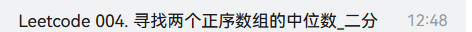


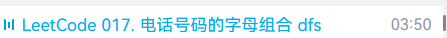


NO


```C++

```

当然可以！为了帮助你系统地克服这些问题，我为你设计了一个两周的计划，分为三个阶段。计划中包含了理论学习、实际练习和总结复盘的步骤。每天的练习时间大约需要1-2小时，周末可以进行更深入的复盘和总结。

---

### 第 1 阶段：理解问题与掌握基本方法（第 1-5 天）

#### 目标
- 理解问题的拆解方法
- 掌握常见算法题的基本思路和模板
- 学会逐步调试代码

#### 每日计划
- **阅读理论**：学习一种算法（如动态规划、贪心、回溯等），找一些经典题目来理解算法的逻辑。
  - **第一天**：动态规划的状态转移方程（经典问题：爬楼梯、最小路径和）
  - **第二天**：贪心算法（经典问题：跳跃游戏、合并区间）
  - **第三天**：回溯算法（经典问题：组合总和、全排列）
  - **第四天**：二分查找与双指针（经典问题：二分查找、两数之和）
  - **第五天**：树和图的遍历（经典问题：二叉树的层序遍历、岛屿数量）

- **练习题目**：每种算法每天做 1-2 道题，按照模板一步一步写出解题过程。
- **逐步调试**：实现时不要求速度，关注正确性。对每一步都进行打印和注释，确保逻辑通顺。
- **总结**：每天记录自己遇到的思路障碍和小错误原因。

#### 复盘（第 5 天）
- 回顾这几天的记录，检查是否对常见算法的模板更加熟悉，列出常见错误，并思考如何避免。

---

### 第 2 阶段：分解问题与独立完成代码（第 6-10 天）

#### 目标
- 练习分解问题的方法，将复杂问题逐步拆解
- 强化调试能力，通过自测代码减少错误
- 学习边界条件和特殊情况处理

#### 每日计划
- **分解题目**：在开始写代码前，先用自然语言或伪代码描述解题步骤，尽量分解成小步骤。
- **专项练习**：从你容易出错的算法类型中选择 2-3 类，做 2-3 道题。推荐以下几种题型：
  - **动态规划**：先写出状态转移方程，再逐步实现代码
  - **边界处理**：做一些涉及边界判断的题目，检查变量初始化、数组边界、特殊输入等
  - **循环与递归**：选择几道包含递归和循环的题目，注意变量的状态变化和边界控制

- **调试过程**：每次写完代码后，逐步调试，检查变量更新、边界条件，观察是否有遗漏。
- **总结记录**：每天将错误记录下来，写下改进方法。

#### 复盘（第 10 天）
- 回顾前几天的记录，思考是否在问题拆解上更加流畅，并检查是否减少了小错误的数量。总结每种算法最常见的边界和调试技巧。

---

### 第 3 阶段：专项练习与提升速度（第 11-14 天）

#### 目标
- 巩固基础，做一遍经典的算法题目
- 进一步减少小错误，提高代码正确性
- 尝试在时间限制内完成题目

#### 每日计划
- **经典题目专项练习**：选择 `LeetCode` 上的经典高频题目，每天做 3-4 道，注意完成时间。
  - **动态规划**、**回溯算法**、**贪心算法** 是重点专项练习内容
  - 如果时间允许，可以选择少量困难题进行练习，但重点在于减少错误
- **限时练习**：对每题设置时间限制，假设是面试环境，强迫自己按时完成。若没完成，记录下来总结思路障碍。
- **优化代码**：完成题目后，检查代码的逻辑是否可以简化或优化，减少不必要的条件判断，确保简洁性。
- **总结记录**：每天记录自己的错误和解决方法，尤其注意新错误。

#### 复盘（第 14 天）
- 总结自己在两周内的进步，复盘经典算法题，检查是否理解透彻。
- 列出自己在每种算法题中容易出错的地方，整理成“面试前检查清单”，确保在正式面试前不会再犯相同错误。

---

### 每日小技巧

- **调试和打印**：遇到逻辑复杂的地方，多打印变量的变化，帮助理解代码。
- **慢速分解**：一开始不要求速度，重点在于理解和准确性，写慢一点也没关系。
- **复习和巩固**：每天花 10 分钟回顾昨天的错误和总结，这有助于巩固知识。

---

通过这个计划，你可以逐步培养良好的解题习惯和调试能力。坚持练习和总结，逐步减少小错误，提升代码实现的准确性和速度。


# 递归——大问题内部分成小问题，内部分到最小的结果逐级返回给上一级递归

https://www.bilibili.com/video/BV1UD4y1Y769/?vd_source=e214bc2cde6387246a99e15bde830cfd

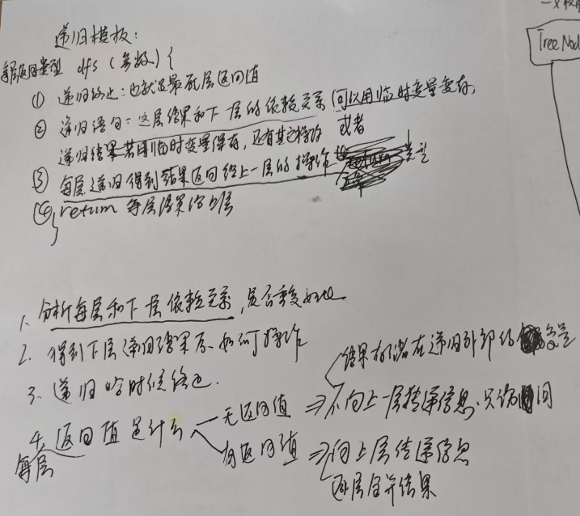

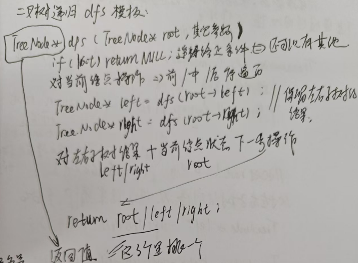

**递归很迷茫的时候，手动画棵树，模拟一下递归过程！！！！！，左右兄弟切换的时候要不要回溯，记录什么值，返回什么给上一层，**

**树的题目已经很简单了，写不出来，多背几个模版就行。前中后序、广度深度遍历、路径和、深度，直径，这些全部背下来**

**递归**简单来说就是函数**自己调用自己**。在编写递归函数时，我们让函数在某些特定条件下重复调用自己，直到满足某个**结束条件**，函数才会停止调用自己。

我们可以把递归看作是让函数通过不断缩小问题规模来解决问题的方式。递归函数通常有两个主要部分：

1. **结束条件**（Base Case）：定义当满足某个条件时，递归调用停止，不再继续。
2. **递归条件**（Recursive Case）：在没有满足结束条件时，函数会自己调用自己，缩小问题的规模。


	


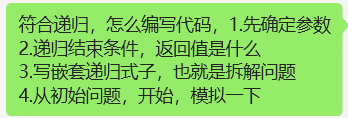

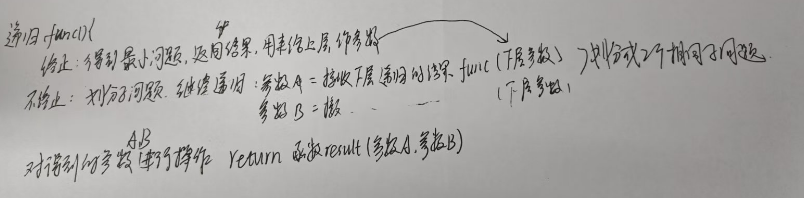

### 什么时候使用递归？

在 LeetCode 上，递归非常适合以下场景：

1. **树结构问题**：如遍历、深度计算、路径查找。
2. **组合和排列生成**：需要试探所有可能的组合和排列。
3. **分治法**：如归并排序、快速排序、寻找矩阵的分割。
4. **动态规划（记忆化）**：用于有大量重复子问题的场景，如斐波那契数列、爬楼梯问题。

### 模版

这个模板的基本结构适用于**简单递归问题**，比如：

1. **计算数值类问题**：如阶乘、斐波那契数列。
2. **树的递归遍历**：如求二叉树的最大深度、最小深度、节点统计。
3. **分治类问题**：如归并排序和二分查找，尤其是那些可以被分成独立子问题的情况。
4. **组合和排列问题**：生成所有组合、排列时，递归调用和结束条件很清晰。并回溯。在递归过程中，“回溯”是通过**撤销选择**实现的。通过撤销当前递归层的操作，回溯允许我们返回上一个递归状态，进而尝试其他可能的选择。回溯的关键在于：在每层递归函数中做出某个选择后，递归调用下一层，然后在回到当前层时撤销该选择，使得函数能够尝试下一种组合。

```C++
ReturnType recursiveFunction(Parameters) {
    // 1. 结束条件
    if (Base Case) {
        return Result;
    }
    
    // 2. 递归调用（可能有多个）
    // 对于每次递归调用，传入缩小后的子问题
    ReturnType result = recursiveFunction(Smaller Problem);
    
    // 3. 组合子问题的结果（如果有需要）
    return Final Result;
}

```

### 我如何写一个递归函数呢？有什么技巧和要点吗？

**编写递归函数的技巧和要点：结束条件、递归关系、返回值处理**

1. **确定结束条件**（Base Case）
   - 结束条件决定递归何时停止，否则会进入无限递归。常见的结束条件是一些简单情况，比如列表为空、数字变成 0 等。
   - 如果没有写好结束条件，递归就会不断调用自己，导致“栈溢出”错误。
2. **定义递归关系**（Recursive Case）
   - 递归关系是递归函数的核心。我们要把原问题分解成多个规模更小的子问题，并让函数在每一步递归调用中逐步接近结束条件。
   - 比如阶乘函数的递归关系是 `factorial(n) = n * factorial(n - 1)`。
3. **尝试思考递归树**
   - 如果遇到复杂的递归，可以在纸上画出递归调用的流程，模拟每个函数调用的过程。这叫做“递归树”，有助于理解问题的分解过程。
4. **确定递归的返回值**
   - 要明确每一层递归的返回值是什么，特别是当多个递归调用结果需要组合时。例如，二叉树的递归遍历就涉及组合左右子树的返回结果。
5. **防止重复计算**
   - 在某些情况下（如斐波那契数列），递归会导致大量重复计算。可以用“记忆化”技术（也叫缓存）优化，或用动态规划替代递归。

### 如何读懂递归函数

读递归函数时，可以使用“递归树”来帮助理解。以下是阅读递归代码的几个步骤：

1. **找到递归的结束条件**：先明确递归什么时候会停止，找到不再调用递归的那一部分代码。
2. **理解每一层递归的任务**：弄清楚每一层递归调用完成了什么操作，尤其是递归返回的结果如何参与计算。
3. **分解成小问题来理解**：将递归调用的过程一步步写出来，理解每一层如何调用下一层，并观察问题规模的变化。
4. **观察返回值**：如果递归函数有返回值，注意每一层的返回值是如何组合成最终结果的。

### 递归的不足

- **递归深度**：递归可能会导致栈溢出，特别是在递归深度较大时。可以考虑优化递归或用循环替代。
- **效率问题**：有些递归问题可能会造成重复计算，导致效率低下。可以使用“记忆化”或动态规划优化。
- **尾递归优化**：尾递归（递归调用是函数最后一步）在部分语言或编译器中可以优化，以减少栈的使用

### 递归过程

递归确实容易让人头晕，尤其是在多个嵌套层次时。要形成清晰的认知，可以尝试以下方法：

1. **从小规模问题入手**：先练习简单的递归题，比如阶乘或斐波那契数列。这类题只需要简单的递归调用，能帮助你理解递归的基本思想。

2. **使用手动模拟递归过程**：在纸上画出每次递归调用的状态，包括函数调用的参数和返回值。这样可以帮助你清晰地看到每一层递归是如何展开和收回的。

3. **理解递归的两个核心部分**：
   - **递归条件**：也就是继续调用自身的条件。了解每一层调用的操作及目标。
   - **基准条件**：递归结束的条件，通常是最小的子问题，用于避免无限循环。

4. **用函数调用栈的概念去理解**：每次递归调用本质上是将当前的状态“压入栈中”，等到条件满足后再逐层“弹出栈”。可以在代码执行过程中假想一个“栈”，每层递归都对应一个新的栈帧。

5. **使用调试工具或打印**：在每次递归调用时添加打印语句，显示当前的参数值和函数返回值，这样可以动态跟踪递归过程，帮助你观察递归的执行顺序和结果。

6. **多练习分治法的递归题**：分治法题目一般有清晰的递归结构，比如二分查找和归并排序。这些题目很适合建立递归过程的直观理解。

通过这些方法，逐步建立起对递归结构的理解，不会再轻易头晕。递归看似复杂，实际上只要掌握结构，就能清晰地理解每一步的执行过程。


# 动态规划dp–从后往前推i 由i-1 i-2关系推来递推

//     **考虑有多少种状态，每种状态有哪些选择，或者是做了哪些选择后得到哪种状态。**
//     **注意：到底是先选择了才有状态，还是先由状态才能选择。这里是先选择了，才有状态**


42   48定义一个额外的数组dp[i]来记录下标i的某些信息

48优化了：什么时候可以优化空间复杂度？我们可以用一个变量代替 dp 数组

62 63 机器人往右往下

70 / 72

完全平方数，最长递增子序列，coins

1.定义状态2.写状态方程3.初始化0 0 开始递推 4.最终结果

dp[]的size=nums.size()  二维数组m*n的grid[] [],行数 int m = grid.size(); 列数int n = grid[0].size();

1.从起始到当前i累积的XX作为dp[i]  2.先写出前面几个，观察i i-1 i-2有没有加法规律

**Q:dp一维 or 二维？单独一部分就用一维dp[i]     两部分就用二维dp[i] [j]** 

### 什么是状态转移方程？

**状态转移方程**是动态规划（Dynamic Programming，DP）算法的核心部分，用来描述**如何从已知的状态推导出新的状态**。简单来说，状态转移方程是一种递推关系，表明如何通过子问题的解来构建更大问题的解。

在动态规划中，**“状态”**代表问题在每一个子阶段的解，状态转移方程描述了**这些状态之间的关系**。

### 动态规划与状态转移方程的关系

1. **状态定义**：确定动态规划问题的解在每一个子阶段的表示方式（状态），通常用 `dp[i]` 或 `dp[i][j]` 来表示。
2. **状态转移方程**：描述如何根据已知的较小规模子问题的解来推导更大规模问题的解。
3. **初始状态和边界条件**：为状态转移方程提供初始条件，确保算法能从基础状态推导出整个问题的解。

**动态规划的关键就在于设计合适的状态转移方程**，使得通过计算小规模问题的解，可以递推出更大规模问题的解。

### 如何找到状态转移方程？

找到状态转移方程的步骤通常是：

1. **分析子问题的结构**：确定原问题如何分解成子问题。
2. **递推关系**：确定当前状态如何通过已知的子问题解得到。
3. **寻找最优子结构**：在很多问题中，动态规划通过找到最优子结构来进行递推。比如在路径问题中，每个状态的值等于前一个状态的最优解。

### 常见状态转移方程

这里列出一些典型的动态规划问题和它们的状态转移方程，供你在找工作时进行快速复习和使用。

---

#### 1. **斐波那契数列**

- **问题描述**：`F(n) = F(n-1) + F(n-2)`，即当前状态等于前两个状态的和。
- **状态转移方程**：`dp[i] = dp[i-1] + dp[i-2]`
- **初始状态**：`dp[0] = 0`，`dp[1] = 1`

#### 2. **最小路径和**（二维网格路径）

- **问题描述**：在 `m x n` 网格中，从左上角到右下角的路径和最小。
- **状态转移方程**：`dp[i][j] = min(dp[i-1][j], dp[i][j-1]) + grid[i][j]`
- **初始状态**：`dp[0][0] = grid[0][0]`

#### 3. **爬楼梯**

- **问题描述**：爬 `n` 阶楼梯，每次可以爬 `1` 或 `2` 阶，问总共有多少种不同的爬法。
- **状态转移方程**：`dp[i] = dp[i-1] + dp[i-2]`
- **初始状态**：`dp[1] = 1`，`dp[2] = 2`

#### 4. **背包问题**

- **问题描述**：在 `n` 个物品中选择若干，使得在不超过背包总容量 `W` 的情况下，物品价值和最大。
- **状态转移方程**：`dp[i][w] = max(dp[i-1][w], dp[i-1][w-weight[i]] + value[i])`
- **初始状态**：`dp[0][w] = 0`，表示容量为 `w` 时的初始状态。

#### 5. **最长递增子序列（LIS）**

- **问题描述**：求一个数组的最长递增子序列长度。
- **状态转移方程**：`dp[i] = max(dp[i], dp[j] + 1)`，其中 `j < i` 且 `nums[i] > nums[j]`
- **初始状态**：`dp[i] = 1`（每个单独的元素都是一个长度为 1 的子序列）

#### 6. **编辑距离（Levenshtein 距离）**

- **问题描述**：计算将一个字符串变成另一个字符串的最小编辑操作次数。

- **状态转移方程**：

  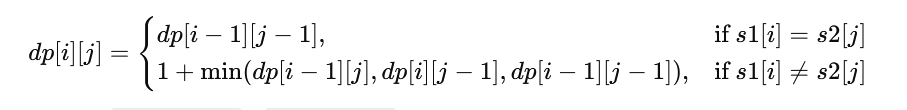

- **初始状态**：`dp[i][0] = i`，`dp[0][j] = j`

#### 7. **最大子数组和**

- **问题描述**：求一个数组的连续子数组的最大和。
- **状态转移方程**：`dp[i] = max(nums[i], dp[i-1] + nums[i])`
- **初始状态**：`dp[0] = nums[0]`

#### 8. **正则表达式匹配**

- **问题描述**：判断一个字符串是否匹配一个包含 `.` 和 `*` 的正则表达式。
- **状态转移方程**：
  - 如果 `p[j] == s[i]` 或 `p[j] == '.'`：`dp[i][j] = dp[i-1][j-1]`
  - 如果 `p[j] == '*'`：`dp[i][j] = dp[i][j-2]` 或者 `dp[i][j] = dp[i-1][j]`
- **初始状态**：`dp[0][0] = true`

#### 9. **三角形最小路径和**

- **问题描述**：给定一个三角形数组，从顶到底找到最小路径和。
- **状态转移方程**：`dp[i][j] = min(dp[i+1][j], dp[i+1][j+1]) + triangle[i][j]`
- **初始状态**：`dp[n-1][j] = triangle[n-1][j]`

#### 10. **分割等和子集**

- **问题描述**：判断一个数组能否分成两个和相等的子集。
- **状态转移方程**：`dp[i][j] = dp[i-1][j] || dp[i-1][j-nums[i]]`
- **初始状态**：`dp[0][0] = true`

---

### 如何熟练掌握状态转移方程

1. **理解每个问题的子结构**：不要仅仅背诵公式，要理解每个状态转移方程的推导过程。
2. **多刷题，熟悉经典问题**：通过练习掌握不同的动态规划问题。
3. **总结公式**：将不同问题的状态转移方程整理成表格，通过对比理解每个公式的区别和适用场景。
4. **记住基本套路**：很多动态规划问题在递推关系上是相似的，尤其是路径问题和序列问题。

通过理解和记忆这些常见的状态转移方程，你在机试中遇到动态规划问题时就会更有信心，能够迅速找到合适的解法。

## 优化dp数组：适用条件

1. **状态只依赖于前一个状态**：如果 `dp[i]` 只依赖 `dp[i - 1]`（或固定的几个前面的状态，如 `dp[i - 1]` 和 `dp[i - 2]`），则可以通过变量替代 `dp` 数组。
2. **结果不需要完整的状态数组**：如果最终结果只依赖于 `dp` 数组中的某一个或几个特定位置的值，则可以通过变量更新实现空间优化。

# 贪心算法

45

跳跃连接，哈夫曼树，最小生成树，最短路径

贪心算法的常见应用场景

1. **区间覆盖**（如活动选择、区间调度）：选择尽可能多的活动，使得它们之间互不重叠。
2. **图论问题**（如最小生成树、最短路径）：如 Kruskal 算法和 Prim 算法用于求图的最小生成树，Dijkstra 算法用于求图的最短路径。
3. **背包问题**（分数背包问题）：选择收益最高的物品装入背包，贪心策略是先选择单位价值最高的物品。
4. **贪心跳跃问题**：如跳跃游戏和跳跃游戏 II，贪心地选择当前跳跃能达到的最远位置，保证最少跳跃次数。

贪心算法的模板并不像动态规划那样固定，因为不同问题的贪心策略有所不同。但大体上，贪心算法的核心思想是每次选择局部最优解，从而期望得到全局最优解。虽然贪心算法没有一个万能模板，但我们可以归纳出一个**通用的贪心算法思路**，适用于大部分贪心问题。

### 贪心算法的通用模板

1. **问题分析**：
   - 确定问题是否可以使用贪心算法求解。
   - 判断问题是否具有**最优子结构**和**无后效性**的性质。也就是，局部最优选择不会影响后续的选择，并且局部最优解能构成全局最优解。

2. **贪心策略的确定**：
   - 定义一个贪心选择规则，在每一步选择中，选择当前看来最优的选项。
   - 确保每一步的选择都是基于当前状态下的最优选择，而不是回溯或重新考虑之前的选择。

3. **实现贪心选择**：
   - 通常需要对输入数据进行排序、使用优先队列（堆）或根据特定条件进行选择。
   - 循环遍历或递归调用，依次做出贪心选择。
   - 更新状态，继续做出下一个贪心选择，直到满足终止条件。

4. **检查解的合理性**：
   - 结束后检查得到的解是否满足题目要求。
   - 有时需要结合问题的性质进行证明，确保贪心选择能构造出全局最优解。

### 通用贪心算法模板（伪代码）

```cpp
// 初始化问题的状态（如排序、定义变量）
初始化数据结构和变量；

// 循环遍历，直到满足条件
while (未达到终止条件) {
    // 在当前状态下做出最优选择
    选择当前最优选项；
    
    // 更新状态
    更新当前状态；
}

// 返回最终结果
返回结果；
```

### 贪心算法模板详解

1. **初始化**：
   - 根据问题的需要，对输入数据进行预处理（如排序）。
   - 定义所需的变量（如计数器、当前状态、结果变量等）。

2. **循环遍历或递归**：
   - 在每一步中，根据贪心选择的规则，选出当前状态下最优的选项。
   - 更新相关的变量，使得状态朝着问题的解方向推进。

3. **终止条件**：
   - 通常在遍历完所有数据，或达到题目要求的结果时结束循环。

4. **返回结果**：
   - 返回在过程中累积得到的结果。

---

### 常见贪心算法问题及其模板

#### 1. 活动选择问题（区间调度问题）

**问题描述**：给定一组活动的起始和结束时间，选择尽可能多的活动，使得它们互不重叠。

**贪心策略**：每次选择结束时间最早的活动。

**模板**：
```cpp
// 假设 activities 已按结束时间升序排序
int count = 0;
int lastEndTime = -1;

for (const auto& activity : activities) {
    if (activity.start >= lastEndTime) {
        // 选择当前活动
        count++;
        lastEndTime = activity.end;
    }
}

return count;
```

#### 2. 跳跃游戏 II（LeetCode 45）

**问题描述**：给定一个非负整数数组，数组中的每个元素表示你在该位置可以跳跃的最大长度，求出最少的跳跃次数到达数组的最后一个位置。

**贪心策略**：在每个位置选择能跳到的最远位置。

**模板**：
```cpp
int jumps = 0;
int currentEnd = 0;
int farthest = 0;

for (int i = 0; i < nums.size() - 1; i++) {
    farthest = max(farthest, i + nums[i]);
    if (i == currentEnd) {
        jumps++;
        currentEnd = farthest;
    }
}

return jumps;
```

#### 3. 分数背包问题

**问题描述**：有一个容量为 W 的背包和一组物品，每个物品有重量和价值，可以部分装入背包，求如何装入使得背包的总价值最大。

**贪心策略**：每次选择单位重量价值最高的物品装入背包。

**模板**：
```cpp
sort(items.begin(), items.end(), [](Item& a, Item& b) {
    return (double)a.value / a.weight > (double)b.value / b.weight;
});

double totalValue = 0.0;
for (const auto& item : items) {
    if (W >= item.weight) {
        // 如果背包能完全装下当前物品
        W -= item.weight;
        totalValue += item.value;
    } else {
        // 如果背包不能完全装下当前物品，装入部分
        totalValue += item.value * ((double)W / item.weight);
        break;
    }
}

return totalValue;
```


# 分治法


# 回溯法—递归语句的下一条pop

17/39/40组合求和/46  78 79

1.是否是一个探索问题，往哪个方向移动（for循环遍历，还是上下左右）

2.对于每一个元素而言他的操作是什么–

3.对下一个元素的操作是什么——–继续递归

4.下一个元素操作结束的操作是什么—-回溯

5.怎么样得到结果

6.要不要提前退出递归，没必要递归到尽头在退出

## 1.for循环回溯

口诀  result /current   /不可以重复-i做参数-i=start   /  可以重复i =1；

```C++

//1.满足找到条件，加入结果集合，提前退出
    if（条件满足）{
    result.push_back(current);
    //这里return是不再继续向下探索可能性了，提前退出递归
    return;
}
/*2.或者无条件 直接加入结果集合即可
     result.push_back(current);
*/
void backtrack (参数){
    for (int i = start; i < nums.size(); i++) {
            current.push_back(nums[i]);            // 做选择：加入当前元素
            backtrack(nums, i + 1, current, result); // 递归进入下一层
            current.pop_back();                    // 撤销选择：回溯
        }
}


```

​      两种情况

 1.满足找到条件，加入结果集合，提前退出

**适用场景**：适用于在满足特定条件后，无需继续向下递归的情况。例如：

- **组合总和问题**：当当前路径的和等于目标值时，立即返回，因为继续向下搜索会导致和超出目标。
- **生成排列问题**：当路径长度达到指定大小（例如，排列长度），可以直接返回，不必再递归。

2.或者无条件 直接加入结果集合即可

**作用**：不需要满足任何条件，直接将当前路径 `current` 加入结果集 `result`。这种情况通常用于生成所有可能的组合、子集等。

**适用场景**：适用于所有路径都可以加入结果集的情况，例如：

- **子集问题**：每一层递归中的路径都是一个有效的子集。
- **全组合问题**：每个组合都可以加入结果集。

### 优化建议

可以通过在 `for` 循环中使用剪枝条件（如提前跳过不必要的元素）来进一步提升效率。例如，如果当前路径已超过目标值，可以直接 `return`，减少无效递归。

## 双重for循环，17电话号码

**`for` 循环的回溯结构**则用于更复杂的选择（如排列、组合），在这些场景下，每层选择的可能性超过两种，因此需要 `for` 循环。

## 2.二叉树回溯dfs

该方法适用于**组合或子集**问题，每个元素有“选择加入当前子集”或“选择不加入当前子集”两种可能。代码通过递归调用来处理每种选择的分支，相当于构建了一棵**二叉树**，每个递归层都决定一个元素的取舍。

```
#include <vector>
using namespace std;

class Solution {
public:
    vector<vector<int>> result;  // 用于存储所有可能的组合

    void dfs(vector<int>& nums, int idx, vector<int>& current) {
        // 递归终止条件：当 idx 超过数组范围时，记录当前组合
        if (idx >= nums.size()) {
            result.push_back(current);
            return;
        }

        // 选择当前元素：将 nums[idx] 加入当前组合
        current.push_back(nums[idx]);
        dfs(nums, idx + 1, current);  // 递归处理下一个元素
        current.pop_back();           // 撤销选择，回到上一个状态

        // 不选择当前元素：直接跳过 nums[idx]
        dfs(nums, idx + 1, current);  // 继续递归处理下一个元素
    }

    vector<vector<int>> generateSubsets(vector<int>& nums) {
        vector<int> current;   // 用于存储当前组合
        dfs(nums, 0, current); // 从第 0 个元素开始递归
        return result;
    }
};

```


# 背二分查找

33/34/35

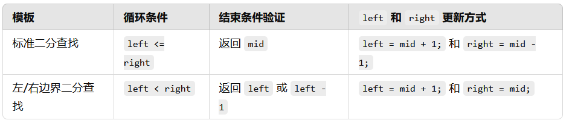

### 总结

- **标准二分查找**：用于查找单个元素位置，循环条件为 `left <= right`。
- **左/右边界二分查找**：用于查找目标值的边界位置，循环条件为 `left < right`，配合 `right = nums.size()` 这种不包括的右边界。

选择模板时，根据具体需求决定。如果是查找区间，优先选择左/右边界二分查找模板；如果是查找单个元素，使用标准二分查找模板更简单。

二分查找是算法中的基础操作，有多种实现方式。以下是常见的两种二分查找模板，分别是 **标准二分查找模板** 和 **寻找左边界/右边界的二分查找模板**。

为什么int mid = left + (right - left) / 2;   

如果直接使用 `int mid = (left + right) / 2;`，当 `left` 和 `right` 的值非常大时（比如接近 `INT_MAX`），它们相加的结果可能会超出 `int` 的范围，导致整数溢出。溢出会导致计算的 `mid` 值不正确，从而导致二分查找出错。

### 解决方案

`left + (right - left) / 2` 的形式能够有效避免溢出：

1. **计算 `(right - left) / 2`**：确保计算出的中间偏移量在 `left` 和 `right` 的范围内。
2. **加上 `left`**：得到 `mid`，即中间位置。

### 模板 1：标准二分查找模板（用于查找特定元素）

这种模板用于查找目标元素是否存在于数组中，返回其索引位置。如果没有找到目标元素，则返回 `-1`。

```cpp
int binarySearch(vector<int>& nums, int target) {
    int l = 0, right = nums.size() - 1;

    while (l <= r) {
        int mid = (l + r) >> 1;
        
        if (nums[mid] == target) return mid;    // 找到目标，直接返回
        else if (nums[mid] < target) l = mid + 1;   // target 在右边
        else r = mid - 1;                    // target 在左边
    }
    
    return -1;  // 未找到目标
}
记忆要点：

    循环条件： <=
    mid 计算： int mid = (l + r) >> 1;
    移动指针：left = mid + 1 或 right = mid - 1
```

#### 应用场景

- 查找特定元素是否存在于有序数组中，例如查找整数值或字符。
- 返回数组中满足条件的某个元素的位置。

---

### 模板 2：左边界/右边界的二分查找模板（用于查找在重复元素的边界）

这种模板用于查找目标值在数组中第一次或最后一次出现的位置，通常在重复元素中查找边界索引时使用。

#### 先找左边界（first occurrence）

查找目标值的**左边界**（即第一次出现的位置）。如果找到目标值，返回它的第一个位置；如果没有找到，返回插入位置（即第一个大于等于 `target` 的位置）。`mid = (l + r) >> 1`，这里的 `>> 1` 表示右移一位，相当于除以 2，这是常见的计算 `mid` 的优化写法

```cpp
while(l < r) {
    int mid = (l + r) >> 1;
    if(nums[mid] >= target) r = mid;
    else l = mid + 1;
}
int first = l;
//左边界如果是目标值找右边界才有意义，要判断左边界这个数值不一定目标值
if(nums[l] != target) return vector<int>{-1, -1};
```

#### 再找右边界（last occurrence）

查找目标值的**右边界**（即最后一次出现的位置）。如果找到目标值，返回它的最后一个位置；如果没有找到，返回 `-1`。

```cpp
while(l < r) {
    int mid = (l + r) >> 1;
    if(nums[mid] >= target) r = mid;
    else l = mid + 1;
}
int last = l;
```

- 查找目标值的左边界或右边界，尤其适合有重复元素的数组。
- 可以用于查找目标值的出现次数，比如 LeetCode 34 题 *Find First and Last Position of Element in Sorted Array*。


**背自带的算法**

# 背排序算法

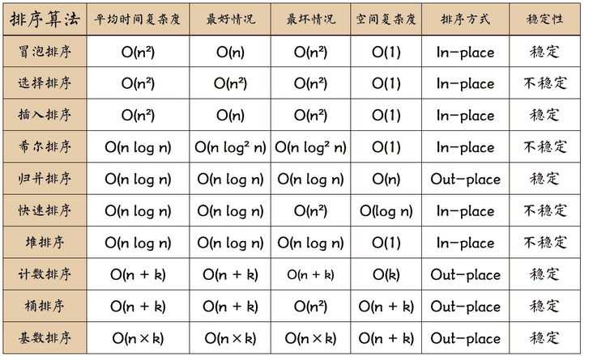

如果机试的时候不允许用内置的排序算法，我该怎么快速的写一个排序算法出来？给我推荐一个简单容易写，容易被下来的排序算法：冒泡排序，某个数没有发生交换，说明全部有序，可以提前退出

```C++
void bubbleSort(vector<int>& nums) {
    int n = nums.size();
    bool unswapped;
    for (int i = 0; i < n - 1; i++) {
        unswapped = true;
        // 内层循环比较相邻元素
        for (int j = 0; j < n - i - 1; j++) {
            if (nums[j] > nums[j + 1]) {
                swap(nums[j], nums[j + 1]);
                unswapped = false;
            }
        }
        // 如果没有交换，说明数组已经有序，提前退出
        if (unswapped) break;
    }
}
```

自带的排序算法，记忆

1.sort  **时间复杂度**：O(n log n)， **空间复杂度**：O(1)

2.手撕快排 **时间复杂度**：平均 O(n)，最坏情况下 O(n^2)。**空间复杂度**：O(1)，快速选择只需要常数级别的空间。

3.堆排序，优先队列容器 **时间复杂度**：O(n log k) **空间复杂度**：O(k) 堆的大小是 `k`

4.归并排序

## 快排

性质，什么时候会达到最优最坏复杂度，手撕

在快速排序（QuickSort）算法中，基准元素（pivot）的选择方式对算法的效率影响很大，尤其是在处理某些特定情况下的数据时。

通常来说，快速排序的性能会受到基准选择的影响。如果我们总是选择第一个元素或者最后一个元素作为基准，并且输入数据是有序或接近有序时，快速排序的时间复杂度可能退化到最坏情况 O(n²)，这会极大地影响效率。

因此，**随机选择基准元素**（或者采用其他更为优化的选择方式，如“三数取中法”）是一种常见的优化手段，可以避免最坏情况，提高排序算法的性能。

### 总结：

- **不使用随机基准**：某些简单的快速排序实现使用固定的基准位置（如第一个元素），但这样做可能会导致最坏情况（O(n²)）。
- **使用随机基准**：随机选择基准可以避免最坏情况，提高排序的性能，通常可以保持期望时间复杂度为 O(n log n)。
- **其他优化方法**：除了随机化基准，还可以使用三数取中法等方法来优化基准的选择，减少排序性能退化的风险。

### 为什么有些实现不使用随机数作为基准？
1. **实现简洁性**：
   - 许多标准的快速排序实现（例如 C++ 标准库的 `std::sort`）通常会选择某个固定位置（如第一个元素、最后一个元素或中间元素）作为基准。这样实现起来代码较简单，不需要额外的随机化步骤。
   
2. **随机化带来的开销**：
   - 在一些简单的实现中，可能不考虑使用随机数选择基准，因为引入随机数的生成会带来一些额外的时间开销。对于大部分数据集，这种开销相对较小，但对于时间要求严格的应用程序，可能希望避免这类开销。

3. **数据分布**：
   - 如果输入数据已经是无序的，且是完全随机的，简单地选择第一个或最后一个元素作为基准，通常会表现出较好的性能。因为数据是随机的，退化成最坏情况的可能性较低。
   
4. **优化策略**：
   - 一些优化版的快速排序算法使用**三数取中法**（Median of Three）或**随机选取基准**来改进基准选择。这种方法选择第一个、最后一个和中间元素的中位数作为基准，或者完全随机选择基准。这可以帮助避免遇到已经排序的或者几乎排序的数据时导致时间复杂度退化的情况。

### 采用随机数作为基准的优点：
- **避免最坏情况**：
   - 随机选择基准元素可以有效防止输入数据已经是升序或降序时导致的 O(n²) 时间复杂度。无论输入数据如何，随机化会将每个元素有一定的概率作为基准，避免某些输入数据模式导致时间复杂度退化。
   
- **分布均匀**：
   - 随机选择基准可以使得每次划分的左右两部分尽量均匀，避免极端情况下的划分，通常可以获得 O(n log n) 的期望时间复杂度。

### 快速排序的不同基准选择方法：
1. **固定基准**（最简单的方法）：
   - 选择第一个元素或最后一个元素作为基准。
   - 优点：实现简单。
   - 缺点：如果数据是有序的，性能最差。

2. **随机基准**：
   - 随机选择一个元素作为基准。
   - 优点：避免了最坏情况，期望时间复杂度为 O(n log n)。
   - 缺点：引入随机数的额外开销。

3. **三数取中法**（Median of Three）：
   - 选择第一个元素、最后一个元素和中间元素的中位数作为基准。
   - 优点：在某些情况下，选择中位数可以减少退化为最坏情况的概率。
   - 缺点：需要更多的比较，代码复杂度增加。

### 代码示例（随机选择基准）：
如果你选择使用随机数来选择基准，可以通过以下方式来实现：

```cpp
#include <iostream>
#include <vector>
#include <cstdlib> // 用于随机数生成
#include <ctime>   // 用于时间

using namespace std;

int partition(vector<int>& nums, int left, int right) {
    // 随机选择基准
    int pivotIndex = left + rand() % (right - left + 1);
    int pivot = nums[pivotIndex];
    
    // 将基准放到末尾
    swap(nums[pivotIndex], nums[right]);
    
    // 进行划分
    int i = left - 1;
    for (int j = left; j < right; j++) {
        if (nums[j] < pivot) {
            i++;
            swap(nums[i], nums[j]);
        }
    }
    swap(nums[i + 1], nums[right]);
    return i + 1;
}

void quickSort(vector<int>& nums, int left, int right) {
    if (left < right) {
        int pivotIndex = partition(nums, left, right);
        quickSort(nums, left, pivotIndex - 1);
        quickSort(nums, pivotIndex + 1, right);
    }
}

int main() {
    srand(time(0));  // 设置随机种子
    
    vector<int> nums = {10, 80, 30, 90, 40, 50, 70};
    
    quickSort(nums, 0, nums.size() - 1);
    
    // 输出排序后的数组
    for (int num : nums) {
        cout << num << " ";
    }
    cout << endl;
    
    return 0;
}
```

- 

## 堆排序

时间On 空间Onlogn

三个参数：①队列元素类型，②存储队列容器，一般是用vector<①队列元素类型>

③小顶堆额外greater<①队列元素类型>

```
priority_queue<int, vector<int>, greater<int>> minHeap;
```

要剩下前k个最大的，就用最小堆，一直入队，当堆的大小超过k时，堆顶出队

性质，什么时候会达到最优最坏复杂度，priority_queue/手撕

Heap.push(x)  压入堆        auto x=Heap.pop()   弹出对顶

默认情况下最大堆：priority_queue<int> maxHeap;

如果想要创建最小堆（Min-Heap）：传入greater<int>

`priority_queue<int>` 默认是 **最大堆**，堆顶是最大的元素。

如果需要 **最小堆**，需要使用 `std::greater<int>` 作为第三个模板参数，像这样：`priority_queue<int, vector<int>, greater<int>>`。

```C++
priority_queue<int, vector<int>, greater<int>> minHeap;
priority_queue<pair<int, int>, vector<pair<int, int>>, greater<pair<int, int>>> minHeap;
//当使用 pair<int, int> 时，默认会首先按 first 元素排序，如果 first 元素相等，则会按 second 元素排序。
```

## 归并排序

递归非递归

## 桶排序topk频率347

哈希表 + 桶排序

O(n)+O(n)

需要最高效的解决方案

# 双指针

11 15 19 42 76 141 142 283 344 438 567 680 986

```C++
/*
第 11 题：盛最多水的容器
第 15 题：三数之和
第 19 题：删除链表的倒数第 N 个节点
第 42 题：接雨水
第 76 题：最小覆盖子串
第 141 题：环形链表
第 142 题：环形链表 II
第 283 题：移动零
第 344 题：反转字符串
第 438 题：找到字符串中所有字母异位词
第 567 题：字符串的排列
第 680 题：验证回文字符串 Ⅱ
第 986 题：区间列表的交集
*/
```


双指针是指在一个序列上使用两个指针来遍历、比较或操作数据。根据指针的方向和操作场景，双指针可以分为以下几种常见形式：

1. **对撞指针**：用于从两端向中间收缩的情形，如求两个数的和等于特定值的问题。
2. **快慢指针**：一个指针移动得快，一个移动得慢，用于检查链表是否有环或找到链表的中点。
3. **同向双指针**：两个指针从一端向另一端移动，用于处理两个子序列（如两个数组或字符串）的比较或合并操作。———-滑动窗口

# 单调栈

84 85  496 503 739

单调栈是一种特殊的栈结构，通过维持栈内元素的单调性（递增或递减），可以高效解决一些关于区间最值、下一个更大/小元素的问题。下面是单调栈的基本模板，适用于常见的“下一个更大元素”或“下一个更小元素”问题。

**下一个更大元素的意思就是：对于数组中的每个元素，按数组顺序从左往右找到第一个比当前元素大的元素。**，不是全局意义上的下一个更大，有顺序

## 关键理解：

**单调递增栈确保里面的高度递增，当前元素i高度<栈顶元素高度时，可以进行相关操作（计算一个矩形面积），要循环检查，！！！因为他的高度也可能＜栈顶的后面其他元素！！！，（每计算完一次栈顶，弹出栈顶，检查当前元素i高度<栈顶元素高度），直至检查当前元素i高度>=栈顶元素高度，此时加入栈顶，继续遍历下一个元素**

---

栈 `stack` 用来存储元素的**索引**，而不是值。栈的目的是帮助找到下一个更大元素。

### 

- **单调递增栈**：用于查找下一个更大元素。
- **单调递减栈**：用于查找下一个更小元素。
- **栈内存储索引**：方便在 `nums` 中查找下一个元素的值并将其存入 `bigger/smaller`。

### 应用场景

单调栈广泛应用于解决许多关于“下一个更大/小元素”、“最大/最小矩形面积”等问题。例如：

- LeetCode 84 题：柱状图中最大的矩形
- LeetCode 85 题：最大矩形
- LeetCode 739 题：每日温度
- LeetCode 496 题：下一个更大元素 I
- LeetCode 503 题：下一个更大元素 II

单调栈在这些问题中可以高效地处理相邻元素的比较，避免暴力求解的复杂度。


# 矩阵操作

行优先遍历，列优先遍历，转置，旋转


# 二叉树操作

## 1.判断节点（指针）是否为空

if(!X)  读成  如果X不存在时 执行{}

if(指针)  这个是说 如果指针有值（非空） 执行
        if(!指针) 这个是说 如果没有值 （空） 执行

`!root` 时，`!` 会将 `root` 的布尔值取反：

- 如果 `root` 是非空指针（例如指向某个树节点），它的值被视为 `true`。`!root` 则会将它取反为 `false`。
- 如果 `root` 是空指针（`nullptr`），它的值被视为 `false`。`!root` 则会将它取反为 `true`。
- i是 true 才成立  ，if(true){true时成立}
- if(ptr)  ptr是 true才成立 此时ptr非空 
- if(！ptr)  ! ptr是 true才成立 此时ptr 空 


```
if(root){  root不为空成立   }
if(!root) {root为空成立}
```

如果 `root` 是空指针（`nullptr`），它的值被视为 `false`。`!root` 则会将它取反为 `true`。

在 `if (!root)` 中：

- 如果 `root` 为 `nullptr`，`!root` 为 `true`。
- 如果 `root` 指向有效节点，`!root` 为 `false`。

**if (!root) 就是 if(root==NULL)**

### 为什么 `!root` 更简洁

- **简化代码**：`!root` 比 `root == nullptr` 更简洁，代码可读性更高。
- **惯用法**：在 C++ 中，`!ptr` 是判断指针是否为空的常用写法，很多 C++ 程序员都会习惯使用它。

# map使用

## 用map还是unordered_map 

#### 看有序无序要求，不要求有序按键值升序就用unordered_map

- **优先使用 `unordered_map`**：如果题目不涉及有序需求，并且需要频繁查找键值，`unordered_map` 是更好的选择。
- **选择 `map`**：当题目有顺序需求，或者需要查找上界、下界等按顺序查找操作时，`map` 更合适。

1. **频繁查找的场景**（如统计出现次数、寻找对应值）：用 `unordered_map`。
2. **按顺序输出或查找区间的场景**（如找上界或下界）：用 `map`。

在刷力扣题目时，一般来说，如果没有特定要求，使用 `unordered_map` 会更高效。

## 用unordered_map建立哈希映射加快查找速度

   **unordered_map<int, int> myMap1;
   // 访问任何键，未赋值时默认为 0
    //！！！！！可以直接对键进行下标操作，即使键不存在，也不会报错。**

平均查找、插入和删除时间复杂度O（1）

不用for循环遍历查找

递归缓存结果，记忆化搜索，加快速度，避免重复计算

## 函数

**定义初始化：**

map<key类型,value类型> myMap;

value类型

**遍历:**

for (const auto& pair : myMap) {

​    pair.first就是key

​    pair.second就是value

}

**插入/赋值：**

myMap[key] =value

myMap.insert({key, value})

map没有push_back,如果 `map` 的 `value` 是 `vector` 或其他支持 `push_back` 的容器，可以在对应的 `value` 上使用 `push_back`。例如，`map<int, vector<int>>`

```C++
map<int, vector<int>> myMap;

    myMap[1].push_back(10); // 在键 1 对应的 vector 中插入 10
    myMap[1].push_back(20); // 再插入 20
    myMap[2].push_back(30); // 在键 2 对应的 vector 中插入 30
```

**删除：**

myMap.erase(key); 

**有返回值：**

myMap.find(key) //map的find查找成功返回value，不成功则是map.end(),要判断失败

`map` 的 `find` 函数返回的是一个**指向键值对的迭代器**，这个迭代器指向的是 `pair<const Key, T>` 类型的对象。 auto it =myMap.find(key), it.first=Key,it.second=T

myMap.size()

myMap.empty()

## 常见map/unordered_map:

在 LeetCode 中，常用的 `map` 组合一般取决于题目需求。以下是几种常见的 `key` 和 `value` 类型组合及其应用场景：

### 1. `map<int, int>`

**应用场景**：用于统计频次、记录位置索引、存储映射关系等。

- **频率统计**：用于记录元素出现的次数。
- **位置记录**：例如，记录数组中每个数字出现的位置。
- **映射关系**：将一个整数映射到另一个整数，比如在动态规划中记录某个状态的计算结果。

**示例**：
```cpp
map<int, int> frequency;
frequency[1] = 3;  // 表示元素 1 出现 3 次
```

### 2. `map<int, vector<int>>`

**应用场景**：用于记录多个值与一个键的映射关系。

- **索引存储**：记录某个数字在数组中的所有出现位置。
- **邻接列表**：在图论题目中，用于表示节点的邻接列表。

**示例**：
```cpp
map<int, vector<int>> adjacencyList;
adjacencyList[1].push_back(2);  // 表示节点 1 有一个边到节点 2
adjacencyList[1].push_back(3);  // 表示节点 1 有一个边到节点 3
```

### 3. `map<int, set<int>>`

**应用场景**：与 `map<int, vector<int>>` 类似，但使用 `set` 可以去重并保持顺序。

- **图的邻接集合**：适用于需要有序、不重复的邻接关系。
- **去重存储**：如果需要去除重复项，可以用 `set` 代替 `vector`。

**示例**：
```cpp
map<int, set<int>> adjacencySet;
adjacencySet[1].insert(2);  // 表示节点 1 有一个边到节点 2
adjacencySet[1].insert(2);  // 重复插入不会影响结果
```

### 4. `map<string, int>`

**应用场景**：用于字符串频率统计或将字符串映射到特定的值。

- **字符串频率统计**：用于统计字符或单词出现的次数。
- **字符串到索引映射**：如在字典或数据查找时，将字符串映射到特定的索引或值。

**示例**：
```cpp
map<string, int> wordCount;
wordCount["apple"] = 1;
wordCount["banana"] += 1;  // 增加出现次数
```

### 5. `map<pair<int, int>, int>`

**应用场景**：用于二维平面上的坐标映射或存储网格中的状态。

- **坐标映射**：记录平面中某个坐标的值。
- **二维状态记录**：用于动态规划或状态存储，例如记录棋盘上的某些状态。

**示例**：
```cpp
map<pair<int, int>, int> grid;
grid[{0, 1}] = 1;  // 表示坐标 (0, 1) 的值为 1
```

### 6. `map<int, map<int, int>>`

**应用场景**：在二维矩阵或图中，存储更加复杂的映射关系。

- **稀疏矩阵**：在稀疏矩阵中，记录仅有值的坐标。
- **图的多级关系**：例如，`map<int, map<int, int>>` 可以表示节点间的带权关系。

**示例**：
```cpp
map<int, map<int, int>> matrix;
matrix[1][2] = 5;  // 表示坐标 (1, 2) 的值为 5
```

### 7. `map<char, int>`

**应用场景**：用于字符频率统计，如在字符串或词组中统计各字符的出现次数。

**示例**：
```cpp
map<char, int> charCount;
charCount['a'] += 1;  // 增加字符 'a' 的出现次数
```

### 选择何种 `map` 组合

在 LeetCode 中，选择 `map` 的 `key` 和 `value` 类型组合取决于：
- **题目数据类型**：比如，数组元素是整数还是字符串。
- **映射需求**：是统计次数还是记录多个索引。
- **是否需要有序性**：如果不需要有序性，可以考虑 `unordered_map` 以提升性能。

### 7.对节点用map

unordered_map<TreeNode*, pair<int, int>> memo; // 缓存每个节点的 {rob, notRob}

```C++
pair<int, int> dfs(TreeNode* root) {
    if (!root) return {0, 0};
    if (memo.count(root)) return memo[root]; // 如果已经计算过，直接返回
```

# set使用

## 函数

**定义初始化：**

map<key类型,value类型> myMap;

value类型

**遍历:**

for (auto it = mySet.begin(); it != mySet.end(); ++it) {

**插入/赋值：**

myMap[key] =value

myset.insert({key, value})

map没有push_back,如果 `map` 的 `value` 是 `vector` 或其他支持 `push_back` 的容器，可以在对应的 `value` 上使用 `push_back`。例如，`map<int, vector<int>>`

```C++
map<int, vector<int>> myMap;

    myMap[1].push_back(10); // 在键 1 对应的 vector 中插入 10
    myMap[1].push_back(20); // 再插入 20
    myMap[2].push_back(30); // 在键 2 对应的 vector 中插入 30
```

**删除：**

myset.erase(key); 

mySet.clear() 清空集合

**交换集合**：`swap()`   set1.swap(set2); 

**有返回值：**

myset.find(key)

mySet.count(key)—也叫判断存不存在，返回指定元素的个数，在 `set` 中结果只能是 `0` 或 `1`（因为元素唯一）

myMap.size()

myMap.empty()

**获取元素范围**：`lower_bound()` 和 `upper_bound()`

- `lower_bound(x)` 返回第一个不小于 `x` 的元素的迭代器。
- `upper_bound(x)` 返回第一个大于 `x` 的元素的迭代器。

auto itLow = mySet.lower_bound(3); auto itUp = mySet.upper_bound(3);

### `set` 与 `unordered_set` 的区别总结

- **底层实现**：`set` 是基于红黑树（有序），`unordered_set` 是基于哈希表（无序）。

- 时间复杂度

  ：

  - `set` 的查找、插入、删除的平均时间复杂度为 `O(log n)`。
  - `unordered_set` 的查找、插入、删除的平均时间复杂度为 `O(1)`。

- **元素顺序**：`set` 中的元素按升序排列，而 `unordered_set` 中的元素是无序的。

- 适用场景

  ：

  - 如果需要元素有序或范围操作，使用 `set`。
  - 如果仅需判断元素存在且对顺序无要求，使用 `unordered_set`。

### 选择 `unordered_set` 的原因总结

- **简洁性**：我们只关心元素是否存在，而 `unordered_set` 正是为这种场景设计的。
- **空间优化**：`unordered_set` 不需要额外存储值，节省了空间。
- **适配性**：在题目要求的查找操作上，`unordered_set` 比 `unordered_map` 更直观。

### `unordered_set` 和 `unordered_map` 的区别

1. **存储内容**：
   - **`unordered_set`**：只存储键（即唯一的元素），没有关联的值。常用于需要快速判断某个元素是否存在的场景。
   - **`unordered_map`**：存储键值对（`key-value`），每个键都有一个关联的值。常用于需要通过键快速查找到对应值的场景。
2. **元素存储结构**：
   - **`unordered_set`**：每个元素都是唯一的，仅作为集合的一部分，没有关联的值。
   - **`unordered_map`**：每个键都是唯一的，但每个键都关联着一个值，类似于字典或哈希表。
3. **使用场景**：
   - **`unordered_set`**：适合存储不重复的元素，并提供快速查找是否包含某个元素的能力。
   - **`unordered_map`**：适合存储键值对映射，例如统计词频、查找元素关联的值等。


# 或与非  移位运算

在 LeetCode 上，有一些题目可以通过**或（|）、与（&）、非（~）**等位运算来高效解决。这些位运算题目通常涉及数字的特性、快速判断和转换。以下是几个常见的 LeetCode 题目，它们可以使用位运算技巧解决：

### 1. **136. 只出现一次的数字**
   - **描述**：给定一个非空整数数组，除了某个元素只出现一次以外，其余每个元素均出现两次。找出这个只出现一次的元素。
   - **解法**：使用异或运算（^）。重复出现的数字异或后会抵消为 0，最终只留下唯一的数字。
   - **代码**：
     ```cpp
     int singleNumber(vector<int>& nums) {
         int result = 0;
         for (int num : nums) {
             result ^= num;
         }
         return result;
     }
     ```

### 2. **231. 2 的幂**
   - **描述**：判断一个整数是否为 2 的幂。
   - **解法**：2 的幂的数字在二进制表示中只有一个 `1` 位。因此 `n > 0` 且 `n & (n - 1) == 0` 则为 2 的幂。
   - **代码**：
     ```cpp
     bool isPowerOfTwo(int n) {
         return n > 0 && (n & (n - 1)) == 0;
     }
     ```

### 3. **191. 位1的个数**
   - **描述**：计算一个无符号整数的二进制表示中 `1` 的个数。
   - **解法**：使用 `n & (n - 1)` 清除最低位的 `1`，循环计数。
   - **代码**：
     ```cpp
     int hammingWeight(uint32_t n) {
         int count = 0;
         while (n != 0) {
             n &= (n - 1); // 清除最低位的1
             count++;
         }
         return count;
     }
     ```

### 4. **190. 颠倒二进制位**
   - **描述**：将一个无符号整数的二进制位倒序。
   - **解法**：每次取最后一位并左移到结果中，用右移更新原数。
   - **代码**：
     ```cpp
     uint32_t reverseBits(uint32_t n) {
         uint32_t result = 0;
         for (int i = 0; i < 32; i++) {
             result = (result << 1) | (n & 1); // 将最低位移到result
             n >>= 1;
         }
         return result;
     }
     ```

### 5. **338. 比特位计数**
   - **描述**：给定一个非负整数 `num`，计算从 `0` 到 `num` 的每个数字的二进制表示中 `1` 的个数。
   - **解法**：动态规划 + 位运算。`bits[i] = bits[i >> 1] + (i & 1)`。
   - **代码**：
     ```cpp
     vector<int> countBits(int num) {
         vector<int> bits(num + 1);
         for (int i = 1; i <= num; i++) {
             bits[i] = bits[i >> 1] + (i & 1);
         }
         return bits;
     }
     ```

### 6. **268. 丢失的数字**
   - **描述**：给定一个包含 `0` 到 `n` 中 `n` 个数的数组，找出丢失的数字。
   - **解法**：利用异或运算。`missing = (0 ^ 1 ^ 2 ^ ... ^ n) ^ (nums[0] ^ nums[1] ^ ... ^ nums[n-1])`。
   - **代码**：
     ```cpp
     int missingNumber(vector<int>& nums) {
         int missing = nums.size();
         for (int i = 0; i < nums.size(); i++) {
             missing ^= i ^ nums[i];
         }
         return missing;
     }
     ```

### 7. **201. 数字范围按位与**
   - **描述**：给定范围 `[m, n]`，计算范围内所有数字的按位与。
   - **解法**：寻找公共前缀，逐次右移 `m` 和 `n`，直到它们相等，再将结果左移。
   - **代码**：
     ```cpp
     int rangeBitwiseAnd(int m, int n) {
         int shift = 0;
         while (m < n) {
             m >>= 1;
             n >>= 1;
             shift++;
         }
         return m << shift;
     }
     ```

这些题目都可以通过位运算高效解决。您可以使用 `&`、`|`、`^` 等运算符来优化复杂度，快速处理数组、数字和二进制位。


# 设计实现一个类的题目

LRU ,最小栈

构造函数

成员函数

在public前面写全局变量，数据结构


# DFS

回溯，二叉树dfs，网格dfs模板（单词搜索和岛屿问题）.

：边界检查和已访问检查 返回，条件检查 返回 ，标记当前为已经访问过的（设置为一个其他字符），继续沿着其他方向dfs，回溯：复原

网格dfs，主函数双重循环遍历每个节点，先检查当前这个节点是否满足条件再dfs（比如这个字符是单词第一个字母，这个数字是1即岛屿）

https://leetcode.cn/problems/number-of-islands/solutions/211211/dao-yu-lei-wen-ti-de-tong-yong-jie-fa-dfs-bian-li-/

二叉树

```C++
void dfs(TreeNode *root) {
    // 判断 base case
    if (root == null) {
        return;
    }
    // 访问两个相邻结点：左子结点、右子结点
    dfs(root->left);
    dfs(root->right);
}

```

网格模板

```C++
    // DFS深度优先搜索
    void dfs(vector<vector<char>>& board, int i, int j, string& word, int index) {
        // 边界检查和其他条件检查：当前字符是否匹配
        if (i < 0 || j < 0 || i >= board.size() || j >= board[0].size() || board[i][j] != word[index]) {
            return;
        }
        
        // 如果所有字符都匹配，返回
        if (index == word.size() - 1) {
            return;
        }
        
        // 临时标记当前网格位置，避免重复访问
        char temp = board[i][j];
        board[i][j] = '#';  // 记为已访问
        
        // 四个方向：上、下、左、右
        dfs(board, i + 1, j, word, index + 1);  // 下
        dfs(board, i - 1, j, word, index + 1);  // 上
        dfs(board, i, j + 1, word, index + 1);  // 右
        dfs(board, i, j - 1, word, index + 1);  // 左
        
        // 恢复状态
        board[i][j] = temp;  // 恢复原字符
    }

    bool exist(vector<vector<char>>& board, string word) {
        if (board.empty() || word.empty()) return false;
        
        // 遍历网格中的每个位置
        for (int i = 0; i < board.size(); i++) {
            for (int j = 0; j < board[0].size(); j++) {
                // 如果当前字符与word的第一个字符匹配，开始DFS
                if (board[i][j] == word[0]) {
                    dfs(board, i, j, word, 0);
                }
            }
        }
        
        // 如果能在网格中找到word，返回true，否则返回false
        return false;
    }
};

```


# N4寻找两个正序数组的中位数_二分

# N10正则表达式匹配

# N15三数之和


# 17电话号码字母组合

排列组合问题：**for循环里递归和回溯** 

递归调用就是陷入关键递归语句中一直执行到满足递归条件再逐级返回上一级，执行上一级的剩下语句后，再返回上一级，比如

```C++
*/核心
for (char letter : letters) {
            currentCombination.push_back(letter);  // 添加字母到当前组合
            backtrack(combinations, phoneMap, digits, index + 1, currentCombination);  // 递归
            currentCombination.pop_back();  // 回溯，移除最后一个字母
        }
```

输入digits”23”

拿出digit”2”  对应letters “abc”  

for (char letter : letters)  对  letters “abc”   循环遍历

①对于字母“a”   加入组合， 再进入下次递归又是一个三次循环：

​                        拿出digit”3”  对应letters “def”  

​                        for (char letter : letters)  对  letters “def”   循环遍历

​                        ①对于字母“d”  加入组合， 再进入下次递归：

​                                                 满足递归条件，backtrack递归语句结束，把“d”移出去，

​                       返回上一层递归，得到“ad”, 加入结果组，

​                        ②对于字母“e”  同“d”


​                       ③ 对于字母“f”  同“f”


②对于字母“b” 同“a”


③对于字母“c” 同“a”

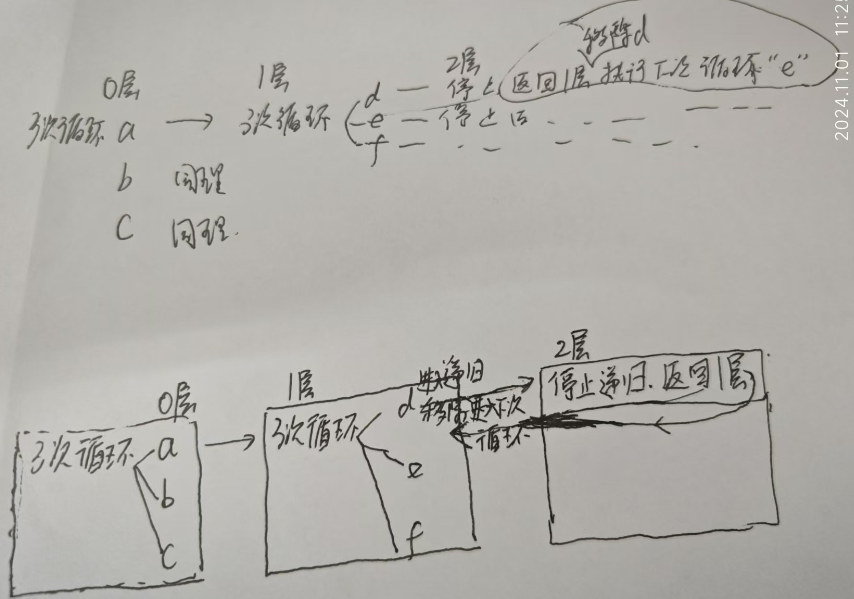

```C++
class Solution {
public:
    vector<string> letterCombinations(string digits) {
        if (digits.empty()) {
            return {};  // 如果输入为空，直接返回空结果
        }

        // 数字到字母的映射
        unordered_map<char, string> phoneMap = {
            {'2', "abc"}, {'3', "def"}, {'4', "ghi"}, {'5', "jkl"},
            {'6', "mno"}, {'7', "pqrs"}, {'8', "tuv"}, {'9', "wxyz"}
        };

        vector<string> combinations;  // 存储结果
        string currentCombination;  // 当前组合

        // 调用递归函数
        backtrack(combinations, phoneMap, digits, 0, currentCombination);
        return combinations;
    }

private:
    void backtrack(vector<string>& combinations,
                   const unordered_map<char, string>& phoneMap,
                   const string& digits, int index,
                   string& currentCombination) {
        // 结束条件：当组合长度达到输入数字长度时
        if (index == digits.size()) {
            combinations.push_back(currentCombination);  // 添加当前组合
            return;
        }

        // 取出当前数字对应的字母列表
        char digit = digits[index];
        const string& letters = phoneMap.at(digit);

        // 遍历当前数字对应的所有字母
        for (char letter : letters) {
            currentCombination.push_back(letter);  // 添加字母到当前组合
            backtrack(combinations, phoneMap, digits, index + 1, currentCombination);  // 递归
            currentCombination.pop_back();  // 回溯，移除最后一个字母
        }
    }
};
```

# 21合并两个升序链表

这道题是模版，以后这个合并的函数，可以用到其他难一点的题里面

新建一个节点，从两个链表里把小的接到空链表里去

```C++
class Solution {
public:
    ListNode* mergeTwoLists(ListNode* list1, ListNode* list2) {
        // 创建一个虚拟头节点
        ListNode* dummy = new ListNode(-1);
        ListNode* tail = dummy;

        // 使用两个指针 p 和 q 遍历 list1 和 list2
        ListNode* p = list1;
        ListNode* q = list2;

        // 合并两个链表
        while (p != NULL && q != NULL) {
            if (p->val <= q->val) {
                tail->next = p;
                p = p->next;
            } else {
                tail->next = q;
                q = q->next;
            }
            tail = tail->next;
        }

        // 将剩余部分直接接到合并链表的尾部
        if (p != NULL) {
            tail->next = p;
        }
        if (q != NULL) {
            tail->next = q;
        }

        // 返回合并后的链表头节点
        ListNode* ans = dummy->next;
        delete dummy;  // 释放虚拟头节点的内存
        return ans;
    }
};

```


# 22括号对生成

**什么是有效的括号组合？**

1. **左括号和右括号的数量相等**：必须有 `n` 个左括号和 `n` 个右括号。
2. **右括号不能在左括号前面**：即任何时候右括号的数量都不能超过左括号的数量。

**解题思路**

这个问题可以使用**回溯算法**（Backtracking）来解决。回溯算法是一种试探性的方法，适用于需要搜索所有可能解决方案的问题。

在这个问题中，我们需要构建所有可能的括号组合，并确保它们是有效的。有效性的关键在于：

1. **左括号的数量永远不超过 `n`**：因为我们只有 `n` 对括号。
2. **在任何时候，右括号的数量不超过左括号的数量**：因为右括号不能在没有匹配的左括号之前出现。

**总体思路**

- **递归构建括号组合**：从空字符串开始，每一步可以选择添加一个左括号 `'('` 或右括号 `')'`。

- 控制添加的条件：

  - **左括号**：只有当左括号的数量小于 `n` 时，才能添加左括号。
  - **右括号**：只有当右括号的数量小于左括号的数量时，才能添加右括号。

- **结束条件**：当生成的字符串长度等于 `2 * n` 时，表示我们已经用了 `n` 个左括号和 `n` 个右括号，构成了一个完整的组合，介入答案集合中。

- **参数解释**：

  - `result`：存储所有合法的括号组合。
  - `current`：当前构建的括号字符串。
  - `open`：当前已使用的左括号数量。
  - `close`：当前已使用的右括号数量。
  - `max`：括号对数，即 `n`

  1.**结束条件**：

  - 如果 `current.length() == max * 2`，表示我们已经用了 `n` 个左括号和 `n` 个右括号，构成了一个完整的括号组合。
  - 将 `current` 加入 `result`，然后返回。

  2.**递归构造**：

  - 尝试添加左括号

    ：

    - 如果 `open < max`，说明左括号数量还没达到 `n`，可以添加左括号。
    - 在 `current` 末尾添加 `'('`，`open + 1`，递归调用。
    - 递归调用结束后，`current.pop_back()` 撤销添加的左括号，进行回溯。

  - 尝试添加右括号

    ：

    - 如果 `close < open`，说明右括号数量小于左括号数量，可以添加右括号。
    - 在 `current` 末尾添加 `')'`，`close + 1`，递归调用。
    - 递归调用结束后，`current.pop_back()` 撤销添加的右括号，进行回溯。

  **回溯的作用**

  - 回溯的核心是**在尝试一个选择后，撤销该选择，尝试其他可能性**。
  - 在递归过程中，我们不断尝试添加左括号或右括号，并在每次递归结束后撤销上一次的选择，以便尝试新的组合。

```C++
#include <iostream>
#include <vector>
#include <string>

using namespace std;

class Solution {
public:
    vector<string> generateParenthesis(int n) {
        vector<string> result;  // 用于存储所有合法的括号组合
        string current;  // 当前构建的括号组合
        backtrack(result, current, 0, 0, n);  // 开始回溯
        return result;
    }

private:
    // backtrack 函数用于递归构建括号组合
    void backtrack(vector<string>& result, string& current, int open, int close, int max) {
        // 结束条件：如果当前字符串长度等于 2 * n，表示完成一个合法的括号组合
        if (current.length() == max * 2) {
            result.push_back(current);  // 将当前组合加入结果集
            return;
        }

        // 如果左括号数量小于 n，继续添加左括号
        if (open < max) {
            current.push_back('(');  // 选择添加一个左括号
            backtrack(result, current, open + 1, close, max);  // 递归调用，open + 1
            current.pop_back();  // 回溯，撤销选择
        }

        // 如果右括号数量小于左括号数量，继续添加右括号
        if (close < open) {
            current.push_back(')');  // 选择添加一个右括号
            backtrack(result, current, open, close + 1, max);  // 递归调用，close + 1
            current.pop_back();  // 回溯，撤销选择
        }
    }
};

```

# 23合并K个升序列表

`std::priority_queue`，这是一个默认实现为最大堆的数据结构。为了使 `priority_queue` 变成最小堆，我们需要自定义比较函数 `cmp`，让较小的元素排在堆的顶部。

```C++
方法1：使用优先队列（最小堆）STL 的

因为每个链表本身已经是排序的，所以我们可以利用优先队列（最小堆）来获取当前k个链表的最小头节点。
    //堆里的节点对应每个链表的头节点
解法思路

    1.将每个链表的头节点插入最小堆中。
    2.每次从堆中取出最小节点，并将该节点的 next 节点(这个节点就是新的头结点)（如果存在）插入堆中。
    3.重复此过程，直到堆为空。
    #include <queue>
#include <vector>

struct ListNode {
    int val;
    ListNode* next;
    ListNode(int x) : val(x), next(nullptr) {}
};

class Solution {
public:
    ListNode* mergeKLists(std::vector<ListNode*>& lists) {
        auto cmp = [](ListNode* a, ListNode* b) { return a->val > b->val; };
        std::priority_queue<ListNode*, std::vector<ListNode*>, decltype(cmp)> minHeap(cmp);

        // 将每个链表的头节点加入最小堆
        for (ListNode* list : lists) {
            if (list != nullptr) {
                minHeap.push(list);
            }
        }

        // 创建虚拟头节点，便于构建结果链表
        ListNode* dummy = new ListNode(-1);
        ListNode* tail = dummy;

        // 不断从堆中取出最小元素，构建合并链表
        while (!minHeap.empty()) {
            ListNode* minNode = minHeap.top();
            minHeap.pop();
            tail->next = minNode;
            tail = tail->next;

            if (minNode->next != nullptr) {
                minHeap.push(minNode->next);
            }
        }

        ListNode* ans = dummy->next;
        delete dummy;  // 释放虚拟头节点
        return ans;
    }
};
复杂度分析

    时间复杂度：O(N log k)，其中 N 是所有链表节点的总数，k 是链表的数量。每次插入和取出堆，堆都要调整的操作是 O(log k)，而总共需要 N 次操作。
    空间复杂度：O(k)，因为堆中最多会包含 k 个链表的节点。
    
    
    方法2：分治合并

可以使用分治的思想，将多个链表两两合并，逐步缩小规模，直到所有链表合并成一个。
解法思路

    1.递归地将链表分成两部分，分别合并，然后将合并的结果再合并。
    2.使用LeetCode 21题（合并两个排序链表）的解法来实现两两合并。
    class Solution {
public:
    ListNode* mergeKLists(std::vector<ListNode*>& lists) {
        if (lists.empty()) return nullptr;
        return mergeRange(lists, 0, lists.size() - 1);
    }

private:
    ListNode* mergeRange(std::vector<ListNode*>& lists, int left, int right) {
        if (left == right) return lists[left];
        int mid = left + (right - left) / 2;
        ListNode* l1 = mergeRange(lists, left, mid);
        ListNode* l2 = mergeRange(lists, mid + 1, right);
        return mergeTwoLists(l1, l2);
    }

    ListNode* mergeTwoLists(ListNode* list1, ListNode* list2) {
        ListNode dummy(-1);
        ListNode* tail = &dummy;
        while (list1 && list2) {
            if (list1->val < list2->val) {
                tail->next = list1;
                list1 = list1->next;
            } else {
                tail->next = list2;
                list2 = list2->next;
            }
            tail = tail->next;
        }
        tail->next = list1 ? list1 : list2;
        return dummy.next;
    }
};
复杂度分析

    时间复杂度：O(N log k)，N 是所有链表节点的总数，k 是链表的数量。每一轮合并的时间复杂度是 O(N)，而需要进行 log k 轮合并。
    空间复杂度：O(log k)，用于递归调用栈的空间。
```

# 31下一个排列


# N32.最长有效括号

# 33.二分查找升序旋转数组中查找

用二分查找，平常用的惯性思维 只能用来整个数组有序，而不是这种两部分结构

首先数组的构造  有两部分 [升序A，升序B]

用二分查找，left mid right ，  不管mid在何处 ，

 举个例子 :

比如mid在升序部分A 处  [升序A，升序B]   A划分成A1 A5

若target在左边升序A1部分，仍旧二分查找

若target在右边升序A2部分， 查找集合又是两部分了[升序A2，升序B] ，继续用二分查找

mid在升序部分B处同理

# 34.二分查找模板2


# 35.二分查找模板2

# 39.组合 求和 可重复  

和电话号码一样，

1.结果result是集合，每个元素记录可能结果，他是变长数组vector<vector<int>> result;

2.combination是变长数组临时存放当前组合结果，    vector<int> combination;

3.


# 40.组合求和 每个数字只能使用一次

下一次递归从下个字母开始i+1

#  42.接雨水


要理解这道题的关键在于，某个位置能接多少水取决于其左侧和右侧的最高柱子。具体来说：

- 对于位置 `i` 能接的水量 = `min(左边的最高高度, 右边的最高高度) - height[i]`
- 如果 `min(左边的最高高度, 右边的最高高度)` 大于 `height[i]`，说明当前位置可以接水，否则无法接水。（为什么不需要显式地判断Q2）

在计算 `leftMax` 和 `rightMax` 时，要包含当前位置的高度，因为当前高度是最高高度时，接水量为0

Q1:为什么左边最高高度从 `i = 1` 开始遍历？在计算 `leftMax` 数组时：`leftMax[0]` 直接等于 `height[0]`，因为第一个位置左边没有其他柱子，所以左边最高高度就是 `height[0]` 本身。

Q2:为什么不需要显式地判断Q2

1. 暴力解法

   leftMax, rightMax都包含了对自身取最大的操作，再怎么也是≥自己的

在暴力解法中，尽管没有显式判断 `min(leftMax, rightMax) > height[i]`，但 `totalWater += min(leftMax, rightMax) - height[i]` 这个操作自动过滤掉了不能接水的情况。如果 `min(leftMax, rightMax) <= height[i]`，结果会是 `0`，不会影响 `totalWater` 的计算。

2. 动态规划

   leftMax, rightMax都包含了对自身取最大的操作，再怎么也是≥自己的

在动态规划解法中，我们同样利用了 `totalWater += min(leftMax[i], rightMax[i]) - height[i]`。如果 `height[i]` 大于或等于 `min(leftMax[i], rightMax[i])`，这个计算结果是 `0`，不会影响最终的接水量。

3.


1.暴力解  对每个位置i  直接按解题思路单独求每个位置的{max左，max右，计算当前位置接水量}

**时间复杂度**：`O(n^2)`。每次都需要重新遍历找到左边和右边的最高柱子。

2.dp  

（空间换时间）用两个数组先记录每个位置的左边最高，

//bp思想：第i个位置的MAX左 = MAX{第i-1的MAX左和第i个位置的高度}

//bp思想：第i个位置的MAX右 = MAX{第i+1的MAX右和第i个位置的高度}

**左边最高柱子数组 `leftMax[i]`**：表示从位置 `0` 到 `i` 的最大高度。

**右边最高柱子数组 `rightMax[i]`**：表示从位置 `i` 到 `n-1` 的最大高度


然后遍历每个位置   查这两个数组 max左，max右 取绝对值

```C++
 //bp思想：第i个位置的MAX左 = MAX{第i-1的MAX左和第i个位置的高度}
 // 计算左边的最大高度数组
        leftMax[0] = height[0];
 for (int i = 1; i < n; i++) {
            leftMax[i] = max(leftMax[i - 1], height[i]);
        }

//bp思想：第i个位置的MAX右 = MAX{第i+1的MAX右和第i个位置的高度}
// 计算右边的最大高度数组
        rightMax[n - 1] = height[n - 1];
        for (int i = n - 2; i >= 0; i--) {
            rightMax[i] = max(rightMax[i + 1], height[i]);
        }
```

3.双指针 —-不理解死记硬背也可以

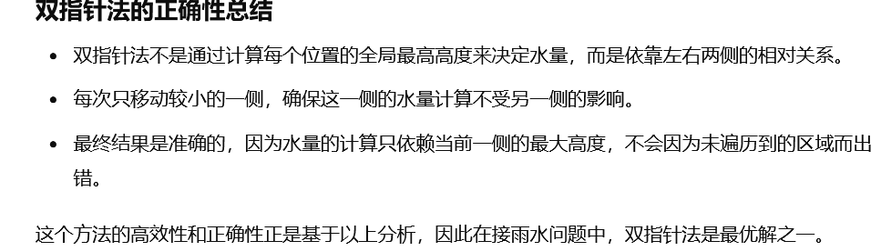

在双指针法中，我们使用两个指针 `left` 和 `right`，分别从数组的左右两端向中间移动。双指针的思想是：每次根据当前的 `leftMax` 和 `rightMax` 决定我们要移动哪个指针，从而逐步缩小问题的规模。

为什么能用双指针？

在计算每个位置可以接的水时，我们发现，每个位置的水量取决于该位置**左边的最高柱子**和**右边的最高柱子**。具体来说，当前位置能接的水量是 `min(左边最高柱子, 右边最高柱子) - 当前高度`。

**核心观察**：

- 如果

  左边的最高高度 `leftMax` 小于右边的最高高度 `rightMax`

  ，那么当前位置的接水量只取决于 leftMax，和右边的柱子无关。

  - 为什么？因为 `leftMax` 小于 `rightMax`，说明右边的柱子高度足够高，可以挡住右侧的水流，所以只需要关注左边的高度。

- 同理，如果 `rightMax` 小于 `leftMax`，那么当前接水量只取决于 `rightMax`。


1. **初始化**：
   - `left` 指针指向数组的最左边。
   - `right` 指针指向数组的最右边。
   - `leftMax` 和 `rightMax` 分别表示当前已知的从 `left` 和 `right` 方向上遇到的最高柱子高度。
2. **移动指针**：
   - 每次比较 leftMax 和 rightMax
     - 如果 `leftMax` 比 `rightMax` 小，则移动 `left` 指针，更新 `leftMax`。
     - 如果 `rightMax` 比 `leftMax` 小，则移动 `right` 指针，更新 `rightMax`。
   - 这样，每次移动时，我们可以计算出该位置的水量。
3. **计算水量**：
   - 如果 `leftMax` 比 `height[left]` 高，则 `left` 位置可以接到 `leftMax - height[left]` 的水。
   - 同理，如果 `rightMax` 比 `height[right]` 高，则 `right` 位置可以接到 `rightMax - height[right]` 的水。

```c++
class Solution {
public:
    int trap(vector<int>& height) {
        int left = 0, right = height.size() - 1;
        int leftMax = 0, rightMax = 0;
        int totalWater = 0;

        while (left < right) {
            //代码很对称
            if (height[left] < height[right]) {
                if (height[left] >= leftMax) {
                    leftMax = height[left];
                } else {
                    totalWater += leftMax - height[left];
                }
                left++;
            } else {
                if (height[right] >= rightMax) {
                    rightMax = height[right];
                } else {
                    totalWater += rightMax - height[right];
                }
                right--;
            }
        }
        
        return totalWater;
    }
};

```


# 45.跳跃连接–当前能到达的最远的位置时检查更新下次跳跃点

对于每个位置 `i`，我们遍历它能到达的下一个位置 `j`（从 `i+1` 到 `i + nums[i]`，j是当前能到达的最远的位置），  到达的最远的位置检查更新下次跳跃点

[2,3,1,1,1]

贪心思路：遍历数组 ：从nums[0]开始，你能到最远的位置下标0+nums[0]=2(计算到下标2–下次跳跃点为止，接下来计算从此次跳跃点到下次跳跃点之间有没有最远的，来寻找下下次跳跃点), 

接下来经过nums[1]，能到达最远的位置是1+nums[1]=4，

接下来经过nums[2]，能到达最远的位置是2+nums[2]=3,

此时到达下次跳跃点（当前能到达最远的位置）nums[2]，跳跃次数+1，至于下下跳跃点是这期间最远的也就是4

接下来经过nums[3]，能到达最远的位置是3+nums[3]=4，

接下来经过nums[4]，能到达最远的位置是4+nums[4]=5，

此时到达下次跳跃点nums[4]，跳跃次数+1，至于下下跳跃点是这期间最远的也就是5

```C++
class Solution {
public:
    int jump(vector<int>& nums) {
        int n = nums.size();
        if (n <= 1) return 0;

        int jumps = 0;      // 跳跃次数
        int currentEnd = 0; // 当前跳跃的边界
        int farthest = 0;   // 在当前跳跃范围内能到达的最远位置

        for (int i = 0; i < n - 1; i++) {
            farthest = max(farthest, i + nums[i]); // 更新最远能到达的位置

            // 当遍历到当前跳跃的边界时，更新边界并增加跳跃次数
            if (i == currentEnd) {
                jumps++;
                currentEnd = farthest;

                // 如果当前跳跃的边界已经到达或超过终点
                if (currentEnd >= n - 1) break;
            }
        }

        return jumps;
    }
};

```

贪心算法实现步骤

1. **定义选择标准**：每次在当前跳跃范围内选择能够跳到的最远位置。
2. **初始化状态**：
   - `jumps`：记录跳跃次数，初始值为 `0`。
   - `currentEnd`：当前跳跃的边界，初始值为 `0`。**到达这里（当前能到达的最远的位置）为止检查下次跳跃点**
   - `farthest`：能到达的最远位置，初始值为 `0`。
3. **循环执行贪心选择**：
   - 遍历数组中的每个位置 `i`，计算从当前位置跳跃能到达的最远位置 `farthest = max(farthest, i + nums[i])`。
   - 如果遍历到当前的跳跃边界（`i == currentEnd`），就需要增加一次跳跃次数，并更新新的跳跃边界 `currentEnd = farthest`。
4. **返回结果**：最终返回 `jumps`。


# 46.矩阵旋转

旋转90度=矩阵转置+每一行逆序（可reverse,因为二维数组每一行底层都是向量）

旋转180度=2次旋转90度

旋转270度=3次旋转90度  矩阵转置+每一列逆序（不可reverse,因为二维数组每一列底层不是向量）

矩阵转置 = 双重循环 swap(m[i] [j],m[j] [i]);

每一行逆序 =  一重循环  reverse(m[i].begin(),m[i].end());

每一列逆序 =  一重循环 +每列元素双指针交换

```C++
//每列元素双指针交换
for (int j = 0; j < n; j++) {
            int top = 0, bottom = n - 1;
            while (top < bottom) {
                swap(matrix[top][j], matrix[bottom][j]);
                top++;
                bottom--;
            }
        }
```

# 47.**字母异位词分组**

### 方法一：排序法

1. **排序字符**：将每个字符串按字母顺序排序后，相同字母异位词会变成相同的字符串。例如，`"eat"` 和 `"tea"` 排序后都变为 `"aet"`。
2. **哈希表存储**：将排序后的字符串作为键，将原字符串作为值存储在哈希表中，最终哈希表中相同键的字符串就是字母异位词。

```C++
//map如何一个键对应多个字符串：unordered_map<关键字类型, vector<string>>
unordered_map<string, vector<string>> anagramMap;
//刚好结果数组的每个元素是数组(vector<vector<string>> result;) 
//---map的pair.second类型也是数组，可以放多个字符串
//字符串数组遍历
for (string s : strs) 
//遍历map：
for (auto& pair : anagramMap)
//pair.first 和 pair.second 分别用于访问第一个和第二个值。

```

# 背48.连续子数组最大值

**动态规划法**

1. **定义状态**：

   - 令 `dp[i]` 表示以 `nums[i]` 结尾的最大子数组和。
   - 我们希望通过计算 `dp[i]` 得到数组中所有可能的子数组和，然后找到最大值。

2. **状态转移方程**：

   - 如果 `dp[i-1] > 0`，则 `dp[i] = dp[i-1] + nums[i]`，即前面的子数组和对当前元素有增益效果，可以构成一个更大的子数组和。
   - 如果 `dp[i-1] <= 0`，则 `dp[i] = nums[i]`，即前面的子数组和对当前元素没有增益效果，此时以 `nums[i]` 为新的开始。

3. **初始状态**：

   - `dp[0] = nums[0]`，因为只有一个元素时，最大子数组和就是该元素本身。

4. **结果**：

   - `max(dp[i])` 即为我们要的最大子数组和。

   Q:此时以 `nums[i]` 为新的开始。是什么意思？

   A:在 `dp[i] = max(nums[i], dp[i - 1] + nums[i])` 的公式中，**“以 `nums[i]` 为新的开始”** 是指：在计算位置 `i` 的最大子数组和时，我们选择直接使用当前的元素 `nums[i]`，而不包含前一个元素（或之前的子数组和）。

   具体来说，如果 `dp[i - 1] + nums[i] < nums[i]`，说明**前面的子数组和对当前的元素产生了负作用**，也就是说，加入前面的子数组会使总和变得更小。因此，我们此时选择舍弃前面的累积和，以 `nums[i]` 为新的起点，从当前元素重新开始计算子数组和。

```C++
#include <vector>
#include <algorithm>
using namespace std;

class Solution {
public:
    int maxSubArray(vector<int>& nums) {
        int n = nums.size();
        vector<int> dp(n);  // dp[i] 表示以 nums[i] 结尾的最大子数组和
        dp[0] = nums[0];    // 初始化 dp[0] 为第一个元素

        int maxSum = dp[0]; // 全局最大和，初始化为 dp[0]
        
        for (int i = 1; i < n; i++) {
            // 状态转移方程，隐含了对 dp[i-1] > 0 的判断
            dp[i] = max(nums[i], dp[i - 1] + nums[i]);
            // 更新全局最大和
            maxSum = max(maxSum, dp[i]);
        }

        return maxSum;
    }
};
```

**优化空间复杂度**

我们可以用一个变量代替 `dp` 数组，只记录当前子数组的最大和，这样可以将空间复杂度从 `O(n)` 优化到 `O(1)`。

只需要用currentsum 来表示dp[i]和dp[i-1]即可

currentSum = max(nums[i], currentSum + nums[i]);  // 更新当前子数组和

```C++
#include <vector>
#include <algorithm>
using namespace std;

class Solution {
public:
    int maxSubArray(vector<int>& nums) {
        int maxSum = nums[0];  // 全局最大和
        int currentSum = nums[0];  // 当前子数组的最大和

        for (int i = 1; i < nums.size(); i++) {
            currentSum = max(nums[i], currentSum + nums[i]);  // 更新当前子数组和
            maxSum = max(maxSum, currentSum);  // 更新全局最大和
        }

        return maxSum;
    }
};

```

# 55.跳跃游戏

## 每到一个位置i,检验之前的fathest>=i，满足才能检查是否要更新当前fathest>=i，不满足则说明前面所经过的数字能保证到达的最远距离不够，根本就走不到这里,i>fathest,没有继续走下去的必要了

`farthest` 表示能到达的最远位置(从头开水出发能到达的最远的下标)

Q是不是因为至少都前进一步，也就是说nums[i]>0,你才能这样遍历

A是的，**贪心算法的解法确实依赖于至少可以每次前进一步**，否则如果在某个位置停住了（即 `nums[i] == 0`），且我们当前的最远可达位置正好是这个位置，就无法继续前进了。因此，我们在遍历过程中需要确保当前位置 `i` 是可以达到的，否则说明路径被阻断。

不过，贪心算法可以处理数组中包含 `0` 的情况，但前提是**在遇到 `0` 的位置之前，我们的 `farthest` 必须已经超过这个位置**。也就是说，只要当前能跳跃的范围能覆盖整个数组中的 `0`，就可以安全通过；否则遇到 `0` 时就会被卡住，导致无法到达终点。

```C++

if (i > farthest) return false;  // 如果当前位置无法到达，返回 false            
//下面这句满足了i<=farthest
farthest = max(farthest, i + nums[i]);  // 更新最远位置
```

```C++
//代码写法1
#include <vector>
#include <algorithm>
using namespace std;

class Solution {
public:
    bool canJump(vector<int>& nums) {
        int farthest = 0;
        for (int i = 0; i < nums.size(); i++) {
            if (i > farthest) return false;  // 如果当前位置无法到达，返回 false
            farthest = max(farthest, i + nums[i]);  // 更新最远位置
        }
        return true;
    }
};

```


### 举例说明

以 `nums = [3, 2, 1, 0, 4]` 为例：

- `i = 0`：`farthest = max(0, 0 + 3) = 3`，最远可以到达位置 `3`。
- `i = 1`：`farthest = max(3, 1 + 2) = 3`，最远可以到达位置 `3`。
- `i = 2`：`farthest = max(3, 2 + 1) = 3`，最远可以到达位置 `3`。
- `i = 3`：`farthest = max(3, 3 + 0) = 3`，在位置 `3` 停住了，因为 `nums[3] = 0`。
- `i = 4`：`i > farthest`，说明位置 `4` 不可达，因此返回 `false`。


```C++
//代码写法2
class Solution {
public:
    bool canJump(vector<int>& nums) {
        int canreach = nums[0];
//这里循环条件显示的currPos <= canreach 才能接着循环 
        for (int currPos = 0; currPos <= canreach; currPos++) {
            if (canreach >= nums.size() - 1) return true;
            canreach = max(canreach, currPos + nums[currPos]);
        }

        return false;
    }
};

```

两种代码都行

# 56.合并区间

`std::sort` 在排序二维数组（或嵌套 `vector`）时，**默认会按照每个子数组的第一个元素进行升序排序**。

每次合并最终结果{left,right}   起始的时候等于第一个数组

遍历每个区间

后0<=前1 且 后1>前0 才能合并  更新rihht

否则不能合并，合并结束   ，将此次合并结果{left,right}加入result

遍历结束时，i=size-1;到达末尾  而你的left = intervals [i] [0];right = intervals[i] [1];

每次push_back只是把上次的合并结果加入，若此时循环结束，此时的left和right还未加入其中

所以还要在大循环外面加上merged.push_back({left,right});

```C++
//自己的解法
#include <vector>
#include <algorithm>
using namespace std;

class Solution {
public:
	vector<vector<int>> merge(vector<vector<int>>& intervals) {
		if (intervals.empty()) return {};

		// 1. 按照区间的起始位置进行排序
		sort(intervals.begin(), intervals.end());

		vector<vector<int>> merged;
		int left = intervals[0][0], right = intervals[0][1];//来记录每次合并的最终区间，直至不能合并，加入merged

		for (int i = 1; i < intervals.size(); i++) {
			if (intervals[i][0] <= intervals[i - 1][1]) {//[1,4][2,5] or [1,4][2,3] or[1,4][1,5] or [1,4][1,3] or[1,4] [4,5]
				// 有重叠，合并区间：更新结束位置
				if (intervals[i][1] > intervals[i - 1][1]) { //[1,4][2,5] or  [1,4][1,5]
					right = intervals[i][1];
				}
			}
			else {
				// 4. 无重叠，直接加入到结果数组//[1,4][5,6]

				merged.push_back({left,right});
				left = intervals[i][0];
				right = intervals[i][1];
			}
		}
        //循环结束后，将最后一个合并区间 {left, right} 加入结果数组。
		merged.push_back({left,right});
		return merged;
	}
};
```

### 循环结束后的几种情况

当 `for` 循环遍历完所有的区间时，会有以下几种情况需要处理：

#### 情况 1：最后一个区间未被合并且未加入结果集

在这种情况下，`for` 循环结束时的 `left` 和 `right` 代表的区间还没有加入 `merged` 结果集。例如：

- `intervals = [[1, 3], [4, 6], [8, 10]]`
- 在合并过程中，由于所有区间之间都没有重叠，循环结束时的 `left` 和 `right` 为 `[8, 10]`，该区间尚未加入 `merged`。

因此，最后需要将 `[left, right]`（即 `[8, 10]`）加入 `merged` 中。

#### 情况 2：最后一个区间已经被部分合并，但尚未加入结果集

这是最常见的情况，即最后一个区间或多个连续区间在循环过程中被合并成了一个大区间，但这个合并区间还没有被添加到 `merged` 结果集中。例如：

- `intervals = [[1, 3], [2, 6], [5, 10]]`
- 合并过程会得到一个大区间 `[1, 10]`，但 `for` 循环结束时，`[1, 10]` 还未加入 `merged`。

因此，循环结束后需要将 `[left, right]`（即 `[1, 10]`）加入到结果集中。

#### 情况 3：单一的区间被处理，但结果集中还未添加

如果 `intervals` 数组只有一个区间，比如 `[[1, 3]]`，或者最终合并成了一个区间，那么循环结束时 `left` 和 `right` 仍指向该区间。例如：

- `intervals = [[1, 3]]`
- 在这种情况下，循环结束后 `left` 和 `right` 仍然是 `[1, 3]`，这个区间需要在循环结束后加入 `merged`，以确保最终结果包含该区间。

### 总结

不论哪种情况，循环结束后都需要将最后一个合并区间 `[left, right]` 加入 `merged`。因此，通常在循环结束后添加 `merged.push_back({left, right});` 是保证结果完整性的必要步骤。

# 62.机器人格子不同路径数

二维数组m*n的grid, int m = grid.size();行数
        int n = grid[0].size();列数

#### 动态规划的核心思路

1. **定义状态**：

   - 用 `dp[i][j]` 表示从起点 `(0, 0)` 到达位置 `(i, j)` 的不同路径数量。

2. **状态转移方程**：

   - 机器人只能从上面 `(i-1, j)` 或左边 `(i, j-1)` 的位置到达 `(i, j)`，因此有： 

     ```
     dp[i][j]=dp[i−1][j]+dp[i][j−1]
     ```

     

3. **初始化**：

   - **第一行**和**第一列**的路径数量为 `1`，因为在这些位置机器人只能沿着网格边界单向移动。
   - 即，`dp[i][0] = 1` 和 `dp[0][j] = 1`，其中 `0 <= i < m` 和 `0 <= j < n`。

4. **最终结果**：

   - `dp[m-1][n-1]` 就是从起点到达右下角的总路径数。

// 学会创建一个 m x n 的 dp 二维数组，初始化所有元素为 1        vector<vector<int>> dp(m, vector<int>(n, 1));

# 63.格子最小路径和–只要把62的路径数改成路径和就行

1.定义状态2.写状态方程3.初始化0 0 开始递推 4.最终结果

#### 动态规划的核心思路

1. **定义状态**：

   - 用 `dp[i][j]` 表示从起点 `(0, 0)` 到达位置 `(i, j)` 的路径和。

2. **状态转移方程**：

   - 机器人只能从上面 `(i-1, j)` 或左边 `(i, j-1)` 的位置到达 `(i, j)`，因此有： 

     ```C++
     dp[i][j]=dp[i−1][j]+dp[i][j−1]+grid[i][j]
     ```

     

3. **初始化**：

   - **第一行**和**第一列**的路径数量为 `1`，因为在这些位置机器人只能沿着网格边界单向移动。

   - 即，

     ```C++
      // 初始化第一列
             for (int i = 1; i < m; i++) {
                 dp[i][0] = dp[i-1][0] + grid[i][0];
             }
             
             // 初始化第一行
             for (int j = 1; j < n; j++) {
                 dp[0][j] = dp[0][j-1] + grid[0][j];
             }
     ```

     

4. **最终结果**：

   - `dp[m-1][n-1]` 就是从起点到达右下角的最小路径和。

# 70.爬楼梯

1.定义状态2.写状态方程3.初始化0 0 开始递推 4.最终结果

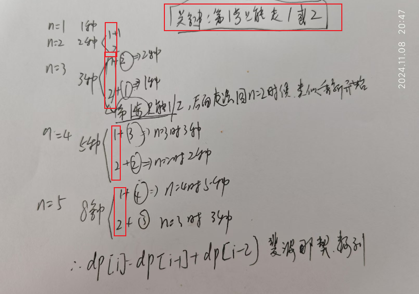

空间优化，代替dp数组

因为 `dp[i]` 只依赖于前两项 `dp[i-1]` 和 `dp[i-2]`，我们可以使用两个变量来替代 `dp` 数组，将空间复杂度优化为 `O(1)`。

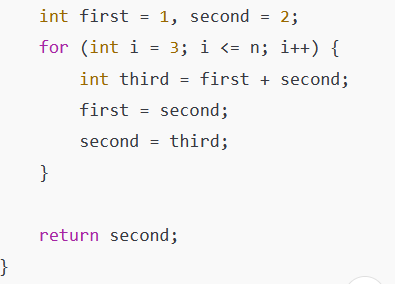

为什么return second 因为跳出循环的时候，第三个third越界了，所以最后是second

# **背72.编辑距离**

**`dp[i][j]` 表示的是一个状态**，即**从 `word1` 的前 `i` 个字符（即 `word1[0:i]`）转换为 `word2` 的前 `j` 个字符（即 `word2[0:j]`）**所需的最少操作次数。

#### 动态规划思路

1. **定义状态**：

   - 令 `dp[i][j]` 表示将 `word1[0:i]` 转换为 `word2[0:j]` 的最少操作数。
   - `i` 和 `j` 分别表示字符串 `word1` 和 `word2` 的前 `i` 和 `j` 个字符。

2. **状态转移方程**：

   - 如果 `word1[i-1] == word2[j-1]`，则 `dp[i][j] = dp[i-1][j-1]`，因为最后一个字符不需要修改。

   - 如果 

     ```
     word1[i-1] != word2[j-1]
     ```

     ，则我们可以进行以下三种操作，并选择其中最小的一个：

     1. **插入**：将 `word2[j-1]` 插入到 `word1[0:i]` 的末尾，使得 `word1[0:i]` 变成 `word2[0:j]`。此时需要 `dp[i][j-1] + 1` 步。
     2. **删除**：将 `word1[i-1]` 删除，此时需要 `dp[i-1][j] + 1` 步。
     3. **替换**：将 `word1[i-1]` 替换为 `word2[j-1]`，此时需要 `dp[i-1][j-1] + 1` 步。

   因此，有：

   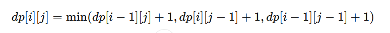

   

3. **初始状态**：

   - 当 `i=0` 时，即 `word1` 是空字符串，将 `word1` 变成 `word2[0:j]` 需要 `j` 次插入操作，所以 `dp[0][j] = j`。
   - 当 `j=0` 时，即 `word2` 是空字符串，将 `word1[0:i]` 变成空字符串需要 `i` 次删除操作，所以 `dp[i][0] = i`。

4. **结果**：最终答案为 `dp[m][n]`，其中 `m` 和 `n` 分别是 `word1` 和 `word2` 的长度。

找到状态转移方程的关键在于理解如何**将较小的子问题组合**，并**递归地构建更大的问题**。以下是找到这道题状态转移方程的具体步骤和思考过程：

### 1. 理解问题和子问题结构

我们要将字符串 `word1` 转换为 `word2`，并且可以进行以下操作：
- 插入一个字符
- 删除一个字符
- 替换一个字符

每个操作都有一个“代价”（操作次数为1），所以我们需要找到一种方法来**最小化这些操作次数**。

#### 定义子问题
为了使用动态规划，我们需要将问题划分为更小的子问题，这样我们可以递归地求解。假设我们已经解决了将 `word1[0:i-1]` 转换为 `word2[0:j-1]` 的最小操作数问题，然后尝试把它扩展到 `word1[0:i]` 和 `word2[0:j]`。

定义 `dp[i][j]` 表示将 `word1[0:i]` 转换为 `word2[0:j]` 的最小操作数。我们的目标是找到 `dp[m][n]`，其中 `m` 和 `n` 分别是 `word1` 和 `word2` 的长度。

### 2. 寻找递推关系

#### 最后一字符的影响

在 `dp[i][j]` 的问题中，`word1[0:i]` 和 `word2[0:j]` 的**最后一个字符的匹配情况**决定了所需的操作：
- 如果 `word1[i-1] == word2[j-1]`（相等），那么不需要额外操作，我们可以直接复用 `dp[i-1][j-1]` 的结果。
  - 即 `dp[i][j] = dp[i-1][j-1]`
- 如果 `word1[i-1] != word2[j-1]`（不相等），则有三种可能的操作，我们可以从中选择最小的：
  1. **插入**：假设我们插入 `word2[j-1]`，这样 `word1[0:i]` 只需要和 `word2[0:j-1]` 对齐即可，所需操作数为 `dp[i][j-1] + 1`。
  2. **删除**：假设我们删除 `word1[i-1]`，那么只需要把 `word1[0:i-1]` 和 `word2[0:j]` 对齐即可，所需操作数为 `dp[i-1][j] + 1`。
  3. **替换**：假设我们将 `word1[i-1]` 替换成 `word2[j-1]`，那么 `word1[0:i-1]` 和 `word2[0:j-1]` 已经对齐，只需要加一次替换操作，所需操作数为 `dp[i-1][j-1] + 1`。

#### 综合以上三种情况，得到递推公式：
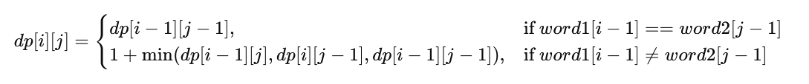

### 3. 初始条件

- 当 `i=0` 时，即 `word1` 是空字符串，将 `word1` 转化为 `word2[0:j]` 需要 `j` 次插入操作：`dp[0][j] = j`
- 当 `j=0` 时，即 `word2` 是空字符串，将 `word1[0:i]` 变为空字符串需要 `i` 次删除操作：`dp[i][0] = i`

### 4. 最终结果

`dp[m][n]` 即为 `word1` 转换为 `word2` 的最小操作数。

### 完整的状态转移公式

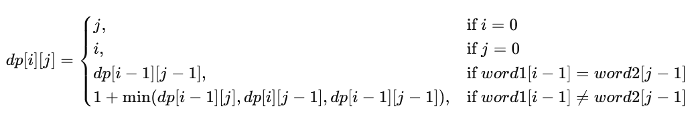

### 总结

找到这个状态转移方程的思路是：
1. 将问题划分为更小的子问题：即 `dp[i][j]` 表示部分字符串的最优解。
2. 考虑当前状态与之前状态的关系：即如何从 `dp[i-1][j]`、`dp[i][j-1]`、`dp[i-1][j-1]` 推导出 `dp[i][j]`。
3. 考虑特殊情况和初始条件：比如空字符串的情况。
4. 通过字符是否相等确定操作的成本并设计递推公式。

```c++
#include <vector>
#include <string>
#include <algorithm>
using namespace std;

class Solution {
public:
    int minDistance(string word1, string word2) {
        int m = word1.size(), n = word2.size();
        
        // 创建 dp 数组，并初始化为 0
        //为什么长度都要+1
//在这道题中，我们将 dp 数组的长度设置为 m + 1 和 n + 1，这是为了方便处理空字符串的情况。
        vector<vector<int>> dp(m + 1, vector<int>(n + 1, 0));
        
        // 初始化边界条件
        for (int i = 1; i <= m; i++) dp[i][0] = i; // word2 为空字符串
        for (int j = 1; j <= n; j++) dp[0][j] = j; // word1 为空字符串
        
        // 填充 dp 数组
        for (int i = 1; i <= m; i++) {
            for (int j = 1; j <= n; j++) {
                if (word1[i - 1] == word2[j - 1]) {
                    dp[i][j] = dp[i - 1][j - 1]; // 字符相等，无需操作
                } else {
                    dp[i][j] = min({dp[i - 1][j] + 1, dp[i][j - 1] + 1, dp[i - 1][j - 1] + 1});
                }
            }
        }
        
        // 返回最终编辑距离
        return dp[m][n];
    }
};

```


# 75 .颜色分类

#### 解题思路

**方法一：  **

本题可以用 **双指针** 方法来实现，使用三个指针 `left`、`i` 和 `right` 进行操作。

1. **指针的作用**：
   - `left` 指向数组中下一个应该放 0 的位置。
   - `right` 指向数组中下一个应该放 2 的位置。
   - `i` 用来遍历数组。
2. **操作过程**：
   - 当 `i` 指向的元素为 0 时，将其与 `left` 指针指向的元素交换，然后 `left` 和 `i` 同时右移。
   - 当 `i` 指向的元素为 2 时，将其与 `right` 指针指向的元素交换，然后 `right` 左移，而 `i` 不变（因为交换后的元素还需检查）。
   - 当 `i` 指向的元素为 1 时，仅将 `i` 右移。
3. **停止条件**：
   - 当 `i` 超过 `right` 时，说明数组已经按 0、1、2 排序完毕。

**方法二：  **

1. 遍历数组，统计每种颜色（0、1、2）的个数。
2. 根据计数结果，重新在数组中填充 0、1 和 2 的数量，从而完成排序。

**方法三：**

**第一次遍历**：将所有的 0 移动到数组的左边，并更新 `l` 来指向下一个要放 0 的位置。

**第二次遍历**：从上一个循环结束的位置（`l`）继续遍历，将 1 移动到数组的中间位置，同时更新 `l` 来指向下一个要放 1 的位置。

**结果**：所有的 0 会在数组最左边，1 在中间，2 自动留在右边

# 76.最小覆盖子串-map记录字符出现次数（个数），滑动窗口

滑动窗口来统计窗口里的字符出现次数是不是满足1.包含，2.最小  

双指针向右移动   不断移动  放大窗口  找到所有满足的，同时确保最小

难点：

**1.用了两个map，来分别记录1.目标串所有字符出现的次数2.当前滑动窗口里的字符出现次数**

**2.用start 来记录返回串的起始位置，minlen记录最小串长度初始值>t.size即可，conut记录滑动窗口中已经覆盖了目标串字母的个数（可重复）**

**3.使用滑动窗口处理，right在动用来遍历处理匹配串的每个字符  left只是用来计算minlen**

**4.滑动窗口里每个字符处理过程是个难点：①当前字符出现次数+1，然后判断若是目标串t的一员，且他在滑动窗口出现次数<=目标串中出现次数 count+1 ②检查滑动窗口是否已经满足，若满足更新minlen和start，同时检查left所指字符出现次数 恰好等于 t串字符次数，若等于则窗口map windows种该字符出现次数减一 ，（因为要缩小滑动窗口，左移left找一个更短的了）,，最后左移left，-1**

**5.right检查完最后一个字符，遍历结束，返回结果①若没有找到，minlen肯定是>t.size，返回空串  ②若找到，返回最小覆盖子串s.substr(start, min_len) **


对应代码

**1.用了两个map   window    t_freq  ，来分别记录1.目标串所有字符出现的次数 window[c]2.当前滑动窗口里的字符出现次数  t_freq[c]**

  

**2.用start 来记录返回串的起始位置，minlen记录最小串长度，**三目运算符 return 条件？条件满足时返回值 ：条件不满足是返回值

**return min_len > s.size() ? "" : s.substr(start, min_len);**

**3.使用滑动窗口处理，right在动用来遍历处理匹配串的每个字符  left只是用来计算minlen**
    for (int right = 0; right < s.size(); right++) {
        char c = s[right];

**4.滑动窗口里每个字符处理过程是个难点：①判断若是目标串t的一员，当前字符出现次数+1,且他在滑动窗口出现次数<=目标串中出现次数 count+1 ②检查滑动窗口是否已经满足，若满足更新minlen和start，同时检查left所指字符出现次数 恰好等于 t串字符次数，若等于则窗口map windows种该字符出现次数减一 ，（因为要缩小滑动窗口，左移left找一个更短的了）,，最后左移left，-1**

**5.right检查完最后一个字符，遍历结束，返回结果①若没有找到，minlen肯定是>t.size，返回空串  ②若找到，返回最小覆盖子串s.substr(start, min_len) **


****


```c++
#include <string>
#include <unordered_map>
using namespace std;

string minWindow(string s, string t) {
    unordered_map<char, int> t_freq, window;
    for (char c : t) t_freq[c]++;  // 统计 t 中的字符频率
    
    int left = 0, min_len = s.size() + 1, start = 0, count = 0;

        if (t_freq[c] > 0) {  // 只处理 t 中的字符
            window[c]++;
            if (window[c] <= t_freq[c]) count++;
        }

        while (count == t.size()) {  // 满足条件时收缩窗口
            if (right - left + 1 < min_len) {
                min_len = right - left + 1;
                start = left;
            }
            if (t_freq[s[left]] > 0) {  // 更新窗口内字符计数
                if (window[s[left]] == t_freq[s[left]]) count--;
                window[s[left]]--;
            }
            left++;
        }
    }

    return min_len > s.size() ? "" : s.substr(start, min_len);
}

```

字符串处理中，`substr(起始下标，长度)` 常用于：

1. **截取子串**：如提取特定位置的单词或短语。  str.substr(起始下标，长度)
2. **实现分割操作**：在切分字符串时可以结合 `find` 使用 `substr` 提取单词或符号


您的理解非常准确，并且逻辑清晰。让我为您逐点确认和补充细节，以确保理解完整无误：

1. **两个 `map` 的使用**：
   - **`t_freq`**：用于记录目标字符串 `t` 中每个字符的出现次数，这样可以知道我们需要的每个字符的数量。
   - **`window`**：用于记录当前滑动窗口中每个字符的出现次数，以便判断窗口是否满足包含 `t` 所有字符的条件。

2. **辅助变量**：
   - **`start`**：记录最小覆盖子串的起始位置，以便在找到最小子串时提取结果。
   - **`min_len`**：用于记录找到的最小子串长度，初始化为比 `t` 的长度更大的值，这样可以确保一旦找到符合条件的子串，`min_len` 会被更新。
   - **`count`**：记录滑动窗口中满足目标字符要求的字符个数。通过判断 `count` 是否达到 `t` 的长度（即 `count == t.size()`），来确定窗口是否已经完全覆盖 `t`。

3. **滑动窗口处理**：
   - **右指针 `right`**：用于遍历字符串 `s`，扩展窗口的右边界。
   - **左指针 `left`**：当窗口满足条件后，用于收缩窗口的左边界以寻找更小的覆盖子串。

4. **滑动窗口中字符的处理**：
   - **①**：每次右移 `right` 时，向窗口添加一个字符 `s[right]`：
     - 更新 `window` 中该字符的出现次数。
     - 如果该字符在 `t` 中且当前窗口中该字符的数量不超过 `t` 的需求（即 `window[c] <= t_freq[c]`），则 `count++`。
   - **②**：检查窗口是否满足条件，即 `count == t.size()`：
     - 如果满足条件，检查当前窗口的长度是否小于 `min_len`，若是则更新 `min_len` 和 `start`。
     - 然后，尝试收缩窗口，通过移动 `left` 来排除左端字符 `s[left]`，并在 `window` 中减少该字符的计数。
     - 如果 `s[left]` 是 `t` 中的字符且在窗口中出现次数恰好满足 `t` 的需求（即 `window[s[left]] == t_freq[s[left]]`），则减少 `count`，因为收缩窗口后不再满足该字符的需求。

5. **结束条件与返回结果**：
   - 当遍历结束时，如果没有找到符合条件的子串，则 `min_len` 会保持初始化值，返回空串 `""`。
   - 否则，返回最小覆盖子串 `s.substr(start, min_len)`。

---

您的理解已经覆盖了算法的核心逻辑，尤其是对 `count` 增加和 `left` 移动的条件把握得非常准确。您对滑动窗口的逻辑及收缩窗口的细节掌握得很好！

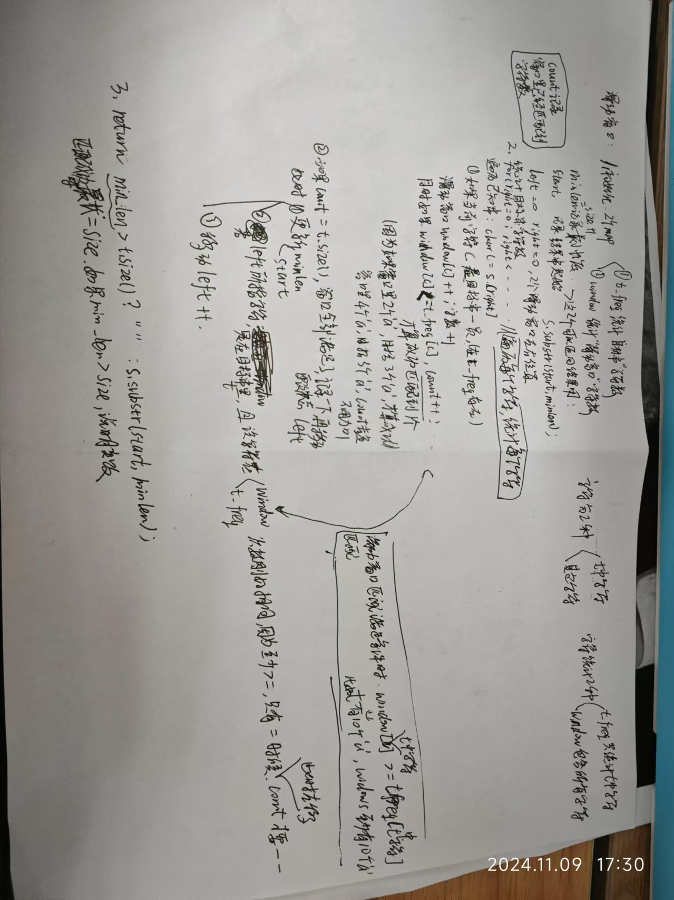

# 78.求集合的所有子集

经典回溯，这里还不能重复，所以参数要包括i，i=start  

```C++
#include <vector>
using namespace std;

class Solution {
public:
    vector<vector<int>> subsets(vector<int>& nums) {
        vector<vector<int>> result;
        vector<int> current;
        backtrack(nums, 0, current, result);
        return result;
    }
    
    void backtrack(vector<int>& nums, int start, vector<int>& current, vector<vector<int>>& result) {
        result.push_back(current);
        for (int i = start; i < nums.size(); i++) {
            current.push_back(nums[i]);
            backtrack(nums, i + 1, current, result);
            current.pop_back();
        }
    }
};

```


# 79.单词搜索

遍历矩阵每个元素，对每个元素上下左右深度遍历dfs走下一步(对于每个元素而言)，探寻所有可能，一旦不满足条件，提前返回上一层，只要求返回 true/false ，这道题

好的，让我们逐行用中文详细解释这段代码的逻辑。我们将从代码结构和每个函数的作用入手，详细介绍每一行的作用。

```cpp
#include <vector>
#include <string>
using namespace std;

class Solution {
public:
    bool exist(vector<vector<char>>& board, string word) {
        int m = board.size(), n = board[0].size();
        
        for (int i = 0; i < m; i++) {
            for (int j = 0; j < n; j++) {
                if (dfs(board, word, i, j, 0)) return true;
            }
        }
        return false;
    }
```

### 1. `exist` 函数

#### 功能概述

`exist` 函数是搜索的主函数，负责在整个二维网格中查找是否存在指定的单词 `word`。它通过遍历每一个起始位置 `(i, j)` 来尝试找到单词的第一个字符，并从该点开始进行深度优先搜索。

#### 代码详解

1. **`int m = board.size(), n = board[0].size();`**：
   - 获取网格 `board` 的行数 `m` 和列数 `n`，以便在遍历和递归时避免越界。

2. **双重 `for` 循环：`for (int i = 0; i < m; i++) { for (int j = 0; j < n; j++) {`**
   - 遍历 `board` 的每一个位置 `(i, j)`，作为搜索单词 `word` 的起始位置。
   - 外层循环遍历行 `i`，内层循环遍历列 `j`。

3. **`if (dfs(board, word, i, j, 0)) return true;`**
   - 调用 `dfs` 函数从当前位置 `(i, j)` 开始搜索单词的第一个字符 `word[0]`。
   - 如果从当前位置 `(i, j)` 成功找到整个单词 `word`，返回 `true`，表示单词存在于网格中。

4. **`return false;`**
   - 如果遍历完所有位置都无法找到单词，返回 `false`。

---

```cpp
private:
    bool dfs(vector<vector<char>>& board, const string& word, int i, int j, int index) {
        if (index == word.size()) return true; // 找到单词
        if (i < 0 || i >= board.size() || j < 0 || j >= board[0].size() || board[i][j] != word[index]) return false;
```

### 2. `dfs` 函数

#### 功能概述

`dfs` 函数是一个递归函数，用于在二维网格中查找单词的每一个字符。每次递归调用会查找单词的一个字符，同时尝试向上、向下、向左、向右四个方向移动，逐步查找剩余字符。

#### 代码详解

1. **`if (index == word.size()) return true;`**
   - 检查 `index` 是否等于 `word.size()`，即当前已找到 `word` 的全部字符。
   - 如果 `index` 等于 `word.size()`，表示成功找到整个单词，返回 `true`。

2. **`if (i < 0 || i >= board.size() || j < 0 || j >= board[0].size() || board[i][j] != word[index]) return false;`**
   - 检查边界条件：
     - 如果 `i` 或 `j` 越界（即超出 `board` 的行列范围），返回 `false`，表示该路径无效。
   - 检查字符是否匹配：
     - 如果 `board[i][j]` 不等于 `word[index]`，说明当前位置的字符不匹配，返回 `false`。

---

```cpp
        char temp = board[i][j];
        board[i][j] = '*';  // 标记为已访问
```

3. **访问标记**

- **`char temp = board[i][j];`**：
  - 保存当前格子的字符 `board[i][j]`，以便后续回溯时恢复原始字符。
  
- **`board[i][j] = '*';`**：
  - 将当前格子标记为已访问，使用 `'*'` 表示。这样可以避免在递归中重复访问同一格子，形成环路。

---

```cpp
        bool found = dfs(board, word, i + 1, j, index + 1) ||
                     dfs(board, word, i - 1, j, index + 1) ||
                     dfs(board, word, i, j + 1, index + 1) ||
                     dfs(board, word, i, j - 1, index + 1);
```

4. **四个方向递归调用**

- **`bool found = dfs(board, word, i + 1, j, index + 1) || ...`**：
  - 尝试从当前格子 `(i, j)` 向四个方向进行递归搜索。
  - **递归参数解释**：
    - `i + 1, j`：向下搜索。
    - `i - 1, j`：向上搜索。
    - `i, j + 1`：向右搜索。
    - `i, j - 1`：向左搜索。
    - `index + 1`：每次递归 `index` 增加 1，表示匹配 `word` 的下一个字符。
  - **`bool found`**：只要四个方向中的任意一个找到完整单词 `word`，`found` 就为 `true`。

---

```cpp
        board[i][j] = temp; // 恢复当前状态
        return found;
    }
};
```

5. **回溯和返回结果**

- **`board[i][j] = temp;`**：
  - 恢复当前格子的字符状态，将其改回 `temp`。这是典型的回溯操作，确保当前格子的状态不会影响后续其他路径的搜索。
  
- **`return found;`**：
  - 返回 `found` 的值。如果找到单词，返回 `true`，否则返回 `false`。

---

### 总结

- `exist` 函数遍历整个网格，尝试每个格子作为起始点。
- `dfs` 函数递归查找单词的每一个字符，处理越界和不匹配的情况。
- 标记已访问的格子，使用回溯恢复状态，以便不同路径共享网格。
- 若找到单词则返回 `true`，否则返回 `false`。


在这段代码中，恢复状态时没有使用 `pop`，是因为我们没有使用数据结构（如 `vector`）来存储路径或选择序列，而是直接在二维网格 `board` 上修改字符来标记已访问的单元格。

## 为什么不需要 `pop`

在一些回溯算法中，例如生成子集或排列，我们通常会：

- **使用 `push_back`**：在路径中添加当前选择的元素。
- **递归调用**：继续探索下一层。
- **使用 `pop_back`**：在回溯时撤销选择，恢复路径状态。

这种方式需要一个数据结构（如 `vector`）来记录当前路径，以便在回溯时进行状态恢复。

然而，在这道 **LeetCode 79. 单词搜索** 的题目中：

- **不需要记录路径序列**：我们只需要检查从某个起始点出发，能否通过相邻单元格匹配整个单词。
- **状态标记在 `board` 上完成**：通过修改 `board` 中的字符，标记哪些单元格已被访问，防止重复使用。

### 状态标记和恢复的方法

```cpp
char temp = board[i][j];
board[i][j] = '*';  // 标记为已访问

// 递归调用，尝试四个方向
bool found = dfs(board, word, i + 1, j, index + 1) ||
             dfs(board, word, i - 1, j, index + 1) ||
             dfs(board, word, i, j + 1, index + 1) ||
             dfs(board, word, i, j - 1, index + 1);

board[i][j] = temp; // 恢复当前状态
```

- **标记已访问**：
  - **保存当前字符**：`char temp = board[i][j];`，以便后续恢复。
  - **标记为已访问**：`board[i][j] = '*';`，使用特殊字符表示该单元格已被访问。

- **递归搜索**：
  - 尝试从当前单元格的上下左右四个方向继续搜索下一个字符。
  - 不需要记录路径，只需确保不重复访问同一个单元格。

- **恢复状态**：
  - **恢复原始字符**：`board[i][j] = temp;`，将单元格的值还原，供其他路径使用。

### 为什么不需要 `pop`

- **没有使用额外的路径数据结构**：我们没有 `vector` 或 `stack` 来存储访问过的单元格或字符序列，因此不需要 `push` 或 `pop`。
- **状态通过修改 `board` 实现**：我们直接在 `board` 上进行标记和恢复，所有的信息都保存在网格中。
- **目的不同**：`pop` 通常用于撤销对路径或序列的修改，而在这里，我们只需要恢复单元格的状态即可。

### 对比使用 `push` 和 `pop` 的回溯

在需要记录路径的回溯算法中，例如生成所有的排列或组合，我们会：

- **使用 `push_back`**：将选择的元素加入当前路径。
- **递归调用**：继续探索。
- **使用 `pop_back`**：在回溯时撤销选择，恢复路径。

示例：

```cpp
void backtrack(vector<int>& nums, vector<int>& path) {
    // 满足条件时，处理结果
    if (满足条件) {
        result.push_back(path);
        return;
    }
    for (int i = 起始位置; i < nums.size(); i++) {
        path.push_back(nums[i]);     // 做选择
        backtrack(nums, path);       // 递归
        path.pop_back();             // 撤销选择
    }
}
```

在这种情况下，`pop_back` 非常重要，用于在递归返回时恢复路径状态。

### 总结

在 **LeetCode 79. 单词搜索** 中：

- **不需要记录路径序列**：只需知道单词是否存在。
- **状态管理通过修改和恢复 `board` 上的字符完成**。
- **不需要 `pop` 操作**：因为没有使用额外的数据结构来存储路径。

希望这个解释能帮助您理解为什么这里没有 `pop` 操作。如果您还有其他疑问，欢迎继续提问！


## 为什么不需要 `for` 循环

通常，在**回溯算法**中使用 `for` 循环是因为每一层递归都需要对多个选择（如不同元素或位置）进行尝试。例如，在排列或组合问题中，每层递归都会尝试选择不同的元素加入到当前路径，这就需要一个 `for` 循环来遍历每个可能的选择。

而在这道题中，**单词搜索的递归结构更像是一个二叉递归树，而非需要遍历选择的组合问题**。每个单元格的下一步选择始终只有上下左右四个方向，因此不需要 `for` 循环。

在这道 **LeetCode 79. 单词搜索** 中，`dfs` 函数没有使用 `for` 循环，因为每次递归调用中，我们只需要探索当前位置的上下左右四个固定方向，而不需要遍历所有元素。因此，我们直接在 `dfs` 函数中使用四次递归调用来探索四个方向，而不是通过 `for` 循环来遍历可能的选择。

### 代码的结构

在这段代码中，每一层递归直接调用四次 `dfs`，分别代表上下左右四个方向：

```cpp
bool found = dfs(board, word, i + 1, j, index + 1) ||  // 向下
             dfs(board, word, i - 1, j, index + 1) ||  // 向上
             dfs(board, word, i, j + 1, index + 1) ||  // 向右
             dfs(board, word, i, j - 1, index + 1);    // 向左
```

在这个递归结构中，每一层的选择总是固定的四个方向，而不是一个不确定的集合。

### 什么情况需要 `for` 循环？

`for` 循环通常在回溯中用于以下情况：

1. **遍历多个选择**：在排列或组合问题中，每层递归都需要从剩余元素中选择一个元素，`for` 循环用于遍历这些可选的元素。
2. **动态选择集合**：有些问题的可选集合会随递归层数变化。例如，在排列问题中，每层的可选元素取决于当前已选择的元素。

例如，生成子集的代码结构：

```cpp
void backtrack(vector<int>& nums, int start, vector<int>& path) {
    for (int i = start; i < nums.size(); i++) {
        path.push_back(nums[i]);   // 做选择
        backtrack(nums, i + 1, path);  // 递归
        path.pop_back();           // 撤销选择
    }
}
```

在这种情况中，`for` 循环用于尝试不同的元素。

### 单词搜索为什么不需要 `for` 循环？

在单词搜索中，每一层的选择始终是固定的四个方向，我们只需递归调用 `dfs` 四次来探索这四个方向，而不需要动态选择集合。这样可以使代码更加简单和直接：

- **没有多种元素需要遍历**，只有固定的上下左右四个方向。
- **避免了重复访问**：通过将访问过的格子标记为 `'*'`，确保不会重复访问。

### 总结

- **固定方向递归**：单词搜索中每次递归只需探索上下左右四个方向，因此不需要 `for` 循环来遍历选择。
- **选择有限**：由于选择总是四个方向，不需要 `for` 循环动态选择。
- **代码简化**：直接调用四次递归即可，简化了代码结构。

希望这能帮助您理解为什么 `dfs` 中没有 `for` 循环。如果还有疑问，欢迎继续提问！

## 代码如何实现防止重复访问

其中 **`board[i][j] != word[index]`** 起到了过滤访问过的单元格的作用：

- 当某个单元格被标记为 `'*'` 时，即使我们再次访问到这个单元格，由于 `'*'` 不等于任何 `word` 中的字符，这条路径会被立即剪枝，不再继续向下搜索。


# 84.最大矩形面积–单调栈，递增栈，下一个更小的下标是栈顶

在柱状图中，要找到能够形成的最大矩形面积，需要对于每个柱子，确定其能够延伸的最大宽度。这就要求我们找到：

- **左边第一个小于当前柱子的柱子（左边界）**
- **右边第一个小于当前柱子的柱子（右边界）**

只有知道了左右边界，才能计算以当前柱子高度为高的最大矩形面积。

对于每个元素而言，计算他做高的矩形面积，往两边覆盖延伸，此时，宽就等于他左边和右边第一个比他矮的柱子下标相减再减去1，

**单调递增栈确保里面的高度递增，当前元素i高度<栈顶元素高度时，可以计算一个矩形面积，要循环检查，！！！因为他的高度也可能＜栈顶的后面其他元素！！！，（每计算完一次栈顶，弹出栈顶，检查当前元素i高度<栈顶元素高度），直至检查当前元素i高度>=栈顶元素高度，此时加入栈顶，继续遍历下一个元素**

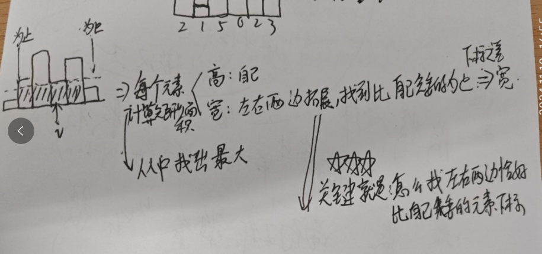

### 解题思路

为了求解每个柱子能够形成的最大矩形面积，我们可以使用**单调栈**，具体过程如下：

1. **单调递增栈**：
   - 我们使用一个单调递增栈，存储柱子的索引。
   - 栈中的元素对应的柱子高度从栈底到栈顶**依次递增**。
   
2. **确定每个柱子的左右边界**：
   - 当遇到一个高度比栈顶柱子小的柱子时，
   - 栈顶柱子右侧的第一个较小柱子就是当前柱子——**在数组中下标  i**，
   - 而栈顶柱子左侧的第一个较小柱子是栈中下一个柱子———**在栈中下标 top-1**。
   - 因此，当遇到比栈顶柱子小的柱子时，可以弹出栈顶并计算以其为高度的矩形面积。
   
3. **增加哨兵元素**：
   - 为了便于处理边界情况，我们在 `heights` 的开头和结尾都添加高度为 `0` 的哨兵柱子，以保证每个柱子都能被计算。

---

### 实现代码

```cpp
#include <vector>
#include <stack>
#include <algorithm>
using namespace std;

class Solution {
public:
    int largestRectangleArea(vector<int>& heights) {
        // 在 heights 开头和结尾添加哨兵
        heights.insert(heights.begin(), 0);
        heights.push_back(0);

        int maxArea = 0;
        stack<int> s;  // 存储柱子的索引

        for (int i = 0; i < heights.size(); ++i) {
            // 当前柱子高度小于栈顶柱子高度，开始计算栈顶柱子的最大矩形面积
            while (!s.empty() && heights[i] < heights[s.top()]) {
                int h = heights[s.top()];
                s.pop();
                int w = i - s.top() - 1;  // 宽度为当前索引到栈中下一个元素的距离
                maxArea = max(maxArea, h * w);
            }
            s.push(i);  // 将当前柱子入栈
        }

        return maxArea;
    }
};
```

---

### 代码解释

1. **哨兵处理**：
   - `heights.insert(heights.begin(), 0)` 和 `heights.push_back(0)` 分别在 `heights` 的开头和结尾插入高度为 `0` 的哨兵，以处理边界柱子的情况。

2. **栈的操作**：
   - 使用单调递增栈，栈中元素的高度始终递增。
   - 当遇到一个柱子高度小于栈顶柱子的高度时，弹出栈顶柱子，并计算以该柱子为高度的矩形面积。

3. **面积计算**：
   - `int h = heights[s.top()]` 获取栈顶柱子的高度。
   - `s.pop()` 弹出栈顶柱子。
   - `int w = i - s.top() - 1` 计算栈顶柱子可以扩展的宽度，宽度为当前柱子索引到新的栈顶柱子索引的距离减 `1`。
   - 通过 `h * w` 得到以该柱子为高度的最大矩形面积，更新 `maxArea`。

4. **返回最大面积**：
   - 遍历完成后，`maxArea` 即为柱状图中可以形成的最大矩形面积。


---

### 复杂度分析

- **时间复杂度**：`O(n)`，因为每个柱子最多入栈和出栈一次。
- **空间复杂度**：`O(n)`，栈的最大空间为 `O(n)`。

使用单调栈方法可以高效求解柱状图中最大的矩形面积，适用于处理大规模数据。

### 举例说明

假设 `heights = [2, 1, 5, 6, 2, 3]`。

#### 使用单调递增栈的过程

1. **初始化**：`heights = [0, 2, 1, 5, 6, 2, 3, 0]`，栈 `s = []`，最大面积 `maxArea = 0`。

2. **遍历索引 `i = 0`**：
   - 高度 `0`，栈为空，入栈 `s = [0]`。

3. **遍历索引 `i = 1`**：
   - 高度 `2`，`2 >= heights[s.top()] (0)`，入栈 `s = [0, 1]`。

4. **遍历索引 `i = 2`**：
   - 高度 `1`，`1 < heights[s.top()] (2)`，开始弹栈：
     - 弹出 `1`，计算面积 `h = 2`，`w = 2 - 0 - 1 = 1`，面积 `2 * 1 = 2`，`maxArea = 2`。
   - `1 >= heights[s.top()] (0)`，入栈 `s = [0, 2]`。

5. **遍历索引 `i = 3`**：
   - 高度 `5`，`5 >= heights[s.top()] (1)`，入栈 `s = [0, 2, 3]`。

6. **遍历索引 `i = 4`**：
   - 高度 `6`，`6 >= heights[s.top()] (5)`，入栈 `s = [0, 2, 3, 4]`。

7. **遍历索引 `i = 5`**：
   - 高度 `2`，`2 < heights[s.top()] (6)`，开始弹栈：
     - 弹出 `4`，计算面积 `h = 6`, `w = 5 - 3 - 1 = 1`，面积 `6 * 1 = 6`，`maxArea = 6`。
     - 弹出 `3`，计算面积 `h = 5`, `w = 5 - 2 - 1 = 2`，面积 `5 * 2 = 10`，`maxArea = 10`。
   - `2 >= heights[s.top()] (1)`，入栈 `s = [0, 2, 5]`。

8. **遍历索引 `i = 6`**：
   - 高度 `3`，`3 >= heights[s.top()] (2)`，入栈 `s = [0, 2, 5, 6]`。

9. **遍历索引 `i = 7`**：
   - 高度 `0`，`0 < heights[s.top()] (3)`，开始弹栈：
     - 弹出 `6`，计算面积 `h = 3`, `w = 7 - 5 - 1 = 1`，面积 `3 * 1 = 3`，`maxArea = 10`。
     - 弹出 `5`，计算面积 `h = 2`, `w = 7 - 2 - 1 = 4`，面积 `2 * 4 = 8`，`maxArea = 10`。
     - 弹出 `2`，计算面积 `h = 1`, `w = 7 - 0 - 1 = 6`，面积 `1 * 6 = 6`，`maxArea = 10`。
   - 入栈 `s = [0, 7]`。

#### 结论

- 最终 `maxArea = 10`，这是以高度为 `5` 的柱子，宽度为 `2` 的矩形。

### 总结

- **单调递增栈**在遇到更矮的柱子时，能够有效地确定栈中柱子的右边界，从而计算以这些柱子为高度的矩形面积。
- **单调递减栈**无法在遇到更高的柱子时确定栈中柱子的右边界，无法满足问题需求。
- **因此，在这个问题中，我们使用单调递增栈更为合适**。

## 循环出栈到哪里为止？为什么不能一次性找到左边边界计算，还循环出栈

### 为什么需要循环出栈？

循环出栈的原因在于，每当遇到一个较小的柱子时，当前柱子作为右边界，可以帮助所有**比当前柱子高的柱子**确定右边界。我们需要为栈内所有高于当前柱子的柱子依次计算以它们为高度的矩形面积，因此要依次将它们出栈，直到栈顶柱子的高度小于当前柱子。

### 为什么不能一次性找到左边界再计算面积？

在每次出栈时，**新的栈顶元素是当前弹出柱子的左边界**。这意味着每次出栈，都会动态调整该柱子的左边界，而无法提前一次性确定所有柱子的左边界。具体原因如下：

1. **动态左边界**：
   - 每个柱子的左边界取决于当前栈顶元素的索引，因此每次出栈时左边界都会变化。
   - 假设一次性找到左边界，那么在每次计算面积时，必须依次回溯所有的左边界，会增加复杂度。
2. **逐一计算面积**：
   - 在遇到更小的柱子时，我们可以知道栈顶元素（即弹出柱子）的完整左右边界，因此可以立即计算以该柱子为高度的最大矩形面积。
   - 如果不依次出栈，我们就无法确保栈顶柱子的左右边界已经确定，进而无法准确计算面积。


# 85.矩阵连续最多1

难点：

## 1.想到结合84，每一行一个heights数组，得到一行的heights数组，就调用maxarea


## 2.计算heights数组要计算 `heights` 数组，需要遍历每一行的每一列，将该列从当前行向上连续出现的 `1` 累加成“高度”—也就是说从最上面那个一开始往下累加计算，中间一旦遇到0就重置heights为0，计算每一行的heights数组，size=列数，

**遍历每一行**：

- 对于j行的heights,遍历每一列，根据矩阵中该位置的值，更新 `heights` 数组。
- 如果矩阵当前位置为 `'1'`，则在 `heights` 数组中将对应位置的高度加 `1`；如果矩阵当前位置为 `'0'`，则将对应的高度重置为 `0`。

要计算 `heights` 数组，需要遍历每一行的每一列，将该列从当前行向上连续出现的 `1` 累加成“高度”。具体地：

- **如果某个位置为 '1'**，则将该位置的高度增加 `1`（即 `heights[j] = heights[j] + 1`）。
- **如果某个位置为 '0'**，则将该位置的高度重置为 `0`，因为这列中断了连续的 `1`。

### 详细步骤

假设我们有一个矩阵 `matrix`：

```plaintext
matrix = [
  ["1", "0", "1", "0", "0"],
  ["1", "0", "1", "1", "1"],
  ["1", "1", "1", "1", "1"],
  ["1", "0", "0", "1", "0"]
]
```

计算 `heights` 数组的过程如下：

1. **初始化 `heights` 数组**：首先，创建一个长度为 `matrix` 列数的 `heights` 数组，并初始化为 `0`。`heights` 的初始状态是：
   ```plaintext
   heights = [0, 0, 0, 0, 0]
   ```

2. **遍历每一行**：
   - 对于每一行的每一列，根据矩阵中该位置的值，更新 `heights` 数组。
   - 如果矩阵当前位置为 `'1'`，则在 `heights` 数组中将对应位置的高度加 `1`；如果矩阵当前位置为 `'0'`，则将对应的高度重置为 `0`。

3. **逐行更新 `heights` 数组**：

   - **第一行** `matrix[0] = ["1", "0", "1", "0", "0"]`：
     - `heights[0] = 1` （第 1 列有一个连续的 `1`）
     - `heights[1] = 0` （第 2 列是 `0`，高度重置）
     - `heights[2] = 1` （第 3 列有一个连续的 `1`）
     - `heights[3] = 0` （第 4 列是 `0`，高度重置）
     - `heights[4] = 0` （第 5 列是 `0`，高度重置）
     
     **更新后的 `heights` 数组**：
     ```plaintext
     heights = [1, 0, 1, 0, 0]
     ```

   - **第二行** `matrix[1] = ["1", "0", "1", "1", "1"]`：
     - `heights[0] = 2` （第 1 列连续两个 `1`，高度累加）
     - `heights[1] = 0` （第 2 列是 `0`，高度重置）
     - `heights[2] = 2` （第 3 列连续两个 `1`，高度累加）
     - `heights[3] = 1` （第 4 列有一个连续的 `1`）
     - `heights[4] = 1` （第 5 列有一个连续的 `1`）

     **更新后的 `heights` 数组**：
     ```plaintext
     heights = [2, 0, 2, 1, 1]
     ```

   - **第三行** `matrix[2] = ["1", "1", "1", "1", "1"]`：
     - `heights[0] = 3` （第 1 列连续三个 `1`，高度累加）
     - `heights[1] = 1` （第 2 列有一个连续的 `1`）
     - `heights[2] = 3` （第 3 列连续三个 `1`，高度累加）
     - `heights[3] = 2` （第 4 列连续两个 `1`，高度累加）
     - `heights[4] = 2` （第 5 列连续两个 `1`，高度累加）

     **更新后的 `heights` 数组**：
     ```plaintext
     heights = [3, 1, 3, 2, 2]
     ```

   - **第四行** `matrix[3] = ["1", "0", "0", "1", "0"]`：
     - `heights[0] = 4` （第 1 列连续四个 `1`，高度累加）
     - `heights[1] = 0` （第 2 列是 `0`，高度重置）
     - `heights[2] = 0` （第 3 列是 `0`，高度重置）
     - `heights[3] = 3` （第 4 列连续三个 `1`，高度累加）
     - `heights[4] = 0` （第 5 列是 `0`，高度重置）

     **更新后的 `heights` 数组**：
     ```plaintext
     heights = [4, 0, 0, 3, 0]
     ```


## 思路

1. **构建高度数组**：
   - 题目给出的矩阵是一个 `m x n` 的二进制矩阵（仅包含 '0' 和 '1'）。对于矩阵的每一行，我们可以将其视为一个柱状图的底部，以此构建一个“高度数组”。
   - 如果在某一列上元素为 '1'，我们将该列的高度加 1；如果该位置为 '0'，高度重置为 0。这会生成一个高度数组 `heights`，其中每个元素表示**连续1的高度**。
   - 举个例子，对于矩阵的每一行，我们依次更新高度数组 `heights`。

2. **应用柱状图最大矩形面积算法**：
   - 当我们构建好一行的高度数组后，可以使用 **单调栈**算法计算该高度数组中的最大矩形面积（这相当于 LeetCode 第 84 题）。
   - 单调栈方法可以在 `O(n)` 时间内找到每个柱子的左右边界，从而计算每个柱子的最大扩展范围，并得到以该柱子为高度的最大矩形面积。

3. **更新最大面积**：
   - 对每一行生成的高度数组 `heights`，调用柱状图最大矩形面积的函数，计算出当前行能形成的最大矩形面积。
   - 用一个变量 `maxArea` 来记录所有行的最大矩形面积。

### 举例说明

假设我们有一个矩阵：
```plaintext
matrix = [
  ["1", "0", "1", "0", "0"],
  ["1", "0", "1", "1", "1"],
  ["1", "1", "1", "1", "1"],
  ["1", "0", "0", "1", "0"]
]
```

我们可以按行逐步构建高度数组：
- 第一行高度数组：`[1, 0, 1, 0, 0]`
- 第二行高度数组：`[2, 0, 2, 1, 1]`
- 第三行高度数组：`[3, 1, 3, 2, 2]`
- 第四行高度数组：`[4, 0, 0, 3, 0]`

每次得到高度数组后，使用单调栈算法找到当前高度数组中最大的矩形面积，然后更新 `maxArea`。

### 代码实现

```cpp
#include <vector>
#include <stack>
#include <algorithm>

using namespace std;

class Solution {
public:
    int maximalRectangle(vector<vector<char>>& matrix) {
        if (matrix.empty()) return 0;
        int maxArea = 0;
        int rows = matrix.size();
        int cols = matrix[0].size();
        vector<int> heights(cols, 0);

        for (int i = 0; i < rows; ++i) {
            for (int j = 0; j < cols; ++j) {
                heights[j] = (matrix[i][j] == '1') ? heights[j] + 1 : 0;
            }
            maxArea = max(maxArea, largestRectangleArea(heights));
        }
        return maxArea;
    }

private:
    int largestRectangleArea(vector<int>& heights) {
        heights.push_back(0);
        stack<int> s;
        int maxArea = 0;
        for (int i = 0; i < heights.size(); ++i) {
            while (!s.empty() && heights[i] < heights[s.top()]) {
                int h = heights[s.top()];
                s.pop();
                int w = s.empty() ? i : i - s.top() - 1;
                maxArea = max(maxArea, h * w);
            }
            s.push(i);
        }
        heights.pop_back();
        return maxArea;
    }
};
```

### 复杂度分析

- **时间复杂度**：`O(m * n)`，其中 `m` 为行数，`n` 为列数。我们需要遍历每一行，并对每行调用一次 `largestRectangleArea`。
- **空间复杂度**：`O(n)`，用于存储高度数组和单调栈。

### 总结

- 通过将每一行的“1”看成柱状图的高度，问题转化为多个柱状图的最大矩形问题。
- 使用单调栈优化了对每一行的高度数组计算矩形面积的过程。

# 101.判断二叉树是否对称

!left   !right   !root 就等价于这个节点为空的意思

### 思路概述

二叉树对称的条件是：

①树的左子树和右子树在结构上完全相同，（但凡有一边为空另一边不空  ->不对称）

②且对应节点的值也相等。（但凡有一边值 ！=另一边值 ->不对称）

③**递归比较子树**：

- 在满足节点值相等且左右子树均不为空的情况下，我们递归地检查 `left` 和 `right` 节点的子树。
- 具体检查内容
  - 左节点的左子树（`left->left`）要和右节点的右子树（`right->right`）对称；
  - 左节点的右子树（`left->right`）要和右节点的左子树（`right->left`）对称。

```C++
bool isMirror(TreeNode* left, TreeNode* right) {
    if (!left && !right) return true;         // 情况1：如果两个节点都为空，返回 true（都为空即为镜像）
    if (!left || !right) return false;        // 情况2：如果只有一个为空，返回 false（一个为空另一个不为空则不对称）
    return (left->val == right->val) &&       // 情况3：两个节点的值相等
           isMirror(left->left, right->right) &&  // 且左节点的左子树和右节点的右子树对称
           isMirror(left->right, right->left);    // 且左节点的右子树和右节点的左子树对称
}
//这里return 太长了，能不能分开写啊
//可以将 return 语句拆分成多行，更加清晰地逐步进行判断
bool isMirror(TreeNode* left, TreeNode* right) {
    // 情况1：如果两个节点都为空，返回 true
    if (!left && !right) return true;

    // 情况2：如果只有一个节点为空，返回 false
    if (!left || !right) return false;

    // 情况3：如果两个节点的值不相等，返回 false
    if (left->val != right->val) return false;

    // 检查左节点的左子树和右节点的右子树是否对称
    bool outerMirror = isMirror(left->left, right->right);
    // 检查左节点的右子树和右节点的左子树是否对称
    bool innerMirror = isMirror(left->right, right->left);

    // 如果以上两个条件都成立，返回 true；否则返回 false
    return outerMirror && innerMirror;
}

```

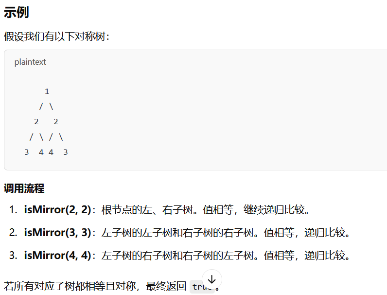


# 102.BFS层序遍历

`!root` -> “root 为空”

`!q.empty()` -> “q 不为空

关键理解：

 1.**初始化结果集合**：数组集合保存结果 vector<vector<int>> result

2.**每层的结果**：每层结果用一个数组表示记录（这步类似回溯）  vector<int> currentLevel;

3.**层级划分的机制**：每次进入新的一层时，队列中只包含上一层的所有节点，不包含其他层的节点。**每到一层，先把上一层的每个节点访问（for循环），加入currentlevel数组，同时把左右孩子入队，然后 保存着一层的值加入结果集合result，**

4.**访问当前层的节点**：在进入每层的 `for` 循环时，逐一访问当前层的每个节点，将节点值加入 `currentLevel`。把他的左右孩子加入队列末尾，以便在下一层处理。


```C++
#include <vector>
#include <queue>

using namespace std;

// 定义二叉树节点结构
struct TreeNode {
    int val;
    TreeNode* left;
    TreeNode* right;
    TreeNode(int x) : val(x), left(nullptr), right(nullptr) {}
};

class Solution {
public:
    vector<vector<int>> levelOrder(TreeNode* root) {
        vector<vector<int>> result;
        if (!root) return result;  // 如果树为空，返回空结果

        queue<TreeNode*> q;  // 初始化队列
        q.push(root);        // 将根节点入队

        while (!q.empty()) {   // 当队列非空时进行层次遍历
            int levelSize = q.size();  // 当前层节点数
            vector<int> currentLevel;  // 存储当前层的节点值

            for (int i = 0; i < levelSize; ++i) {  // 遍历当前层的每个节点
                TreeNode* node = q.front();  // 取出队首节点
                q.pop();                     // 将该节点出队
                currentLevel.push_back(node->val);  // 保存该节点的值

                // 将子节点入队，以便访问下一层
                if (node->left) q.push(node->left);
                if (node->right) q.push(node->right);
            }

            result.push_back(currentLevel);  // 保存当前层的结果
        }

        return result;  // 返回层序遍历的结果
    }
};

```

`int levelSize = q.size();` 的作用是记录**当前层的节点数量**。这是在实现 BFS 层序遍历时的一个关键步骤，确保我们可以在处理当前层的所有节点后，移动到下一层的节点。


### 为什么需要 `levelSize`

在层序遍历（BFS）中，我们是**逐层**处理二叉树的节点。每次遍历一层时，需要知道这一层的节点数量，确保只处理当前层的节点，不影响下一层。

### 具体作用

1. **确保逐层处理**：在每层的节点全部处理完毕后，才会进入下一层。
2. **遍历当前层**：利用 `levelSize`，我们可以遍历队列中存储的当前层的节点，而不影响队列中下一层的节点。

### 代码执行过程

假设有一个二叉树如下：

```
        1
       / \
      2   3
     / \   \
    4   5   6

```

- **初始队列**：`q = [1]`
  - `levelSize = 1`（当前层节点数为 1）
  - 处理节点 `1`，将 `2` 和 `3` 入队
  - 当前层结果：`[1]`
- **第二层队列**：`q = [2, 3]`
  - `levelSize = 2`（当前层节点数为 2）
  - 处理节点 `2`，将 `4` 和 `5` 入队
  - 处理节点 `3`，将 `6` 入队
  - 当前层结果：`[2, 3]`
- **第三层队列**：`q = [4, 5, 6]`
  - `levelSize = 3`（当前层节点数为 3）
  - 处理节点 `4`、`5`、`6`，无新节点入队
  - 当前层结果：`[4, 5, 6]`

通过 `levelSize`，我们确保在每次只处理当前层的节点，而不混入下一层的节点，从而实现层序遍历。


# 103二叉树树高DFS

每个节点的高度=max{左右孩子的高度}+1

左右孩子遇到空节点返回高度0

二叉树的深度优先搜索（DFS）递归的确是沿着一个方向一直深入到最底层，然后逐层返回并计算结果。这种过程可以分解为几个步骤：

1. **递归向下**：沿着树的某一方向（通常是先左后右），不断递归深入节点的子树，直到到达叶子节点或空节点（即基准条件）。
2. **返回并计算**：到达叶子节点或空节点后，会从递归的最深层逐层向上返回，每一层都会处理当前节点的计算。
3. **逐层合并结果**：在返回的过程中，每一层的结果会与其子节点的结果进行组合。比如，在求最大深度的递归中，父节点会取左右子树深度的较大值并加 1，作为当前层的深度。
4. **最终结果**：当递归完全返回到根节点时，最终结果就包含在根节点的返回值中。


```C++
int maxDepth(TreeNode* root) {
        if (root == nullptr) return 0;// 递归结束条件。若当前节点为空，返回深度 0
        // 递归计算左子树的最大深度
        int leftDepth = maxDepth(root->left);
        // 递归计算右子树的最大深度
        int rightDepth = maxDepth(root->right);
         // 返回左右子树较大深度 + 1，表示当前节点的最大深度
        return max(leftDepth, rightDepth) + 1;
    }
```

## if (root == nullptr) return 0;  为什么这段代码写在计算左右子树的前面

这段代码相当于一个“守门员”，确保只有在节点存在时才会继续往下递归，若为空节点则返回 `0`，用于判断是否到达了树的**叶子节点或空节点**。

1.**避免空指针错误**：当递归到达叶子节点（即 `root` 为 `nullptr`）时，程序需要在这里停止进一步递归，直接返回深度 `0`。如果不先判断 `root == nullptr`，继续计算左右子树深度 `maxDepth(root->left)` 和 `maxDepth(root->right)` 会导致对空指针的递归调用，引发错误。

2.**递归结束条件**：基准条件是递归的终止条件，用来防止无限递归。在二叉树递归中，当到达叶子节点时，左右子节点都是空节点（`nullptr`），所以 `if (root == nullptr) return 0;` 能让递归停止，并返回 `0` 作为空节点的深度。这是递归从最底层逐层向上返回结果的关键。

3.**确保返回有效深度值**：只有在 `root` 非空时，才能计算左右子树的深度。因此，先检查 `root` 是否为空节点，才能正确地返回左右子树的深度值，否则在空节点的情况下递归继续就没有意义了。


好的，我们以示例输入 `[3,9,20,null,null,15,7]` 的二叉树为例，逐步演示代码的执行过程。这个树的结构如下：

```
       3
      / \
     9   20
        /  \
       15   7
```

### 递归执行过程

1. **根节点 (3)**：
   - `root` 指向值为 `3` 的节点。
   - 检查 `root` 是否为空，`root` 不为空，进入下一步。
   - 递归调用 `maxDepth(root->left)` 计算左子树的深度。
   
2. **左子节点 (9)**：
   - `root` 指向值为 `9` 的节点（3 的左子树）。
   - 检查 `root` 是否为空，`root` 不为空。
   - 递归调用 `maxDepth(root->left)`，发现 `9` 的左子树为空。
   
3. **左子节点的左子树 (null)**：
   - `root` 为空，返回深度 `0`。
   
4. **左子节点的右子树 (null)**：
   - `root` 为空，返回深度 `0`。
   
5. **回到左子节点 (9)**：
   - 左子树和右子树的深度分别为 `0`。
   - 取最大深度 `max(0, 0) + 1 = 1`。
   - 返回 `1` 作为节点 `9` 的深度。

6. **回到根节点 (3)**：
   - 左子树的深度为 `1`（计算完成）。
   - 递归调用 `maxDepth(root->right)` 计算右子树的深度。
   
7. **右子节点 (20)**：
   - `root` 指向值为 `20` 的节点。
   - 检查 `root` 是否为空，`root` 不为空。
   - 递归调用 `maxDepth(root->left)` 计算左子树的深度。
   
8. **右子节点的左子树 (15)**：
   - `root` 指向值为 `15` 的节点。
   - 检查 `root` 是否为空，`root` 不为空。
   - 递归调用 `maxDepth(root->left)` 和 `maxDepth(root->right)`，发现 `15` 的左右子树为空。
   
9. **节点 (15) 的子树 (null)**：
   - `root` 为空，返回深度 `0`。
   
10. **节点 (15) 的子树 (null)**：
    - `root` 为空，返回深度 `0`。
    
11. **回到节点 (15)**：
    - 左子树和右子树的深度分别为 `0`。
    - 取最大深度 `max(0, 0) + 1 = 1`。
    - 返回 `1` 作为节点 `15` 的深度。

12. **回到节点 (20)**：
    - 左子树的深度为 `1`。
    - 递归调用 `maxDepth(root->right)` 计算右子树的深度。
    
13. **右子节点的右子树 (7)**：
    - `root` 指向值为 `7` 的节点。
    - 检查 `root` 是否为空，`root` 不为空。
    - 递归调用 `maxDepth(root->left)` 和 `maxDepth(root->right)`，发现 `7` 的左右子树为空。
    
14. **节点 (7) 的子树 (null)**：
    - `root` 为空，返回深度 `0`。
    
15. **节点 (7) 的子树 (null)**：
    - `root` 为空，返回深度 `0`。
    
16. **回到节点 (7)**：
    - 左子树和右子树的深度分别为 `0`。
    - 取最大深度 `max(0, 0) + 1 = 1`。
    - 返回 `1` 作为节点 `7` 的深度。
    
17. **回到节点 (20)**：
    - 左子树深度为 `1`，右子树深度为 `1`。
    - 取最大深度 `max(1, 1) + 1 = 2`。
    - 返回 `2` 作为节点 `20` 的深度。
    
18. **回到根节点 (3)**：
    - 左子树深度为 `1`，右子树深度为 `2`。
    - 取最大深度 `max(1, 2) + 1 = 3`。

最终，树的最大深度为 `3`，即从根节点到最深的叶子节点（例如，路径 `3 -> 20 -> 15` 或 `3 -> 20 -> 7`）共有三个节点。

# 105.重构二叉树

一来就看错题意了，以为分别从前序和中序序列构造两棵二叉树

每次递归时，我们都通过以下方式更新树的结构：

- **创建根节点**：每一层递归都会创建一个新的 `TreeNode` 作为当前子树的根节点。
- **递归构建左右子树**：我们使用递归的方式构建左子树和右子树，并将其分别连接到当前根节点的 `left` 和 `right` 指针上。

当递归到最深层时，**左右子树的递归返回的节点**会作为当前节点的左右孩子返回。通过这种方式，最终所有的树节点都被正确地连接到一起。

构建二叉树 ，
当我们构造根节点之后，通过递归调用的返回值，将左右子树连接到根节点的左右孩子上。

```
TreeNode* root = new TreeNode(rootVal);
root->left = 递归调用;
root->right = 递归调用;
return root;
```

**划分区间，找到 左右子树，分别对左右子树递归，每棵子树对应  前序数组和中序数组**

**传入下次递归的下标 4个**


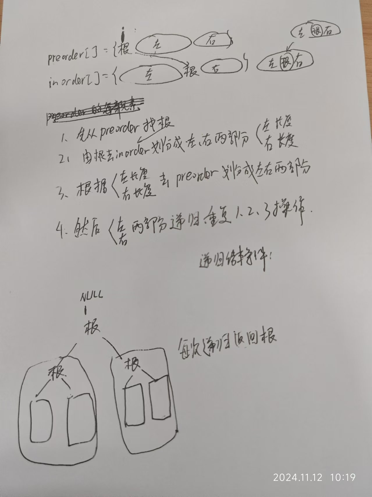

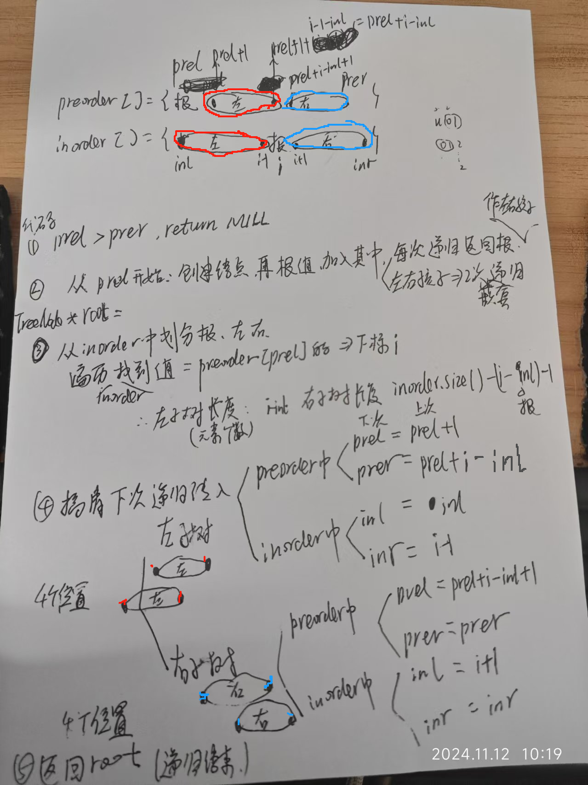

```C++
TreeNode* BuildTree(vector<int>& preorder, vector<int>& inorder, int preL, int preR, int inL, int inR) {
    // 1. 基准条件：如果区间无效，则返回空节点
    if (preL > preR) return NULL;

    // 2. 获取当前的根节点
    int rootVal = preorder[preL];
    TreeNode* root = new TreeNode(rootVal);

    // 3. 在中序遍历中找到根节点的位置，从而划分出左子树和右子树
    int i = inL;
    while (i <= inR && inorder[i] != rootVal) {
        i++;
    }
    int count = i - inL;  // 左子树的节点数量

    // 4. 递归构建左子树，并将返回的左子树接到根节点的左孩子上
     root->left = BuildTree(preorder, inorder, preL + 1, preL + i - inL, inL, i - 1);
    // 5. 递归构建右子树，并将返回的右子树接到根节点的右孩子上
    root->right = BuildTree(preorder, inorder, preL + i - inL + 1, preR, i + 1, inR);

    // 6. 返回当前构造的根节点
    return root;
}
//主函数
TreeNode* buildTree(vector<int>& preorder, vector<int>& inorder) {
    int r = inorder.size() - 1;
    return buildTree(preorder, inorder, 0, r, 0, r);
}

```

### 关键点：递归如何构建树并连接左右子树

每次递归时，我们都通过以下方式更新树的结构：

- **创建根节点**：每一层递归都会创建一个新的 `TreeNode` 作为当前子树的根节点。
- **递归构建左右子树**：我们使用递归的方式构建左子树和右子树，并将其分别连接到当前根节点的 `left` 和 `right` 指针上。

当递归到最深层时，**左右子树的递归返回的节点**会作为当前节点的左右孩子返回。通过这种方式，最终所有的树节点都被正确地连接到一起。

### 为什么返回根节点可以构造整棵树

**构建子树并连接**：在构建一个节点时，递归调用 `buildTree` 来构造它的左子树和右子树，并将这些子树的根节点连接到当前节点的 `left` 和 `right`。

- `root->left = buildTree(...)`：构建左子树并将其接到 `root` 的左孩子上。
- `root->right = buildTree(...)`：构建右子树并将其接到 `root` 的右孩子上。

**返回根节点**：每次构建完根节点后，通过 `return root` 将该节点作为子树的根节点返回给上一层调用。

### 递归过程中的连接关系

1. **第一层**：最初调用时，根节点 `root` 是整个树的根节点，左子树和右子树会递归地构建并连接到 `root->left` 和 `root->right`。
2. **第二层**：在构建左子树的递归调用中，新创建的左子树根节点会继续递归构建自己的左子树和右子树，并将其连接到自己的 `left` 和 `right`。
3. **层层返回**：每一层的递归返回值都是当前子树的根节点，这个根节点在上一层的递归中被连接到相应的 `left` 或 `right` 指针上，从而完成子树连接。

### 举个例子帮助理解

假设 `preorder = [3, 9, 20, 15, 7]`，`inorder = [9, 3, 15, 20, 7]`：

1. 第一次调用：
   - `root = new TreeNode(3)`，根节点是 `3`。
   - 在中序中找到 `3` 的位置，左子树为 `[9]`，右子树为 `[15, 20, 7]`。
   - 递归调用构建 `root->left` 和 `root->right`。
2. 构建左子树（以 `9` 为根）：
   - `root = new TreeNode(9)`，根节点是 `9`。
   - 在中序中 `9` 没有左右子节点，返回 `root`。
   - `root->left` 指向 `9`。
3. 构建右子树（以 `20` 为根）：
   - `root = new TreeNode(20)`，根节点是 `20`。
   - 左子树为 `[15]`，右子树为 `[7]`。
   - 递归调用构建 `root->left` 和 `root->right`。
4. 最终，递归过程构建了整棵树，并在每一步返回值时将左、右子树连接到了父节点上。

## 改进用unordered_map建立哈希映射加快查找速度

不用for循环遍历查找  根在中序遍历中的位置

# 121.股票利润

你买到今天的价格，只能在未来卖出，

解法1双重for循环：从每一天开始遍历，假设这一天买入 ，之后的每天都卖出，比较最小的

解法2贪心：一重for循环： **核心：遇到更小的就更新最小价格，但这个最小价格之后并不一定产生的利润就大于之前记录的利润，有潜在的可能，所以可以贪心，反正最大利润始终记录着**

从每一天开始遍历，维护一个minprice，**在遍历数组的过程中，我们只需要记录当前遇到的最低买入价格，并在每一天计算假设当天卖出的利润，从而找到最大利润**。  

### 具体思路分解

假设我们有一个股票价格数组 `prices = [7, 1, 5, 3, 6, 4]`，我们希望找到最佳的买入和卖出时间点以获得最大利润。

#### 思考流程

1. **目标**：找到价格数组中的两个位置 `i` 和 `j`，满足 `i < j`，使得 `prices[j] - prices[i]` 最大化。
2. **约束**：必须在买入之后才能卖出，即 `j > i`。
3. **贪心策略**：我们希望**每一天的卖出价格**能与**之前的最低买入价格**相比较，从而得出最大利润。

#### 步骤分解

1. **初始化两个变量**：
   - `minPrice`：表示到当前天为止的最低买入价格，初始化为一个较大值（比如 `INT_MAX`）。
   - `maxProfit`：记录我们可以获得的最大利润，初始化为 `0`。

2. **遍历每一天的价格**：
   - 对于每一天的价格 `price`：
     1. **更新最低买入价格**：如果当前的 `price` 比之前记录的 `minPrice` 还要低，我们就更新 `minPrice`，因为更低的买入价格可以带来更高的利润。
     2. **计算假设当天卖出的利润**：用当前 `price` 减去当前的 `minPrice`，计算假设在这一天卖出时的利润。
     3. **更新最大利润**：将计算得到的利润与当前 `maxProfit` 进行比较，如果更大，就更新 `maxProfit`。

3. **遍历结束后，`maxProfit` 就是最大的利润**。

### 为什么这个方法有效

这个方法的本质是贪心算法：
- **每一步**都保留最小的买入价格（这确保利润最大化），并计算当前卖出带来的最大利润。
- 只要维护好 `minPrice` 和 `maxProfit`，我们可以在一次遍历中就找到最大利润。

### 代码分解

```cpp
int maxProfit(vector<int>& prices) {
    int minPrice = INT_MAX;  // 用于存储最低买入价格，初始化为极大值
    int maxProfit = 0;       // 用于存储最大利润，初始化为 0

    for (int price : prices) {
        // 更新最低买入价格，如果当前价格更低
        
        if( Price<=minPrice){
            minPrice=Price;
            continue;
        }
        // 计算当前卖出的利润，并更新最大利润
        maxProfit = max(maxProfit, price - minPrice);
    }

    return maxProfit; // 返回最大利润
}
```

### 示例运行过程

我们来一步步看看这个算法在 `prices = [7, 1, 5, 3, 6, 4]` 上是如何工作的：

| Day  | Price | `minPrice` | `price - minPrice` (Current Profit) | `maxProfit` |
| ---- | ----- | ---------- | ----------------------------------- | ----------- |
| 1    | 7     | 7          | 0                                   | 0           |
| 2    | 1     | 1          | 0                                   | 0           |
| 3    | 5     | 1          | 4                                   | 4           |
| 4    | 3     | 1          | 2                                   | 4           |
| 5    | 6     | 1          | 5                                   | 5           |
| 6    | 4     | 1          | 3                                   | 5           |

- **第一天**：价格为 `7`，更新 `minPrice` 为 `7`。因为没有更低的价格，利润为 `0`。
- **第二天**：价格为 `1`，更新 `minPrice` 为 `1`。此时无法卖出，因此利润依旧为 `0`。
- **第三天**：价格为 `5`，计算假设当天卖出的利润为 `5 - 1 = 4`，更新 `maxProfit` 为 `4`。
- **第四天**：价格为 `3`，利润为 `3 - 1 = 2`，小于当前 `maxProfit`，因此不更新。
- **第五天**：价格为 `6`，利润为 `6 - 1 = 5`，更新 `maxProfit` 为 `5`。
- **第六天**：价格为 `4`，利润为 `4 - 1 = 3`，小于当前 `maxProfit`，不更新。

最后，`maxProfit` 的值为 `5`，即最佳买卖组合的最大利润。

### 总结

通过动态维护最低买入价格 `minPrice` 和最大利润 `maxProfit`，我们可以在一次遍历中得到最大利润。这是因为我们每一步都贪心地选择当前最小的买入价格，并计算当天卖出的利润，这样就可以保证找到最大利润。

# N124hard

# 128.最长连续序列

**关键，1.把数组每个数存到unordered_set，查看一个数是否存在即能优化至 O(1) 的时间复杂度。2.没有前驱数才做起点，避免了很多重复计算**

步骤 1：将数组存入 `unordered_set`方便后续进行快速查找。

步骤 2：判断起点，我们逐个遍历 ，尝试找到以每个数字为起点的连续序列。我们只在数字是“序列起点”时才进行计算，也就是当 `num - 1`前驱数不在集合中时。这样可以避免重复计算。

做法：遍历`nums` 数组，拿每个数字作起点，当`nums[i] - 1`不在数组中（★★去 查 unordered_set  O(1)时间复杂度）：就说明他不是某个连续序列的一员，可以开始一个新的连续序列


步骤 3：若这个数字是新起点，就判断 nums[i]+1  nums[i]+2  nums[i]+3  …….在不数组中，记录序列长度，直至nums[i]+k 不在数组位置为止。

这里仍然是去查unordered_set

步骤4.检查下个数字i++，重复步骤2 3


# 136.只出现一次

异或运算满足交换律  a⊕b=b⊕a ，即以上运算结果与 nums 的元素顺序无关。

在一组数中，异或的顺序无关紧要。

即对于任意整数 a 有 a⊕a=0 ，a⊕0=a，a⊕a⊕B=B

对数组所有元素异或运算求和即可剩下只出现一次的数字

```c++
class Solution {
public:
    int singleNumber(vector<int>& nums) {
        int x = 0;
        for (int num : nums)  // 1. 遍历 nums 执行异或运算
            x ^= num;
        return x;            // 2. 返回出现一次的数字 x
    }
};


```

# 139.单词拆分

**难点1.`dp[i]` 表示 `s[0:i]` 是否可以被字典中的单词组合而成。dp[s.size()]=true就说明 整个字符s[0:size-1]可以拆分  并且  被字典中的单词组合而成**

**2. 状态转移方程：dp[i]取决于 ①dp[j] 是否为 true ② 且s[j:i] 是否在字典中**

**3.使用set来加快查找**

### 为什么可以提前返回 `true`

1. **题目需求**：题目只要求判断字符串 `s` 能否被拆分，而不是要列出所有拆分方式。所以一旦找到一种拆分方案，我们的任务就完成了。
2. **动态规划的特点**：
   - 动态规划数组 `dp` 的本质是**通过前面子问题的解，推导出当前子问题的解**。
   - 在 `dp[i]` 为 `true` 时，表示 `s[0:i]` 可以被拆分成功，那么如果从 `i` 到达了字符串 `s` 的结尾位置，就说明整个字符串可以被拆分。因此在这个过程中，只要找到某个 `j` 满足 `dp[j] = true` 且 `s[j:i]` 在字典中，就可以认为 `dp[i] = true`，并继续向前推进。

```C++
 unordered_set<string> wordSet(wordDict.begin(), wordDict.end()); // 将字典放入集合，方便查找
    vector<bool> dp(s.size() + 1, false);
    dp[0] = true;  // 空字符串可以被成功拆分

    for (int i = 1; i <= s.size(); i++) {//这个循环用来计算所有数组
        for (int j = 0; j < i; j++) {
            // 这个循环检查 dp[j] 是否为 true 且 s[j:i] 是否在字典中
            if (dp[j] && wordSet.count(s.substr(j, i - j))) {
                dp[i] = true;
                break;  // 找到一种拆分方式即可
            }
        }
    }

    return dp[s.size()];
}
```

**1.初始化字典集合**：

将 `wordDict` 转换为 `unordered_set`，可以在 `O(1)` 的时间复杂度内检查单词是否在字典中。

```
unordered_set<string> wordSet(wordDict.begin(), wordDict.end());
```

**2.定义和初始化 `dp` 数组**：

`dp[i]` 表示 `s[0:i]` 是否可以被字典组合拆分，初始时 `dp[0] = true` 表示空字符串是可以“拆分”的。

```C++
vector<bool> dp(s.size() + 1, false);
dp[0] = true;

```

### 示例运行过程

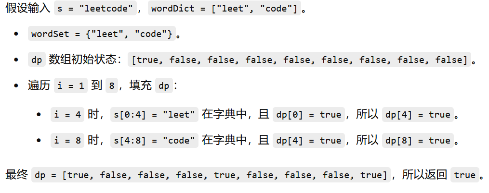

### 代码的分步骤说明：

1. **初始化字典集合和 DP 数组**：  
   将 `wordDict` 转换成 `unordered_set` 存入 `wordSet`，以便于快速查找是否包含某个单词。初始化动态规划数组 `dp`，长度为 `s.size() + 1`，`dp[i]` 表示 `s[0:i]` 是否可以拆分成功。设 `dp[0] = true` 表示空字符串可以被拆分。

2. **填充 DP 数组**：  
   对于每个 `i`（从 `1` 到 `s.size()`），遍历从 `0` 到 `i-1` 的位置 `j`，检查 `s[0:j]` 是否可以被拆分（即 `dp[j] == true`）且 `s[j:i]` 在字典中。如果这两个条件都满足，说明 `s[0:i]` 可以被拆分成功，将 `dp[i]` 设为 `true` 并跳出内层循环，继续处理下一个 `i`。

3. **返回结果**：  
   遍历结束后，`dp[s.size()]` 的值表示整个字符串 `s` 是否可以拆分成功。如果 `dp[s.size()] == true`，返回 `true`；否则，返回 `false`。

这个过程利用动态规划逐步判断子串是否可拆分，以最终决定整个字符串是否可拆分成功。


# 141.链表是否有环

耍赖方法，修改val，

标准解：快慢指针，一个一步，一个两步，初始都指向head，特判空链表和一个节点链表必定没有环，

```C++
class Solution {
public:
    bool hasCycle(ListNode *head) {
        // 如果链表为空或只有一个节点，则不可能有环
        if (!head || !head->next) return false;

        ListNode *slow = head;
        ListNode *fast = head;

        // 进入循环，先移动指针，再检查相遇
        while (fast && fast->next) {
            slow = slow->next;         // 慢指针移动一步
            fast = fast->next->next;   // 快指针移动两步

            if (slow == fast) {        // 如果相遇，说明有环
                return true;
            }
        }

        return false; // 如果快指针到达链表末尾，说明无环
    }
};

```

`fast && fast->next` 确保了在执行 `fast = fast->next->next` 前的安全性，避免了访问空指针的错误。

它也帮助判断链表是否无环。如果链表无环，`fast` 或 `fast->next` 会先到达 `nullptr`，此时循环终止并返回 `false`。


# 142.链表环入口


耍赖方法，修改val，

直接记忆：标准解：快慢指针，一个一步，一个两步，初始都指向head，特判空链表和一个节点链表必定没有环，当 `slow` 和 `fast` 相遇时，将 `fast` 重置为 `head`。`slow` 和 `fast` 每次都走一步，相遇时即为环的入口节点。

**–相遇fast起点改为head，降速，一次走一步直至再相遇**

```C++
#include <iostream>
using namespace std;

struct ListNode {
    int val;
    ListNode *next;
    ListNode(int x) : val(x), next(nullptr) {}
};

class Solution {
public:
    ListNode *detectCycle(ListNode *head) {
        if (!head || !head->next) return nullptr; // 空链表或单节点链表

        ListNode *slow = head;
        ListNode *fast = head;

        // 检测是否有环
        while (fast && fast->next) {
            slow = slow->next;
            fast = fast->next->next;
            if (slow == fast) {
                // ★找到相遇点后，重新设置 fast 为头节点
                fast = head;
                // ★两指针每次都走一步，相遇即为环的入口
                while (fast != slow) {
                    slow = slow->next;
                    fast = fast->next;
                }
                return slow; // 返回环的入口节点
            }
        }

        return nullptr; // 如果没有环，返回 null
    }
};

```


# 146.LRU Least Rcently Used

关键：1.双链表来实现存储  链表头部总是保持最近使用的元素。链表尾部的元素就是“最少使用”的元素。

2.刚访问过的/新插入的，放入头部

3.存储达到上限，又要插入的时候，删除尾部

4.哈希表来存储(key,value)映射，加速查找，双链表存储数据结构关系

 ①get  查找成功返回目标值，查找失败返回-1

 ②put  先查找

（情况1）不存在，检查是否满了，if(满了){删除尾部节点，删除旧的哈希映射}，插入新节点到头部，添加新映射；

（情况2）已存在  将节点移到双链表头部即可

**不论get/put,传入key，先去哈希表查找，然后根据查找结果，成功失败，对双链表来操作**

5.使用C++list实现或者手搓双链表

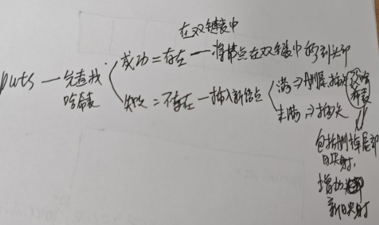

## 方法一：使用 `list` 容器实现 LRU 缓存

在第一种方法中，我们利用 `list` 容器来实现双向链表。`list` 允许我们在 `O(1)` 时间内将元素移动到头部或尾部。我们还使用 `unordered_map` 来存储每个键和 `list` 节点的迭代器，方便查找。

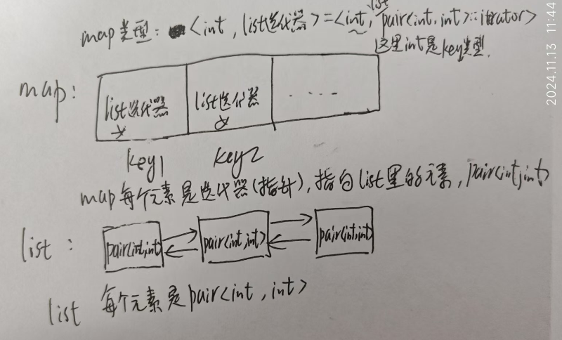

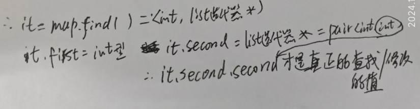

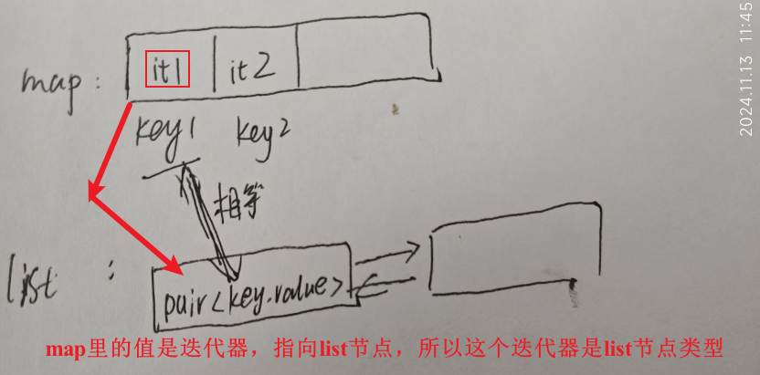

```C++
#include <unordered_map>
#include <list>
using namespace std;

class LRUCache {
public:
    int capacity; // 缓存容量
    list<pair<int, int>> data; // 双向链表，存储键值对
    unordered_map<int, list<pair<int, int>>::iterator> cache; // 哈希表，存储键到链表节点的映射
    // 构造函数：初始化容量
    LRUCache(int capacity) {
        this->capacity = capacity;
    }
    //也可以 LRUCache(int capacity) : capacity(capacity) {}
    
    
    int get(int key) {
        auto it = cache.find(key);//pair<int, int>类型迭代器（指针）
        //map的find查找成功返回value，不成功则是map.end()
        if (it == cache.end()) return -1; // 如果 key 不存在，返回 -1

        // 将访问的节点移到链表头部，表示最近使用
        data.splice(data.begin(), data, it->second);
        return it->second->second; // 返回值
    }

    
    void put(int key, int value) {
        auto it = cache.find(key);

        if (it != cache.end()) {
            // 如果 key 存在，更新值并将节点移到头部
            it->second->second = value;
            data.splice(data.begin(), data, it->second);
        } else {
            // 如果缓存已满，删除最久未使用的节点
            if (data.size() == capacity) {
                int old_key = data.back().first;
                data.pop_back(); // 移除链表尾部
                cache.erase(old_key); // 删除哈希表中的映射
            }

            // 插入新节点到链表头部
            data.emplace_front(key, value);
            cache[key] = data.begin(); // 更新哈希表
        }
    }


};

```

### ::iterator是什么意思，list<pair<int, int>>后面为什么要加上这个？

在 `list<pair<int, int>>` 后面加上 `::iterator`，是为了明确指定我们要使用的是 `list<pair<int, int>>` 容器的迭代器类型。

**不加 `::iterator` 是不可以的**。原因在于，我们希望 `unordered_map` 的 `cache` 中存储的是 **指向 `list<pair<int, int>>` 中元素的迭代器**。如果不加 `::iterator`，我们将无法指定这个类型。

**迭代器看做指针就好了，显示标出来，`list<pair<int, int>>` 类型的迭代器(指针)::iterator  ，不需要存储具体的值，也就是节点，存储迭代器（指针）就好了**

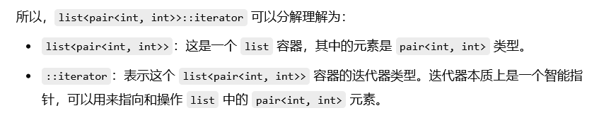

**迭代器类型和迭代器关系   类比 指针类型和指针   就好了**

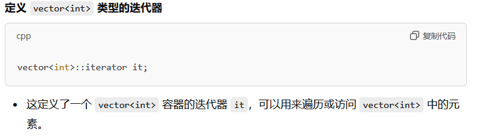

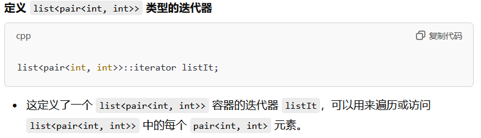

### if (it == cache.end()) return -1;

//map的find查找成功返回value，不成功则是map.end()

### it->second->second和it->second

`map` 的 `find` 函数返回的是一个**指向键值对的迭代器**，这个迭代器指向的是 `pair<const Key, T>` 类型的对象。

unordered_map<**int**, **list<pair<int, int>>::iterator**> cache;

it = cache.find(key) 是map的一个键值对 <int, list<pair<int, int>>::iterator>类型迭代器

it->second 是**list<pair<int, int>>::iterator** 类型 ，也是一个迭代器，指向 pair<int, int>类型

it->second->second   pair<int, int>中后一个int   也就是真正要存的关键字，前一个int是位置

### 加深记忆：双链表list

双向链表是通过**将最近使用的元素移到链表头部**来体现**最近最少使用**的原则。这里的思路是：**越靠近链表头部的元素越是最近使用的，越靠近链表尾部的元素越是最久未使用的**。当缓存容量达到上限时，我们就移除链表尾部的元素（即最久未使用的元素），这样实现了 LRU 策略。

双向链表的设计确实主要是通过体现“最近使用”的元素来间接实现“最少使用”的淘汰策略。具体来说，通过**将最近使用的元素移动到链表头部**，自然会让**最少使用的元素逐渐移到链表尾部**。这样，我们就可以通过在链表尾部找到并移除最久未使用的元素，来实现“最近最少使用”的原则。

科普：**最近最少使用（Least Recently Used, LRU）** 是一种缓存淘汰策略，它的核心思想是：**如果一个数据在最近一段时间没有被使用过，那么它在未来被访问的可能性也较小**。基于这种假设，LRU 策略会优先淘汰那些最近没有被使用过的数据，保证缓存中保留的是最近访问过的数据。

## 方法二：使用自定义双向链表实现 LRU 缓存

在第二种方法中，我们手动实现一个双向链表，用于维护缓存的访问顺序。我们定义一个 `Node` 类来表示链表节点，并将节点插入头部或移除尾部。这样可以避免使用 STL 的 `list`，实现更高的自定义性。

```C++
#include <unordered_map>
using namespace std;

class Node {
public:
    int key, value;
    Node* prev;
    Node* next;
    Node(int k, int v) : key(k), value(v), prev(nullptr), next(nullptr) {}
};

class LRUCache {
public:
    LRUCache(int capacity) : capacity(capacity), head(new Node(0, 0)), tail(new Node(0, 0)) {
        head->next = tail;
        tail->prev = head;
    }

    int get(int key) {
        if (cache.find(key) == cache.end()) {
            return -1; // 如果 key 不存在，返回 -1
        }
        Node* node = cache[key];
        moveToHead(node); // 将访问的节点移到头部
        return node->value;
    }

    void put(int key, int value) {
        if (cache.find(key) != cache.end()) {
            Node* node = cache[key];
            node->value = value; // 更新值
            moveToHead(node); // 将节点移到头部
        } else {
            if (cache.size() == capacity) {
                Node* tailNode = removeTail(); // 缓存已满，移除尾部节点
                cache.erase(tailNode->key);
                delete tailNode;
            }
            Node* newNode = new Node(key, value);
            cache[key] = newNode;
            addToHead(newNode); // 插入新节点到头部
        }
    }

    // 将节点移到链表头部
    void moveToHead(Node* node) {
        removeNode(node);
        addToHead(node);
    }

    // 从链表中移除节点
    void removeNode(Node* node) {
        node->prev->next = node->next;
        node->next->prev = node->prev;
    }

    // 将节点添加到链表头部
    void addToHead(Node* node) {
        node->next = head->next;
        node->prev = head;
        head->next->prev = node;
        head->next = node;
    }

    // 移除链表尾部节点
    Node* removeTail() {
        Node* node = tail->prev;
        removeNode(node);
        return node;
    }

public:
    int capacity;
    Node* head;
    Node* tail;
    unordered_map<int, Node*> cache;
};

```

# 148.排序链表

笨方法：链表中的节点值存入一个 `vector`，对 `vector` 进行排序，然后再将排序后的值逐一写回链表。

错在 vector 并没有初始化大小，应该先使用 push_back 添加元素，或者预分配空间。不能用nums[i++]=p->val,而是nums.psu_back(p->val)


题解  归并排序  {递归写法，迭代写法}

将链表一直二分，直至两部分都一个结点为止，比较两个节点的值，然后合并两个链表

返回上一层

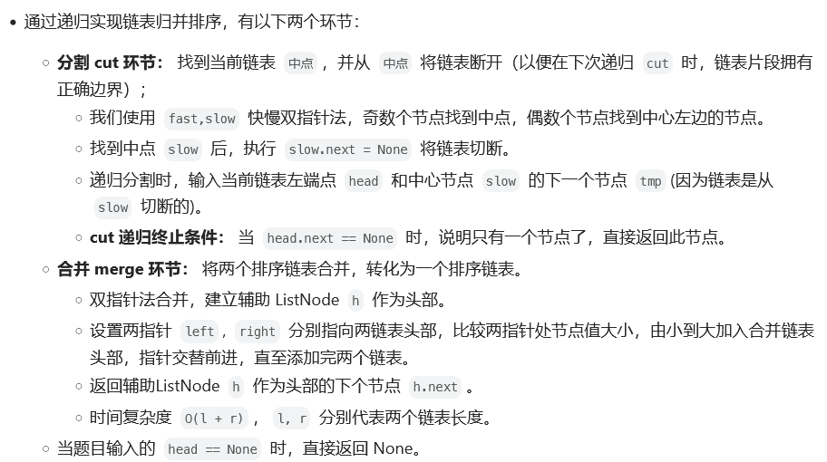

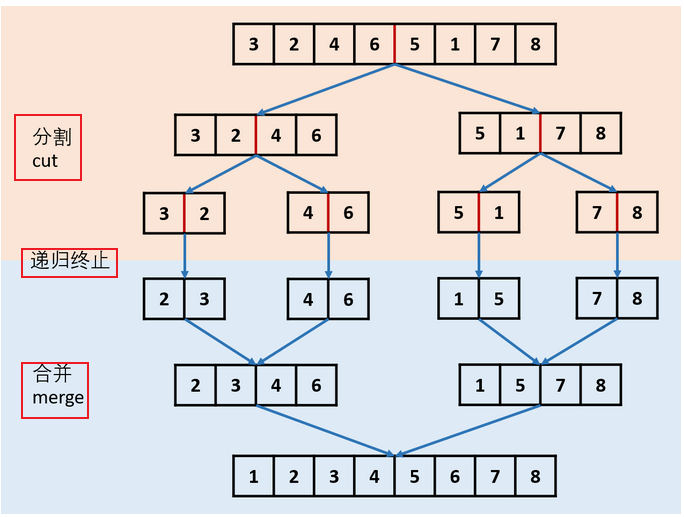

非递归写法没学

# 背152.乘积最小数组

由于存在负数，那么会导致最大的变最小的，最小的变最大的。因此还需要维护当前最小值cruu_1min。

### 解题思路

由于数组中可能存在负数，乘法运算可能会将最大值变成最小值，或者将最小值变成最大值。因此，我们在遍历数组时需要同时维护两个变量：
1. **`curr_max`**：以当前元素结尾的最大乘积。
2. **`curr_min`**：以当前元素结尾的最小乘积。

遍历每个元素时，我们会更新 `curr_max` 和 `curr_min`，并保持一个全局的最大乘积 `max_product`。

### 具体步骤

1. **初始化**：将 `max_product`、`curr_max` 和 `curr_min` 都设置为第一个元素 `nums[0]`。
2. **遍历数组**：从第二个元素开始，逐步更新 `curr_max` 和 `curr_min`：
   - 如果当前元素为负数，`curr_max` 和 `curr_min` 交换，因为乘以负数会将最大值变成最小值，最小值变成最大值。
   - 更新 `curr_max` 和 `curr_min` 为当前元素或乘积中的较大/小值。
3. **更新结果**：在每次迭代中，更新 `max_product` 为 `curr_max` 的最大值。
4. **返回结果**：最后，`max_product` 即为最大乘积。

### 1. 遇到正数时

当 `nums[i] > 0` 时，乘以一个正数会保持乘积的符号，因此我们可以直接更新 `curr_max` 和 `curr_min`：

- **正数乘以当前最大值**仍然是一个更大的正数，因此 `curr_max` 会变得更大。
- **正数乘以当前最小值**仍然会保持最小值的性质，`curr_min` 仍然是较小的负数或更小的正数。

例如，如果 `curr_max = 4`、`curr_min = -2` 且 `nums[i] = 3`：

- 更新 `curr_max = max(nums[i], curr_max * nums[i]) = max(3, 4 * 3) = 12`。
- 更新 `curr_min = min(nums[i], curr_min * nums[i]) = min(3, -2 * 3) = -6`。

在这种情况下，不需要交换，因为乘以正数不会导致最大和最小值的翻转。

### 2. 遇到 0 时

当 `nums[i] = 0` 时，当前的乘积归零，也就是所有连续子数组的乘积都会变成 0：

- **`curr_max` 和 `curr_min` 都会被重置**为 0，因为 0 会中断连续的子数组，之后的子数组需要重新开始。
- 在代码中通常会重置 `curr_max` 和 `curr_min` 为 1 或 `nums[i]`，以便重新开始计算新的子数组的乘积。


### 代码实现

```cpp
#include <vector>
#include <algorithm>
using namespace std;

class Solution {
public:
    int maxProduct(vector<int>& nums) {
        if (nums.empty()) return 0;

        int max_product = nums[0]; // 全局最大乘积
        int curr_max = nums[0];    // 当前最大乘积
        int curr_min = nums[0];    // 当前最小乘积

        for (int i = 1; i < nums.size(); ++i) {
            //curr_max=90, curr_min=-10;遇到 -5
            //乘进去之后 90*-5=-450 -10*-5=50；
            //curr_max=50, curr_min=--450;
            //交换是为了更好计算
            if (nums[i] < 0) {
                swap(curr_max, curr_min); // 负数翻转最大最小
            }
            ////在这里用乘积和元素本身比较的意思是：
            //对于最小值来说，最小值是本身则说明这个元素值比前面连续子数组的最小值还小。相当于重置了阶段最小值的起始位置
            //表示当前元素 nums[i] 本身可以是新的子数组起点，也可能继续当前子数组。我们选择较大的值。
            //curr_max 和 curr_min 与当前元素 nums[i] 进行比较的原因是每个位置的最大或最小乘积子数组可以从当前元素本身开始重新计算。这允许我们处理断开和重启的情况，例如在遇到负数或零时可以重新开始计算乘积，而不依赖于前面的结果。
            curr_max = max(nums[i], curr_max * nums[i]);
            curr_min = min(nums[i], curr_min * nums[i]);

            max_product = max(max_product, curr_max); // 更新全局最大乘积
        }

        return max_product;
    }
};
```

### 代码解释

1. **初始化**：将 `max_product`、`curr_max` 和 `curr_min` 初始化为第一个元素的值。
2. **遍历**：从第二个元素开始遍历数组：
   - 如果当前元素为负数，则交换 `curr_max` 和 `curr_min`，因为负数会反转最大值和最小值的意义。
   - 更新 `curr_max` 为 `max(nums[i], curr_max * nums[i])`，即当前元素或包含它的最大乘积。
   - 更新 `curr_min` 为 `min(nums[i], curr_min * nums[i])`，即当前元素或包含它的最小乘积。
   - 每次更新 `max_product`，确保它始终保持全局最大值。
3. **返回**：最后返回 `max_product`，即乘积最大子数组的乘积。

### 复杂度分析

- **时间复杂度**：`O(n)`，因为我们只遍历一次数组。
- **空间复杂度**：`O(1)`，只使用了常量空间。

### 总结

这种方法利用了动态规划思想，通过维护当前的最大和最小值，解决了负数和零对乘积的影响，实现了高效的遍历和更新。

# 155.最小栈

额外 用一个单调递减栈对所有数字排序

两种最小栈：

1.最小栈和原始栈大小相同，每个元素入栈时 对应存储一个最小值， 一一对应，最小栈可以重复存放最小的值,

**push时两个栈同时push,**

**pop时同时pop**

2.最小栈不存重复值，保持单调递减，栈顶最小，

**push新的值进原始栈，检查比最小栈栈顶还小的时候，才会入最小栈**

**pop出原始栈最小值的时候，最小栈才会pop**

```C++
//第一种同时  push pop 一一对应
class MinStack {
    stack<int> x_stack;
    stack<int> min_stack;
public:
    //构造函数初始化有个最小值
    MinStack() {
        min_stack.push(INT_MAX);//可以写成全局变量
    }
    
    void push(int x) {
        x_stack.push(x);
        min_stack.push(min(min_stack.top(), x));
    }
    
    void pop() {
        x_stack.pop();
        min_stack.pop();
    }
    
    int top() {
        return x_stack.top();
    }
    
    int getMin() {
        return min_stack.top();
    }
};


//第二种


class MinStack {
public:
    stack<int> stack;       // 主栈
    stack<int> minStack;    // 辅助栈，存储最小值

    MinStack() {}

    void push(int x) {
        stack.push(x);
        // 如果 minStack 为空，或者 x 小于等于当前最小值，则将 x 压入 minStack
        if (minStack.empty() || x <= minStack.top()) {
            minStack.push(x);
        }
    }

    void pop() {
        // 如果栈顶元素是当前最小值，minStack 也需要弹出
        if (stack.top() == minStack.top()) {
            minStack.pop();
        }
        stack.pop();
    }

    int top() {
        return stack.top();
    }

    int getMin() {
        return minStack.top();
    }
};

```

# 160.相交链表

双指针，类似，有环链表入口  **相遇了 ，快指针重新从头开始，一次一步直至再相遇**

#### 相交链表问题 先走到末尾的重新从头开始，遍历相同的距离，而且速度都一样，时间一样，终会相遇，类似物理的S-t图

- **思路**：

- 使用两个指针 `pA` 和 `pB`，分别指向链表 `headA` 和 `headB` 的头节点。

  让两个指针同时向前移动。如果指针 `pA` 到达链表 `A` 的末尾，就将它重定位到链表 `B` 的头部；同理，如果指针 `pB` 到达链表 `B` 的末尾，就将它重定位到链表 `A` 的头部。

  这样一来，两个指针将会在第一个相交节点处相遇。如果没有相交节点，最终两个指针会在 `null` 相遇。

- **逻辑**：由于两个指针都走过了 `A + B` 的长度，如果有相交，它们会在第一个相交点相遇；如果没有相交，它们会最终同时到达 `nullptr`。

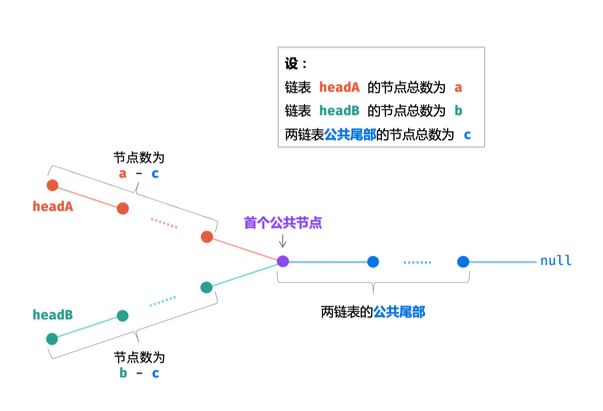

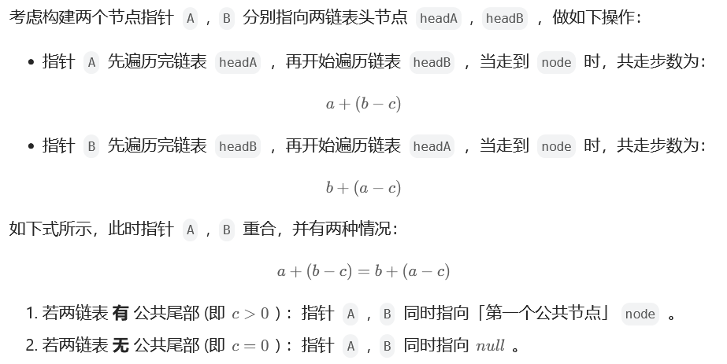

```C++
class Solution {
public:
    ListNode *getIntersectionNode(ListNode *headA, ListNode *headB) {
        if (!headA || !headB) return nullptr;

        ListNode *pA = headA;
        ListNode *pB = headB;

        while (pA != pB) {
            // 如果到达链表末尾，则切换到另一个链表的头部
            pA = pA ? pA->next : headB;//没有遍历到末尾，继续遍历，到末尾切换到另一个链表头
            pB = pB ? pB->next : headA;
        }

        return pA; // 如果有相交，pA 和 pB 会在相交节点相遇；否则会在 null 相遇
    }
};
```

# 169.众数

排序法，2种，在力扣里代码我的

哈希表法

候选者法：

这是我目前看到的最直观形象的解法，时间复杂度O(n)，空间复杂度O(1)。

“同归于尽消杀法” ：

由于多数超过50%, 比如100个数，那么多数至少51个，剩下少数是49个。

1. 第一个到来的士兵，直接插上自己阵营的旗帜占领这块高地，此时领主 winner 就是这个阵营的人，现存兵力 count = 1。
2. 如果新来的士兵和前一个士兵是同一阵营，则集合起来占领高地，领主不变，winner 依然是当前这个士兵所属阵营，现存兵力 count++；
3. 如果新来到的士兵不是同一阵营，则前方阵营派一个士兵和它同归于尽。 此时前方阵营兵力count --。（即使双方都死光，这块高地的旗帜 winner 依然不变，因为已经没有活着的士兵可以去换上自己的新旗帜）
4. 当下一个士兵到来，发现前方阵营已经没有兵力，新士兵就成了领主，winner 变成这个士兵所属阵营的旗帜，现存兵力 count ++。

就这样各路军阀一直以这种以一敌一同归于尽的方式厮杀下去，直到少数阵营都死光，那么最后剩下的几个必然属于多数阵营，winner 就是多数阵营。（多数阵营 51个，少数阵营只有49个，死剩下的2个就是多数阵营的人）

------

下面附上参考视频的题解：

```cpp
public int majorityElement(int[] nums) {
    int winner = nums[0];
    int count = 1;
    for (int i = 1; i < nums.length; i++) {
        if (winner == nums[i]) {
            count++;
        } else if (count == 0) {
            winner = nums[i];
            count++;
        } else {
            count--;
        }
    }
    return winner;
}
```

# 198.打家劫舍

写状态方程   ，默认隔一个间隔来，然后错误了，遇到 1 2  2 9 这种就不能通过哦

状态方程很难写

**状态方程，一个位置的状态可能有多种取值，把情况考虑清楚**

**这里忽视了可以选择每家 偷 或者不偷  一个位置有两种状态**

1. **定义状态**：使用 `dp[i]` 表示偷到第 `i` 间房屋为止可以获得的最大金额。

2. 状态转移方程

   ：

   - 对于第 `i` 间房屋，可以选择**偷**或**不偷**。
   - 若选择**偷第 `i` 间房屋**，则前一个房屋 `i-1` 不能偷，因此金额为 `dp[i-2] + nums[i]`。
   - 若选择**不偷第 `i` 间房屋**，则金额为 `dp[i-1]`。
   - 状态转移方程为：`dp[i] = max(dp[i-1], dp[i-2] + nums[i])`

3. 初始条件

   ：

   - `dp[0] = nums[0]`（只有一个房屋时，最大金额就是它的金额）
   - `dp[1] = max(nums[0], nums[1])`（前两个房屋中选择金额较大的）

4. **结果**：`dp[n-1]` 即为可以偷窃的最大金额。


```C++
//我的做法哪里错了：
//你这个做法的思路基本是正确的，但在更新 dp 数组时有个小问题。问题出现在你更新 dp[i] 时，直接使用 dp[i-2] + nums[i]，但是忘记了考虑“跳过前一个房子”的情况。在这类问题中，我们需要确保在每一步选择时，考虑到两种可能的情况：

    //选择当前房子，即 dp[i-2] + nums[i]
   // 不选择当前房子，而是继承前一个房子的值 dp[i-1]

//你的代码只考虑了选择当前房子的情况，但忘记了考虑“跳过当前房子”的情况，所以没有考虑到最大值的情况。
    int rob(vector<int>& nums) {
        if(nums.size()==1)return nums[0];
        if(nums.size()==2)return max(nums[0],nums[1]);
        vector<int> dp(nums.size(),0);
        dp[0] = nums[0];
        dp[1] = nums[1];
        int maxdp=max(dp[0],dp[1]);
        for (int i = 2;i<nums.size();i++){
            dp[i]=dp[i-2]+nums[i];
            maxdp=max(maxdp,dp[i]);
        }
        return maxdp;
        
    }
```


```C++
//正确代码
using namespace std;

int rob(vector<int>& nums) {
    if (nums.size() == 1) return nums[0];  // 如果只有一个房子，直接返回该房子的值
    if (nums.size() == 2) return max(nums[0], nums[1]);  // 如果有两个房子，取两个中的较大值

    vector<int> dp(nums.size(), 0);  // dp[i]表示偷到第i个房子的最大值
    dp[0] = nums[0];  // 只有一个房子时，偷第一个房子的值
    dp[1] = max(nums[0], nums[1]);  // 偷前两个房子的最大值

    for (int i = 2; i < nums.size(); i++) {
        // 递推公式：要么偷第i个房子，dp[i-2] + nums[i]，要么不偷第i个房子，dp[i-1]
        dp[i] = max(dp[i-1], dp[i-2] + nums[i]); 
    }

    return dp[nums.size() - 1];  // 返回最后一个房子的最大偷盗值
}

```


# 难200.岛屿数量

类似79单词搜索dfs，修改已访问，四个方向dfs，复原

**有点区别的就是：不用复原，遇到1就计算岛屿数量，**

**DFS 遍历**：我们通过递归 `dfs(grid, i, j)` 来遍历当前岛屿，将所有相连的陆地标记为 `'0'`。一旦标记完一个岛屿的所有陆地，我们就认为这个岛屿已经被“消耗”掉了，不再重复计算。

**岛屿计数**：当我们找到一个 `'1'`（陆地），我们就从这个位置开始调用 DFS，这样整个岛屿（包括所有相连的陆地）都会被标记为 `'0'`，然后岛屿计数器 `count` 加 1。

**边界条件**：每次递归前都会检查当前坐标是否越界，或者当前单元格是否是水域（`'0'`），若是水域或者越界则返回。

```C++
using namespace std;

class Solution {
public:
    // DFS 深度优先搜索
    void dfs(vector<vector<char>>& grid, int i, int j) {
        // 边界检查：越界或水域
        if (i < 0 || j < 0 || i >= grid.size() || j >= grid[0].size() || grid[i][j] == '0') {
            return;
        }
        
        // 标记当前陆地为已访问（把当前陆地变成水域 '0'）
        grid[i][j] = '0';
        
        // 向上下左右四个方向扩展
        dfs(grid, i + 1, j);  // 下
        dfs(grid, i - 1, j);  // 上
        dfs(grid, i, j + 1);  // 右
        dfs(grid, i, j - 1);  // 左
    }
    
    int numIslands(vector<vector<char>>& grid) {
        if (grid.empty()) return 0;
        
        int count = 0;
        // 遍历整个网格
        for (int i = 0; i < grid.size(); i++) {
            for (int j = 0; j < grid[0].size(); j++) {
                // 如果遇到陆地 ('1')，则进行 DFS
                if (grid[i][j] == '1') {
                    dfs(grid, i, j);
                    count++;  // 发现一个岛屿，岛屿数量加1
                }
            }
        }
        return count;
    }
};

```

## 为什么不用复原？

这里不能重复计算，所以不用复原,这段代码不需要复原已访问的状态，因为每个岛屿只会在第一次遇到时进行 DFS 并标记，之后的陆地都已变为 `'0'`，不会再被访问

## 为什么count++,表示一个岛屿数量？

因为访问过的都成了0，不会重复计算

假设你遍历到网格的某个位置 `(i, j)`，并且该位置是 `'1'`，那么说明此时我们遇到一个尚未被访问过的岛屿的一个部分。

然后通过 DFS，我们会将该岛屿的所有相连部分（上下左右相邻的 `'1'`）都标记为 `'0'`，这样以后在遍历时就不会再次计数这个岛屿。

当 DFS 执行完毕后，这个岛屿已经被完全标记过了，而我们刚刚遇到的 `'1'` 就是一个新的岛屿的起点，所以我们增加岛屿计数 `count++`。

### DFS 的工作原理：

1. 我们遍历网格中的每个位置。
2. 每当遇到 `'1'` 时，表示发现一个新的岛屿的起点。才会dfs,我们需要进行 **深度优先搜索（DFS）**，将该岛屿上的所有陆地（与当前陆地相连的 `'1'`）都标记为 `'0'`，表示这些陆地已经被访问过，避免重复计算。
3. **每次发现一个新的 `'1'`**，说明我们找到了一个新的岛屿，因而岛屿的数量 `count` 增加 1。


# 背206.反转链表


1.新建带头结点的空链表，必须用一个指针指向他  ListNode *newhead=new ListNode(0);

2.不能对节点取地址，然后赋给一个指针

3.空链表和一个节点的链表必须放在最前面判断，否则陷入空指针错误


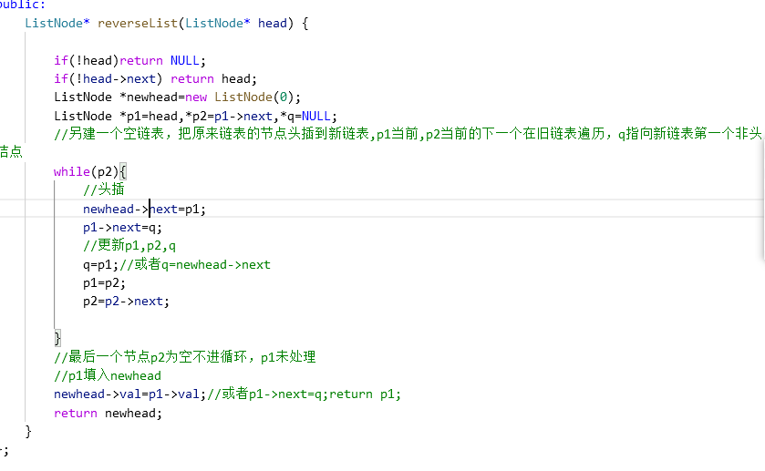

对于链表反转，除了常规的三指针迭代法外，还可以使用递归的方法来实现链表反转。递归方法通过函数调用栈来反转链表，每次递归处理一个节点，直到链表的最后一个节点。然后，递归的返回路径会修改每个节点的 `next` 指针，最终达到反转链表的效果。

### 方法 1: **递归法**（简洁易懂）

递归法的思想是利用递归将链表分成两部分：第一个节点和剩余的部分，然后反转剩余部分，并把第一个节点挂到最后。

#### 递归法思路：
1. 递归到链表的最后节点。
2. 在回溯时，将每个节点的 `next` 指向它的前一个节点。
3. 返回新的头节点。

### C++ 代码实现：

```cpp
class Solution {
public:
    ListNode* reverseList(ListNode* head) {
        // 递归基准：链表为空或只有一个节点时，直接返回头节点
        if (!head || !head->next) {
            return head;
        }
        
        // 递归反转剩余部分
        ListNode* newHead = reverseList(head->next);
        
        // 将当前节点与下一个节点反转
        head->next->next = head;  // 当前节点的下一个节点指向当前节点
        head->next = nullptr;     // 当前节点的 next 设置为 nullptr，成为反转后的最后一个节点
        
        return newHead;  // 返回反转后的新头节点
    }
};
```

#### 代码解析：
1. **递归基准条件**：
   - 如果链表为空（`head == nullptr`）或者只有一个节点（`head->next == nullptr`），直接返回 `head`，这就是递归的终止条件。
   
2. **递归调用**：
   - 对链表的 `next` 部分（`head->next`）进行递归调用，直到链表的末尾。
   
3. **反转操作**：
   - 反转操作发生在递归回溯时：在回溯过程中，`head->next->next = head;` 将当前节点 `head` 连接到它的下一个节点的 `next` 上，从而实现反转。
   - `head->next = nullptr;` 将原来的链表尾部节点的 `next` 设置为 `nullptr`，这是反转后的新尾节点。

4. **返回新头节点**：
   - 最终，递归会返回新的头节点（即原链表的最后一个节点），这是整个反转链表的新的头部。

### 时间复杂度：
- **O(n)**，其中 `n` 是链表的长度。递归需要遍历一次链表，所有操作都是常数时间复杂度。

### 空间复杂度：
- **O(n)**，由于递归需要使用栈空间，每个递归调用需要消耗 O(1) 空间，因此总的空间复杂度为 O(n)，其中 `n` 是递归深度。

---

### 方法 2: **迭代法**（三指针）

你之前的迭代法已经是最常见的一种方法，通常它的空间复杂度较低，因为它不需要使用额外的递归栈空间。

#### 优点：
- **空间复杂度 O(1)**，只有常数空间的额外消耗。
- 不依赖递归，避免了递归调用栈带来的开销。

#### 代码：链表原地逆序

```cpp
class Solution {
public:
    ListNode* reverseList(ListNode* head) {
        ListNode* prev = nullptr;  // 初始化前一个节点为空
        ListNode* curr = head;     // 当前节点指向链表头
        ListNode* next = nullptr;  // 用来保存当前节点的下一个节点
        
        while (curr != nullptr) {
            next = curr->next;     // 保存下一个节点
            curr->next = prev;     // 反转当前节点的指针
            prev = curr;           // 移动 prev 和 curr 指针
            curr = next;           // 继续遍历链表
        }
        
        return prev;  // 返回反转后的链表头节点
    }
};
```

### 时间复杂度：
- **O(n)**，其中 `n` 是链表的长度。只需要遍历链表一次，每次操作都是常数时间。

### 空间复杂度：
- **O(1)**，只使用了常数空间，指针 `prev`、`curr` 和 `next`。

---

### 总结：

- **递归法**：代码简洁，易于理解，但会有栈空间的开销，空间复杂度为 O(n)。
- **迭代法**：更加高效，空间复杂度 O(1)，适合链表很长的情况，避免了递归带来的栈溢出风险。

这两种方法各有优缺点，你可以根据具体的需求和链表的大小来选择使用哪种方法。


# 难207.课程表

我还以为是单一的链式，没想到是有向图，拓扑排序

# 难208.trie树类

https://leetcode.cn/problems/implement-trie-prefix-tree/solutions/98390/trie-tree-de-shi-xian-gua-he-chu-xue-zhe-by-huwt/

# 215.数组中的第K个最大元素

序排序以后，**目标元素的下标是 N−k**，这里 N 是输入数组的长度。

三种方法：

1.sort  **时间复杂度**：O(n log n)， **空间复杂度**：O(1)

2.手撕快排 **时间复杂度**：平均 O(n)，最坏情况下 O(n^2)。**空间复杂度**：O(1)，快速选择只需要常数级别的空间。

3.堆排序，优先队列容器 **时间复杂度**：O(n log k) **空间复杂度**：O(k) 堆的大小是 `k`

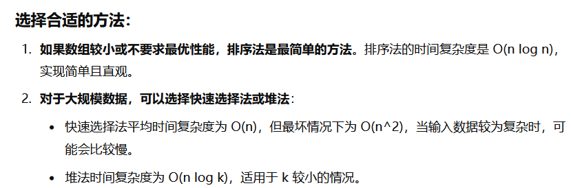

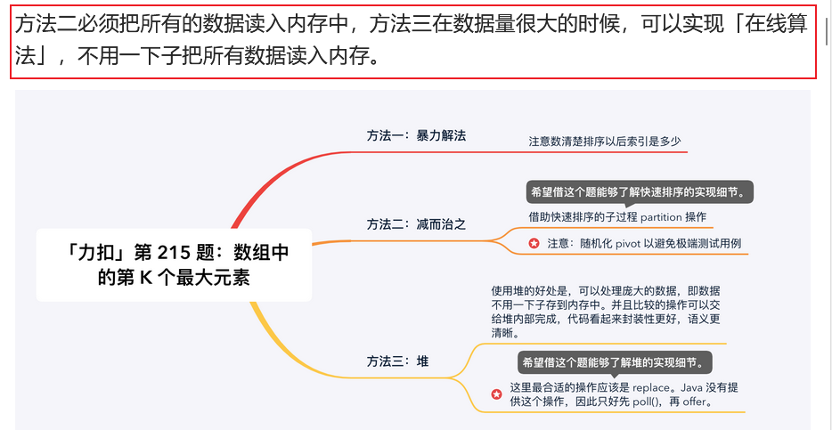

---

### 解题思路：

#### 方法 1: **排序法**
最直观的解决方法是将数组排序，然后直接返回排序后的数组中的第 `k` 个元素。

- **时间复杂度**：O(n log n)，排序的时间复杂度是 O(n log n)，其中 `n` 是数组的长度。
- **空间复杂度**：O(1)，如果使用原地排序（例如快速排序或堆排序）。

#### 方法 2: **快速选择算法**（Quickselect）–可以改进基准的选择
`Quickselect` 是一种基于快速排序的算法，可以在 **O(n)** 时间内找到第 `k` 个最大元素。

- 通过分治方法，将数组分为两部分：一部分小于或大于基准值，另一部分大于或小于基准值。然后根据 `k` 的位置，决定继续在哪一部分进行递归查找。

- **时间复杂度**：平均 O(n)，最坏情况下 O(n^2)。
- **空间复杂度**：O(1)，快速选择只需要常数级别的空间。

#### 方法 3: **堆法**
使用一个大小为 `k` 的最小堆来存储前 `k` 个最大元素。每当我们找到一个比堆顶元素更大的元素时，替换堆顶元素。最终堆顶的元素就是第 `k` 大的元素。

- **时间复杂度**：O(n log k)，因为我们要遍历整个数组，同时堆操作的时间复杂度是 O(log k)。
- **空间复杂度**：O(k)，因为堆的大小是 `k`。

### C++ 代码实现：

#### 方法 1: **排序法**

```cpp
#include <vector>
#include <algorithm>
using namespace std;

class Solution {
public:
    int findKthLargest(vector<int>& nums, int k) {
        sort(nums.begin(), nums.end(), greater<int>());
        return nums[k - 1];  // 返回第 k 个最大元素
    }
};
```

#### 方法 2: **快速选择法**

```cpp
#include <vector>
#include <algorithm>
using namespace std;

class Solution {
public:
    int findKthLargest(vector<int>& nums, int k) {
        return quickselect(nums, 0, nums.size() - 1, k);
    }

private:
    int quickselect(vector<int>& nums, int left, int right, int k) {
        int pivot = partition(nums, left, right);
        
        if (pivot == k - 1) {
            return nums[pivot];  // 找到第 k 个最大元素
        } else if (pivot > k - 1) {
            return quickselect(nums, left, pivot - 1, k);  // 在左半部分继续查找
        } else {
            return quickselect(nums, pivot + 1, right, k);  // 在右半部分继续查找
        }
    }

    int partition(vector<int>& nums, int left, int right) {
        int pivot = nums[right];
        int i = left;
        for (int j = left; j < right; ++j) {
            if (nums[j] >= pivot) {  // 大于等于基准值
                swap(nums[i], nums[j]);
                ++i;
            }
        }
        swap(nums[i], nums[right]);  // 把基准值放到正确的位置
        return i;
    }
};
```

#### 方法 3: **堆法**

```cpp
#include <vector>
#include <queue>
using namespace std;

class Solution {
public:
    int findKthLargest(vector<int>& nums, int k) {
        priority_queue<int, vector<int>, greater<int>> minHeap;  // 小顶堆
        
        // 建堆，保持堆的大小为 k
        for (int num : nums) {
            minHeap.push(num);
            if (minHeap.size() > k) {
                minHeap.pop();
            }
        }
        
        return minHeap.top();  // 堆顶元素即为第 k 大的元素
    }
};
```

---


# 221.最大正方形

我的暴力解超时了

```C++
    // 检查，左上角起始点下标(x,y),到(x+r-1，y+r-1)边长r的是否为正方形，里面是否全是1
    // 遍历是到i<x+r j<y+r 注意次数
    bool check(int x, int y, int r, vector<vector<char>>& matrix) {

        for (int i = x; i < x + r; i++) {
            for (int j = y; j < y + r; j++) {
                if (matrix[i][j] == '0')
                    return false;
            }
        }
        return true;
    }
    int maximalSquare(vector<vector<char>>& matrix) {

        int maxarea = -1;
        // 正方形的边长最大为 矩形的宽
        int m = matrix.size();
        int n = matrix[0].size();
        int r = min(m, n)+1;
        
        while (r>0) {
            // 左上角起始下标 在矩形的 正方形(0,0)到(m-r,n-r)里检查
            ////遍历是到x<m-r+1 y<n-r+1 注意次数
            for (int x = 0; x < m - r + 1; x++) {
                for (int y = 0; y < n - r + 1; y++) {
                    if (check(x, y, r, matrix)) {
                        return maxarea = max(maxarea, r * r);
                    }
                }
            }

            r--;
        }
        return 0;
    }
```

**误区：**

**while(r--),先判断r>0,r再-1，然后进入循环体，r=1也会进入循环体，**

**while(--r),先r-1,然后判断r>0，然后进入循环体，r=1不会进入循环体，**

**这里判断算一个操作 ，r--是在判断操作之后-1，而不是循环体运行结束-1**


# 226.翻转二叉树

我错在只是中序遍历交换了值，而没有把二叉树的结构也交换

### 问题分析：

1. **中序遍历** 保存节点值后再恢复，等价于复制了原始树的结构，不会改变树的左右子树结构。反转树是要交换左右子树的结构，而不仅仅是改变节点的值。
2. **反转树的正确方法**：你应该交换左右子树，而不是改变节点的值。


把二叉树看成一个链表，不过里面每个节点嵌套两层递归而已，每个节点状态由左右两个子树决定

类似反转链表的递归思路

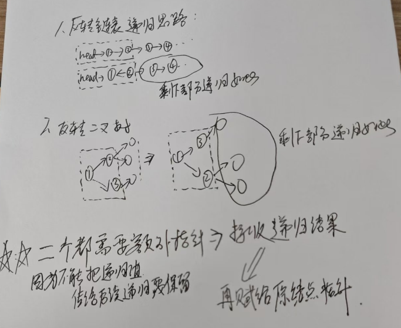


# 234.回文链表

我错在1.书写反转链表太慢  2.纠结总结点数是奇数还是偶数 3.调用反转链表函数时，没用一个指针去接收它

4.链表遍历条件判断：你用到了fast = fast->next->next;必须也要检查fast->next为空，while (fast && fast->next){}

当你循环体里用了X->next，不管X有没有可能为空，即使不可能为空都要检查 ，加入循环判断


## 为什么不用管总结点数是奇数还是偶数

**链表节点数是偶数的情况**：

- 例如，链表 `[1, 2, 3, 4]` 是偶数长度。如果你从中点将后半部分反转，那么你比较的是 `[1, 2]` 和 `[4, 3]`，这两个部分应该完全对称。
- **slow指向3，head指向1,两部分长度一样**

**链表节点数是奇数的情况**：

- 例如，链表 `[1, 2, 3, 2, 1]` 是奇数长度。此时中间的节点 `3` 不参与回文对比，因此需要把链表从中间分成两部分 `1, 2` 和 `2, 1`，它们也应该对称。
- **slow指向3，head指向1,两部分长度不一样**，前半部分短，后半部分长，但是反转slow后半部分后，他和head一起后移比较，到前半部分先结束，与slow无关


# 背236.二叉树的最近公共祖先

加深递归的理解

三种情况想出来了，但是不知道怎么去做，写不出代码

每次递归返回的结果要么用来判断，要么用来做答案，

p/q在左右子树的分布情况 

这里就是去判断当前节点下面三种情况之一，用left/right临时指针来记录当前节点的左右子树的递归结果

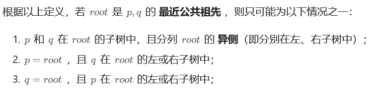

然后二叉树递归必有返回值TreeNode*类型，返回找到的目标节点

因为p/q必存在，

**返回 `p` 或 `q` 的含义**：

当我们遍历到节点 `p` 或 `q` 时，返回该节点的意思是：

- 如果当前节点是 `p` 或 `q`，说明我们已经找到了其中一个目标节点。根据问题的要求，`p` 或 `q` 本身就是它们自己唯一的祖先。所以我们可以立即返回这个节点作为潜在的公共祖先。
- 为什么要立即返回呢？
  - **避免继续遍历**：一旦找到了目标节点，我们不需要再继续遍历该节点的子树了，因为我们已经知道这个节点是一个有效的祖先（至少对它自己来说）。因此，递归返回时，直接返回 `p` 或 `q`，可以有效地减少不必要的计算。
  - **保证递归的结束条件**：在递归的过程中，如果节点是 `p` 或 `q`，返回该节点可以保证递归能够继续并最终达到合适的结束条件。

```C++

class Solution {
public:
    TreeNode* lowestCommonAncestor(TreeNode* root, TreeNode* p, TreeNode* q) {
        // 基本情况：根节点为空，或者当前节点为 p 或 q，返回当前节点
        if (root == nullptr || root == p || root == q) {
            return root;
        }

        // 递归查找左右子树
        //根节点不是p和q中的任意一个，那么就继续分别往左子树和右子树找p和q
        TreeNode* left = lowestCommonAncestor(root->left, p, q);
        TreeNode* right = lowestCommonAncestor(root->right, p, q);

        // 如果 p 和 q 分别在左右子树，说明当前节点是最近公共祖先
        if (left && right) {
            return root;
        }

        // 如果两个节点都在左子树，返回左子树的结果
        // 如果两个节点都在右子树，返回右子树的结果
        return left ? left : right;
    }
};

```

```C++
注释详细点的：
// 定义二叉树节点结构体
struct TreeNode {
    int val;
    TreeNode* left;
    TreeNode* right;
    TreeNode(int x) : val(x), left(nullptr), right(nullptr) {}
};

class Solution {
public:
    TreeNode* lowestCommonAncestor(TreeNode* root, TreeNode* p, TreeNode* q) {
        // 基本情况：根节点为空，或者当前节点为 p 或 q，返回当前节点
        if (root == nullptr || root == p || root == q) {
            return root;
        }
        
        // 分别往左子树和右子树查找 p 和 q
        TreeNode* left = lowestCommonAncestor(root->left, p, q);
        TreeNode* right = lowestCommonAncestor(root->right, p, q);
        
        // 如果左子树和右子树都没有找到 p 和 q，返回 nullptr
        if (left == nullptr && right == nullptr) {
            return nullptr;
        }
        
        // 如果左子树找不到，说明 p 和 q 都在右子树中
        if (left == nullptr) {
            return right;
        }
        
        // 如果右子树找不到，说明 p 和 q 都在左子树中
        if (right == nullptr) {
            return left;
        }
        
        // 如果左右子树都找到 p 和 q，那么当前节点就是最近公共祖先
        return root;
    }
};

```

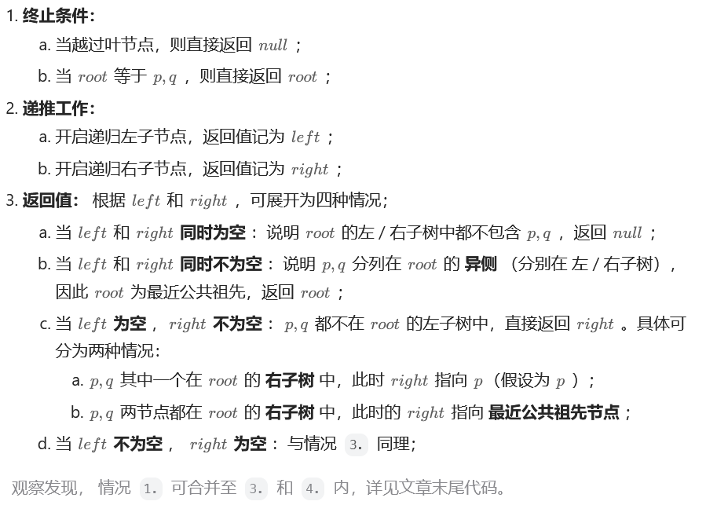

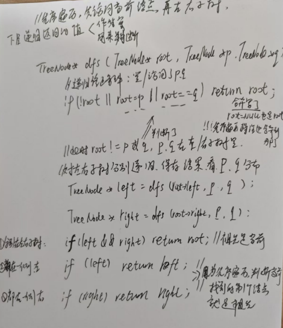

# 238.除自身以外数组的乘积

我的想法用了前缀积 和后缀积  dpA[i] 0到i累积  dpB[i] i到size-1累积

因为每个位置的**ans[i]=dpA[i-1]*dpB[i+1]   ,**

**这里写在for循环里计算时 要注意边界情况**

​    **answer[0]=dpB[1];**
​            **answer[size-1]=dpA[size-2];**


```C++
    vector<int> productExceptSelf(vector<int>& nums) {
            //dpA[i] 0到i累积  dpB[i] i到size-1累积
            int size=nums.size();
            vector<int>dpA(size,0);
            vector<int>dpB(size,0);
            vector<int>answer(size,0);
            dpA[0]=nums[0];
            dpB[size-1]=nums[size-1];
            for(int i=1;i<size;i++){
                dpA[i]=dpA[i-1]*nums[i];
            }
            for(int j=size-2;j>=0;j--){
                dpB[j]=dpB[j+1]*nums[j];
            }
            answer[0]=dpB[1];
            answer[size-1]=dpA[size-2];
            for(int i=1;i<size-1;i++){
                answer[i]=dpA[i-1]*dpB[i+1];
            }
            return answer;
```

可以优化，先把前缀积直接存到ans里面，然后算每个位置后缀积用一个变量存储即可

相当于动态规划里的优化

动态规划数组 `dpA` 和 `dpB` 可以不显式保存，只需用两个变量（分别表示当前的左积和右积）来实现结果的动态更新，从而将空间复杂度优化为 **O(1)**（不计返回数组空间）。

```C++
 vector<int> productExceptSelf(vector<int>& nums) {
        int n = nums.size();
        vector<int> answer(n, 1); // 初始化结果数组，所有元素为 1
        
        // Step 1: 构建左积数组
        int leftProduct = 1;
        for (int i = 0; i < n; i++) {
            answer[i] = leftProduct; // 当前 answer[i] 存储的是左积
            leftProduct *= nums[i]; // 更新左积
        }
        
        // Step 2: 结合右积计算最终结果
        int rightProduct = 1;
        for (int i = n - 1; i >= 0; i--) {
            answer[i] *= rightProduct; // 将右积与左积相乘
            rightProduct *= nums[i]; // 更新右积
        }
        
        return answer;
    }
```


# 240.搜索二维矩阵 

思路，别看到二维矩阵就想着dfs上下左右

**// 从右上角开始搜索，向左向下移动**

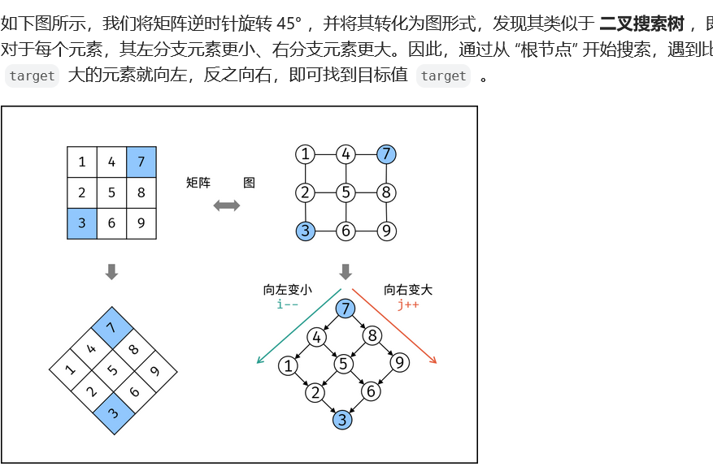

### 解题思路：

#### 1. 从矩阵的右上角开始搜索
- 由于矩阵的特点：
  - **每行从左到右递增**。
  - **每列从上到下递增**。
- 我们可以利用右上角的元素 `matrix[0][n-1]` 来快速缩小搜索范围：
  - 如果 `matrix[0][n-1] == target`，直接返回 `true`。
  - 如果 `matrix[0][n-1] > target`，说明目标不可能在当前列，向左移动一列。
  - 如果 `matrix[0][n-1] < target`，说明目标不可能在当前行，向下移动一行。

#### 2. 复杂度分析：
- 每次移动要么向左（列减一），要么向下（行加一），因此最多移动 `m + n` 步。
- 时间复杂度为 **O(m + n)**，空间复杂度为 **O(1)**。

---

### C++ 实现：

```cpp
#include <vector>
using namespace std;

class Solution {
public:
    bool searchMatrix(vector<vector<int>>& matrix, int target) {
        int m = matrix.size(); // 行数
        if (m == 0) return false;
        int n = matrix[0].size(); // 列数
        if (n == 0) return false;

        // 从右上角开始搜索，向左向下移动
        int row = 0, col = n - 1;
        while (row < m && col >= 0) {
            if (matrix[row][col] == target) {
                return true; // 找到目标值
            } else if (matrix[row][col] > target) {
                col--; // 当前值大于目标值，向左移动
            } else {
                row++; // 当前值小于目标值，向下移动
            }
        }

        return false; // 没有找到目标值
    }
};
```

---

### 示例运行过程：

#### 示例输入：
```plaintext
matrix = [
  [1, 4, 7, 11, 15],
  [2, 5, 8, 12, 19],
  [3, 6, 9, 16, 22],
  [10, 13, 14, 17, 24],
  [18, 21, 23, 26, 30]
]
target = 5
```

#### 运行过程：
1. 初始位置：`row = 0, col = 4`，`matrix[0][4] = 15`。
   - `15 > 5`，向左移动到 `col = 3`。
2. 当前位置：`row = 0, col = 3`，`matrix[0][3] = 11`。
   - `11 > 5`，向左移动到 `col = 2`。
3. 当前位置：`row = 0, col = 2`，`matrix[0][2] = 7`。
   - `7 > 5`，向左移动到 `col = 1`。
4. 当前位置：`row = 0, col = 1`，`matrix[0][1] = 4`。
   - `4 < 5`，向下移动到 `row = 1`。
5. 当前位置：`row = 1, col = 1`，`matrix[1][1] = 5`。
   - 找到目标值，返回 `true`。

#### 输出：
```plaintext
true
```

---

### 复杂度分析：
- **时间复杂度**：O(m + n)，因为最多移动 `m + n` 次。
- **空间复杂度**：O(1)，只使用了常数额外空间。

---

### 总结：
- **从右上角搜索**是利用矩阵特性（行和列的单调性）的高效方法。
- 时间复杂度为 O(m + n)，优于暴力法的 O(m * n)。


# 253.会议室

明白什么时候

1.需要新开一个房间：当前时间段（now_t1,now_t1t2）和所有正在进行的房间的时间段没有时间冲突（交集） ，也就是t1都大于所有正在进行的房间的时间段的t2

这句话 等价于   ==t1大于max{正在进行的房间的时间段的t2}

2.什么时候可以复用一个房间：所有房间最早结束的那个的结束时间t2<=当前时间段的开始时间now_t1，此时可以复用这个房间

①最小堆法：维护所有的最小结束时间，比较当前时间段>= 堆顶最小结束时间，说明可以复用它 ，否则新开一个房间，把结束时间加入堆，堆中的元素数量就是所需的会议室数量

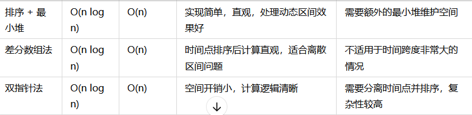

**②差分数组法：推荐背下来**，一个map，记录，map[开始时间]要+1,map[结束时间]要-1，然后遍历map，求value部分（+1/-1）最大前缀和

vector<vector<int>> numset，我想对numset排序，按照每个vector<int>的第一数字大小排序，怎么排序，可以用sort吗?

```C++
bool compare(const vector<int>& a, const vector<int>& b) {
    return a[0] < b[0]; // 按照每个 vector<int> 的第一个数字升序排序
}

int main() {
    // 示例数据
    vector<vector<int>> numset = {{3, 2, 1}, {1, 4, 5}, {2, 6, 7}};

    // 使用 sort，并传入比较函数
    sort(numset.begin(), numset.end(), compare);
```


### 1. 排序 + 优先队列（小顶堆）
#### 思路：
- 使用一个最小堆来模拟会议室的使用情况。
- 会议结束的时间越早，应该优先使用已经结束的会议室。
- 会议开始时，检查最小堆中最早结束的会议室，如果它已经结束，则可以复用。如果没有结束的会议室，分配一个新的会议室。

#### 步骤：
1. 将所有的会议按开始时间排序。
2. 使用小顶堆存储会议的结束时间。
3. 遍历每个会议：
   - 如果当前会议的开始时间大于等于最早结束的会议室时间，则可以复用该会议室，更新该会议室的结束时间。
   - 否则，分配一个新的会议室，将当前会议的结束时间加入堆中。
4. 堆中元素的个数即为所需的会议室数量。

#### 代码实现：
```cpp
#include <vector>
#include <queue>
#include <algorithm>
using namespace std;

class Solution {
public:
    int minMeetingRooms(vector<vector<int>>& intervals) {
        if (intervals.empty()) return 0;

        // 按照会议的开始时间排序
        sort(intervals.begin(), intervals.end(), [](const vector<int>& a, const vector<int>& b) {
            return a[0] < b[0];
        });

        // 小顶堆，存储会议的结束时间
        priority_queue<int, vector<int>, greater<int>> pq;
        
        // 第一个会议，直接加入堆
        pq.push(intervals[0][1]);

        // 遍历剩余的会议
        for (int i = 1; i < intervals.size(); i++) {
            // 如果当前会议的开始时间大于等于最早结束会议的结束时间，复用该会议室
            if (intervals[i][0] >= pq.top()) {
                pq.pop();
            }
            // 新的会议室
            pq.push(intervals[i][1]);
        }

        // 堆中的元素数量就是所需的会议室数量
        return pq.size();
    }
};
```

#### 时间复杂度：
- 排序：`O(N log N)`
- 遍历会议室：`O(N log K)`，其中 `K` 是堆中元素的个数。最坏情况下，堆中会有 `N` 个元素，故复杂度为 `O(N log N)`。

**总时间复杂度**：`O(N log N)`

### 2. 差分数组法
#### 思路：
- 将会议的时间区间转化为“变化点”，并记录每个时间点的变化（+1表示需要一个会议室，-1表示释放一个会议室）。
- 使用一个数组记录每个时间点的变化，最后求出会议室的最大使用数。

#### 步骤：
1. 对于每个会议，记录会议开始时需要增加一个会议室，会议结束时需要减少一个会议室。
2. 对所有的时间点变化排序。
3. 遍历所有变化，计算每个时刻的会议室使用数量，并更新最大值。

#### 代码实现：
```cpp
#include <vector>
#include <map>
using namespace std;

class Solution {
public:
    int minMeetingRooms(vector<vector<int>>& intervals) {
        map<int, int> timeChanges;

        // 记录每个时间点的变化
        for (const auto& interval : intervals) {
            timeChanges[interval[0]]++;  // 会议开始
            timeChanges[interval[1]]--;  // 会议结束
        }

        int roomCount = 0, maxRooms = 0;
        // 遍历所有时间点，计算当前的会议室数
        for (const auto& timeChange : timeChanges) {
            roomCount += timeChange.second;  // 累加当前时刻的会议室变化
            maxRooms = max(maxRooms, roomCount);  // 更新最大会议室数
        }

        return maxRooms;
    }
};
```

#### 时间复杂度：
- 遍历所有时间点：`O(N log N)`（排序所有时间点）
- 计算会议室数量：`O(N)`

**总时间复杂度**：`O(N log N)`

### 总结：
- **排序 + 优先队列**（小顶堆）是一种经典的解决方案，可以动态地管理会议室的使用情况。
- **排序 + 贪心法**（扫描法）不使用堆，通过排序和两个指针来计算会议室的数量。
- **差分数组法**通过记录每个时间点的变化，然后计算会议室的最大使用数。

所有这三种方法的时间复杂度都是 `O(N log N)`，适用于处理大规模数据。

差分数组方法是解决时间区间问题的一种高效方法，核心思想是**将时间变化转化为增减操作**，然后通过一次遍历累积计算需求的最大值。

以下是详细步骤和实现：

---

### 差分数组法的步骤：

1. **将会议时间转换为“时间点变化”**：
   - 每个会议的开始时间表示 **需要增加一个会议室**，用 `+1` 表示。
   - 每个会议的结束时间表示 **释放一个会议室**，用 `-1` 表示。
   
   比如会议区间 `[0, 30]`：
   - 在 `0` 时刻需要一个会议室：`+1`。
   - 在 `30` 时刻释放一个会议室：`-1`。

2. **记录时间点变化**：
   - 使用一个哈希表或有序容器（如 `map`），将每个时间点对应的变化值记录下来。
   - 例如，若有会议时间 `[[0, 30], [5, 10], [15, 20]]`，变化记录为：
     ```
     0 -> +1
     30 -> -1
     5 -> +1
     10 -> -1
     15 -> +1
     20 -> -1
     ```

3. **排序时间点并计算前缀和**：
   - 对所有时间点排序，然后按照时间顺序累加变化值。
   - 前缀和的最大值就是所需的最小会议室数量。

### 


---

### 示例运行：

#### 输入：
```plaintext
intervals = [[0, 30], [5, 10], [15, 20]]
```

#### 运行过程：
1. **构建差分数组**：
   ```
   时间点变化：
   0  -> +1
   5  -> +1
   10 -> -1
   15 -> +1
   20 -> -1
   30 -> -1
   ```

2. **排序时间点并计算前缀和**：
   ```
   按时间顺序计算：
   时间点  变化  当前累计  最大值
   0       +1      1       1
   5       +1      2       2
   10      -1      1       2
   15      +1      2       2
   20      -1      1       2
   30      -1      0       2
   ```

#### 输出：
```plaintext
2
```

---

### 复杂度分析：

1. **时间复杂度**：
   - 差分数组的构建：O(n)。
   - 遍历 `map` 计算前缀和：O(n log n)（`map` 的排序开销）。
   - 总时间复杂度：O(n log n)。

2. **空间复杂度**：
   - 差分数组的存储：O(n)。
   - 总空间复杂度：O(n)。

---

### 总结：
- **核心思路**：利用差分数组记录时间点的变化，结合前缀和计算最大值。
- **适用场景**：适合离散的时间区间，尤其是时间点范围较小时，效果很好。
- **优点**：实现简单，计算逻辑直观，性能稳定。


# 279. 完全平方数

题目意思就是：给一个数，用   个数尽可能少的  完全平方数去凑他

找到n前面最大的一个完全平方数K，记为一个个数；那么 还剩n-kk, 也就是说只要将n-k*k的解dp[n-k*k] 加上 上面那个1，就是n的解，这就是最短的。

给定目标n,遍历1~n，每个数 的所需最小完全平方数个数记为  dp[i]  ，返回结果dp[n]


分析   ： 即  n   =  [0~n-1]中的一个数 + 一个平方数

所以 dp[n]  =min{ dp[0~j] +1}   j从1到n-1//  计算0~n，每个数都要遍历检查

**这里和平常 动态规划不一样 ， 不是依赖前一个 ，而是依赖 前面中的某一个**

**(也就是说不是  dp[i] 和 dp[i-1] ,而是 dp[i] 和 dp[0到i-1中某一个 )**

```prolog
 目标值    =   从前面找一个数    + 一个平方数（多一个平方数，所以+1）
    

//例如13:可以转换为13=12+1,13=9+4,13=4+913=;所以它是可以从12或者9或者4再加一个平方数变过来的
//所以dp[13]=min(dp[12]+1,dp[9]+1,dp[4]+1,13);

```

```C++
#include <vector>
#include <cmath>
#include <algorithm>
using namespace std;

class Solution {
public:
    int numSquares(int n) {
        // 动态规划数组，初始化为一个大值
        vector<int> dp(n + 1, INT_MAX);
        dp[0] = 0; // 和为 0 不需要任何数字
        
        // 枚举 1 到 n
        for (int i = 1; i <= n; i++) {
            // 枚举小于 i 的完全平方数   
            //dp[13]=min(dp[12]+1,dp[9]+1,dp[4]+1,13);
            for (int j = 1; j * j <= i; j++) {
                dp[i] = min(dp[i], dp[i - j * j] + 1);
            }
        }
        
        return dp[n];
    }
};

```

# 283.移动零

思路是没错的，但是 用了双重循环暴力解，

**方法1.把所有非零元素放到最前面去，**

**//循环跳出来的时候 j 指向下一非零元素存放的位置，单但已经放完了，所以从他开始再遍历一次填充0；**

**不用管j位置，就算j位置是非零也没关系，反正此时他已经放到前面去了，记录下来，不用担心丢失或者覆盖**

```C++
void moveZeroes(vector<int>& nums) {
    int j = 0; // 指向下一个非零元素的位置
    for (int i = 0; i < nums.size(); i++) {
        if (nums[i] != 0) {
            swap(nums[j], nums[i]);
            j++; // 更新非零元素的存放位置
        }
    }
    // 将剩余位置置为 0
        for (; j < nums.size(); j++) {
            nums[j] = 0;
        }
    }	
}

```

**方法2.其实可以用一个指针来指向下一个非零元素代替循环，**

j比i走的慢，所以在j到达之前左右元素都成了0，等着j过来呢

`j` 变量在这段代码中不会指向一个非零元素。实际上，`j` 的作用是记录下一个非零元素应该存放的位置。为了更清晰地理解这个过程，我们来详细解释一下：


```cpp
void moveZeroes(vector<int>& nums) {
    int j = 0; // 记录下一个非零元素应该存放的位置
    
    for (int i = 0; i < nums.size(); i++) {
        if (nums[i] != 0) {
            if (i != j) {
                swap(nums[i], nums[j]); // 将非零元素交换到正确的位置
            }
            j++; // 更新j，指向下一个可存放非零元素的位置
        }
    }
}
```

#### `i` 和 `j` 的关系：
- `i` 用于遍历整个数组，逐个检查元素。
- `j` 用来追踪下一个非零元素应该存放的位置。`j` 初始化为 0，表示第一个位置。

#### 关键点：
1. **遇到非零元素**：
   - 当 `nums[i] != 0` 时，表示当前元素是非零元素。
   - 如果 `i != j`，说明该非零元素不是已经在正确的位置了（即它不是放在之前交换过的位置），需要交换 `nums[i]` 和 `nums[j]`。
   - 然后 `j++`，更新 `j` 为下一个可以存放非零元素的位置。

2. **避免重复交换**：
   - 如果 `i == j`，说明 `nums[i]` 本来就应该在这个位置上，因此不需要交换。

#### 举个例子：
假设我们有如下的输入数组：

```cpp
vector<int> nums = {0, 1, 0, 3, 12};
```

- 初始状态：
  - `i = 0, j = 0`， `nums = {0, 1, 0, 3, 12}`。
  - `nums[i] == 0`，什么都不做，继续下一个循环。

- 第二次循环，`i = 1`：
  - `nums[i] = 1`，是非零元素。
  - `i != j`，交换 `nums[1]` 和 `nums[0]`，得到：
    - `nums = {1, 0, 0, 3, 12}`
  - `j++`，`j = 1`。

- 第三次循环，`i = 2`：
  - `nums[i] = 0`，是零，跳过。

- 第四次循环，`i = 3`：
  - `nums[i] = 3`，是非零元素。
  - `i != j`，交换 `nums[3]` 和 `nums[1]`，得到：
    - `nums = {1, 3, 0, 0, 12}`
  - `j++`，`j = 2`。

- 第五次循环，`i = 4`：
  - `nums[i] = 12`，是非零元素。
  - `i != j`，交换 `nums[4]` 和 `nums[2]`，得到：
    - `nums = {1, 3, 12, 0, 0}`
  - `j++`，`j = 3`。

最终结果为：
```cpp
nums = {1, 3, 12, 0, 0};
```

#### 总结：
- `j` 不会直接指向一个非零元素，而是通过 `i` 遍历整个数组，并根据 `i` 的位置逐步更新 `j`，将非零元素移到数组的前面。
- `j` 始终指向下一个可以存放非零元素的位置。

因此，`j` 在此代码中的作用是帮助我们找到下一个空位，而非存储非零元素。


# 背287.寻找重复的数字

我的想法是sort之后，比较相邻的元素，有相等的，就是重复数字

耗时，内存比较长 ，也能AC	

但是我修改了数组，就算不修改，用额外数组保存，空间也不是O1了

### 看题解理解一下，我这次没看！！！
#### 方法 1：二分查找法

1. **核心思想**：
   - 数字范围是 `[1, n]`，可以使用二分查找来缩小范围找到重复的数。
   - 对于数字 `mid`，统计数组中小于等于 `mid` 的数字个数 `count`：
     - 如果 `count > mid`，说明重复的数字在范围 `[1, mid]`。
     - 如果 `count <= mid`，说明重复的数字在范围 `[mid + 1, n]`。

2. **时间复杂度**：
   - 每次统计 `count` 的复杂度是 O(n)，二分查找的复杂度是 O(log n)。
   - **总时间复杂度：O(n log n)**。

3. **空间复杂度**：
   - 使用常数额外空间，**O(1)**。

---

#### 二分查找代码实现：
```cpp
#include <vector>
using namespace std;

class Solution {
public:
    int findDuplicate(vector<int>& nums) {
        int left = 1, right = nums.size() - 1; // 数字范围在 [1, n]
        
        while (left < right) {
            int mid = left + (right - left) / 2;
            int count = 0;
            
            // 统计数组中小于等于 mid 的数字个数
            for (int num : nums) {
                if (num <= mid) count++;
            }
            
            if (count > mid) {
                right = mid; // 重复数字在 [left, mid]
            } else {
                left = mid + 1; // 重复数字在 [mid + 1, right]
            }
        }
        
        return left; // 最后 left 和 right 会相遇
    }
};
```

---

#### 方法 2：快慢指针（Floyd 判圈算法）

1. **核心思想**：
   - 将数组视为一个链表，数组的值表示指针的跳转（`nums[i]` 指向下一个节点 `nums[nums[i]]`）。
   - 在有重复数字的情况下，链表一定存在一个环，重复数字就是环的入口。

2. **步骤**：
   - 使用快慢指针，找到链表中的环。
   - 然后用两个指针，一个从起点出发，一个从环内出发，二者相遇的点即为重复数字。

3. **时间复杂度**：
   - 快慢指针的时间复杂度是 O(n)。

4. **空间复杂度**：
   - 常数空间，**O(1)**。

---

#### 快慢指针代码实现：
```cpp
#include <vector>
using namespace std;

class Solution {
public:
    int findDuplicate(vector<int>& nums) {
        int slow = nums[0];
        int fast = nums[0];
        
        // 第一步：快慢指针寻找相遇点
        do {
            slow = nums[slow];
            fast = nums[nums[fast]];
        } while (slow != fast);
        
        // 第二步：找到环的入口
        slow = nums[0];
        while (slow != fast) {
            slow = nums[slow];
            fast = nums[fast];
        }
        
        return slow; // 环的入口即为重复数字
    }
};
```

---

### 示例运行：

#### 输入：
```plaintext
nums = [1, 3, 4, 2, 2]
```

#### 二分查找法运行：
1. 初始范围：[1, 4]，`mid = 2`，`count = 3`。
   - 因为 `count > mid`，所以范围缩小为 `[1, 2]`。
2. 新范围：[1, 2]，`mid = 1`，`count = 1`。
   - 因为 `count <= mid`，所以范围缩小为 `[2, 2]`。
3. 输出：`2`。

#### 快慢指针运行：
1. 快慢指针初始位置：`slow = nums[0] = 1`，`fast = nums[0] = 1`。
   - 快慢指针开始跳跃：
     - `slow = nums[1] = 3`，`fast = nums[nums[1]] = nums[3] = 2`。
     - `slow = nums[3] = 2`，`fast = nums[nums[2]] = nums[4] = 2`。
   - 相遇点：`slow = fast = 2`。
2. 找到入口：
   - 重置 `slow` 为 `nums[0] = 1`。
   - 慢指针和快指针同时移动：
     - `slow = nums[1] = 3`，`fast = nums[3] = 2`。
     - `slow = nums[3] = 2`，相遇，重复数字是 `2`。

---

### 方法对比：

| 方法       | 时间复杂度 | 空间复杂度 | 优点                         | 缺点                           |
| ---------- | ---------- | ---------- | ---------------------------- | ------------------------------ |
| 二分查找法 | O(n log n) | O(1)       | 适合理解简单的二分查找思路   | 需要多次统计 `count`，效率略低 |
| 快慢指针法 | O(n)       | O(1)       | 高效、空间占用小，适合大数据 | 思路较难理解                   |

---

### 总结：
- **推荐使用快慢指针法**：时间复杂度 O(n)、空间复杂度 O(1)，且不需要修改数组。
- 二分查找法是更容易理解的一种方案，在面试中也是常用方法。

# 300.最长递增子序列


解题思路：动态规划

    状态定义：
        dp[i] 的值代表 nums 以 nums[i] 结尾的最长子序列长度。
    
    转移方程： 设 j∈[0,i)，考虑每轮计算新 dp[i] 时，遍历 [0,i) 列表区间，做以下判断：
        1.当 nums[i]>nums[j] 时： nums[i] 可以接在 nums[j] 之后（此题要求严格递增），此情况下最长上升子序列长度为 dp[j]+1 ；dp[j] + 1 表示将 nums[i] 加入到以 nums[j] 为结尾的子序列后的长度。找到  nums[i]>nums[j]时最大的 `dp[j]`，并加上 1 更新 `dp[i]`。
        2.当 nums[i]<=nums[j] 时： nums[i] 无法接在 nums[j] 之后，此情况上升子序列不成立，跳过。
        上述所有 1. 情况 下计算出的 dp[j]+1 的最大值，为直到 i 的最长上升子序列长度（即 dp[i] ）。实现方式为遍历 j 时，每轮执行 dp[i]=max(dp[i],dp[j]+1)。
        转移方程： dp[i] = max(dp[i], dp[j] + 1) for j in [0, i)。
    
    初始状态：
        dp[i] 所有元素置 1，含义是每个元素都至少可以单独成为子序列，此时长度都为 1。
    
    返回值：
        返回 dp 列表最大值，即可得到全局最长上升子序列长度。

**1.dp要保证递增，越靠近当前i的下标的dp不一定就是最大的  2.nums也不是升序排列，只有nums[i]>nums[j]，也就是当前元素nums[i]大于他前面的某个元素nums[j]，才可以接到他后面，**

**2.此时，dp又要保证最长,，nums[i]，可以是前面的某个元素nums[j]，也就是多个，比如[…99,29,100…..]    这里100，可以是99下一个，也可以是29下一个，所以要是最长，**

**dp[100的下标]=max{dp[99的下标],dp[29的下标]},也就是dp[i]=maxdp[j]+1**

**！！！找到  nums[i]>nums[j]时最大的 `dp[j]`，并加上 1 更新 `dp[i]`**

**这里和平常 动态规划不一样 ， 不是依赖前一个 ，而是依赖 前面中的某一个**

****

复杂度分析：

    时间复杂度 O(N2) ： 遍历计算 dp 列表需 O(N)，计算每个 dp[i] 需 O(N)。
    空间复杂度 O(N) ： dp 列表占用线性大小额外空间。

```C++
int lengthOfLIS(vector<int>& nums) {
        int n = nums.size();
        if (n == 0) return 0;

        vector<int> dp(n, 1); // dp[i] 初始化为 1
        int maxLen = 1;

        for (int i = 1; i < n; i++) {
            //dp[i]
            for (int j = 0; j < i; j++) {
                if (nums[j] < nums[i]) {
                    dp[i] = max(dp[i], dp[j] + 1);
                }
            }
            maxLen = max(maxLen, dp[i]);
        }

        return maxLen;
    
```

## dp[i] = max(dp[i], dp[j] + 1);这句有点难以看懂，进行修改如下：

---

### 修改对比：
#### 原代码：
```cpp
for (int i = 1; i < n; i++) {
    for (int j = 0; j < i; j++) {
        if (nums[j] < nums[i]) {
            dp[i] = max(dp[i], dp[j] + 1);
        }
    }
}
```

#### 修改后：
```cpp
for (int i = 1; i < n; i++) {
    int maxdpj = -1; // 记录所有满足条件的 dp[j] 的最大值
    for (int j = 0; j < i; j++) {
        if (nums[j] < nums[i]) {
            maxdpj = max(maxdpj, dp[j]); // 更新最大 dp[j]
        }
    }
    dp[i] = maxdpj + 1; // 加上 nums[i] 的贡献
}
```

---

### 改动解析：
1. **变化点**：
   - 原代码直接在内部循环中更新 `dp[i]`。
   - 修改后使用一个临时变量 `maxdpj` 记录 `dp[j]` 的最大值，最终在外层循环中统一更新 `dp[i]`。

2. **逻辑一致性**：
   - 两种方式逻辑是一致的，最终效果都是找到 `nums[j] < nums[i]` 时最大的 `dp[j]`，并加上 1 更新 `dp[i]`。

3. **改动的意义**：
   - 分离出 `maxdpj`，让代码语义更加清晰：
     - `maxdpj` 代表所有满足条件的 `dp[j]` 中的最大值。
     - 最后统一更新 `dp[i]`，更直观地表达了 “以 `nums[i]` 结尾的最长递增子序列” 的状态。

---

### 优点：
1. **语义清晰**：
   - 将 `dp[i]` 的更新逻辑独立到外层循环后，使代码更易读。
   - 临时变量 `maxdpj` 直接表达了核心计算逻辑（找到最大 `dp[j]`）。

2. **方便调试**：
   - 如果在更新 `dp[i]` 时出现问题，容易定位到问题点（如 `maxdpj` 未正确计算）。


# 309.买卖股票有冷冻期

若当天买股票，当天为止的最大利润要减去当天价格

**当天买入和卖出，都算做持有，合成一种情况**：**持有**

**只有冷冻期，或者非冷冻期空仓 ，才算不持有：分两种情况**

所以说三种状态**持有，冷冻期，非冷冻期空仓，着重记忆！！！**， 每种状态依赖前面的某几种

从当天持有/不持有角度去看：

1.1当天持有只有一种状态：持有，  `dp[i][1]` 

1.2当天持有的前一天：两种状态：持有 `dp[i-1][1]` ，未持有冷冻期（今天买入）

1.3

```
dp[i][1] = max(dp[i-1][1], dp[i-1][0] - prices[i])
```

2.1当天不持有有两种状态：冷冻 `dp[i][2]` 和非冷冻 `dp[i][0]` 

2.2当天不持有的前一天：三种状态：持有，不持有因为冷冻期，不持有非冷冻期

2.2①当天不持有且冷冻 `dp[i][2]` ，的前一天：一种状态：卖出，dp[i] [1]= max(dp[i-1] [1],dp[i-1] [0]- prices[i])

②当天不持有且非冷冻`dp[i][0]` ，的前一天：两种状态：持有`dp[i-1][1]` ，不持有且冷冻 `dp[i-1][2]` 

#### 方法：动态规划
1. **状态定义**：
   - 用 `dp[i][0]` 表示第 `i` 天结束时，**不持有股票** 且**未处于冷冻期**的最大利润。(也就是说**不持有但可以买却没买**)
   - 用 `dp[i][1]` 表示第 `i` 天结束时，**持有股票** 的最大利润。
   - 用 `dp[i][2]` 表示第 `i` 天结束时，**不持有股票且处于冷冻期** 的最大利润。（**不持有也不可以买**）

2. **状态转移方程**：
   - `dp[i][0]`（不持有且非冷冻期）：可以是前一天不持有且非冷冻期，或者前一天是冷冻期的状态：
     
     ```plaintext
     dp[i][0] = max(dp[i-1][0], dp[i-1][2])
     ```
   - `dp[i][1]`（持有）：可以是前一天就持有，或者今天买入（昨天必须是非冷冻期）：
     ```plaintext
     dp[i][1] = max(dp[i-1][1], dp[i-1][0] - prices[i])
     ```
   - `dp[i][2]`（冷冻期）：只能是当天卖出股票形成的：
     ```plaintext
     dp[i][2] = dp[i-1][1] + prices[i]
     ```
   
3. **初始条件**：
   - 第 0 天：
     ```plaintext
     dp[0][0] = 0            // 初始状态，没有买入，利润为 0
     dp[0][1] = -prices[0]   // 初始状态，买入股票，利润为 -prices[0]
     dp[0][2] = 0            // 初始状态，没有冷冻期，利润为 0
     ```

4. **结果**：
   - 最后一天，最大利润为 `max(dp[n-1][0], dp[n-1][2])`，即不持有股票的两种情况中利润最大。

---

### 动态规划代码实现：
```cpp
#include <vector>
#include <algorithm>
using namespace std;

class Solution {
public:
    int maxProfit(vector<int>& prices) {
        if (prices.empty()) return 0;
        int n = prices.size();
        vector<vector<int>> dp(n, vector<int>(3, 0));
        
        // 初始条件
        dp[0][0] = 0;           // 不持有股票，非冷冻期
        dp[0][1] = -prices[0];  // 持有股票
        dp[0][2] = 0;           // 冷冻期

        for (int i = 1; i < n; i++) {
            dp[i][0] = max(dp[i-1][0], dp[i-1][2]);               // 不持有股票，非冷冻期
            dp[i][1] = max(dp[i-1][1], dp[i-1][0] - prices[i]);   // 持有股票
            dp[i][2] = dp[i-1][1] + prices[i];                   // 冷冻期
        }

        return max(dp[n-1][0], dp[n-1][2]); // 最大利润
    }
};
```

---

### 优化空间复杂度：
因为 `dp[i]` 只依赖于 `dp[i-1]`，可以用三个变量分别表示 `dp[i-1][0]`、`dp[i-1][1]` 和 `dp[i-1][2]` 来优化空间。

#### 优化代码：
```cpp
#include <vector>
#include <algorithm>
using namespace std;

class Solution {
public:
    int maxProfit(vector<int>& prices) {
        if (prices.empty()) return 0;

        int n = prices.size();
        int prev0 = 0, prev1 = -prices[0], prev2 = 0; // 初始化状态

        for (int i = 1; i < n; i++) {
            int temp0 = max(prev0, prev2);             // 不持有股票，非冷冻期
            int temp1 = max(prev1, prev0 - prices[i]); // 持有股票
            int temp2 = prev1 + prices[i];            // 冷冻期
            prev0 = temp0;
            prev1 = temp1;
            prev2 = temp2;
        }

        return max(prev0, prev2); // 最大利润
    }
};
```

---

### 示例运行：
#### 输入：
```plaintext
prices = [1, 2, 3, 0, 2]
```

#### 运行过程：
| `i`  | `prices[i]` | `dp[i][0]` | `dp[i][1]` | `dp[i][2]` |
| ---- | ----------- | ---------- | ---------- | ---------- |
| 0    | 1           | 0          | -1         | 0          |
| 1    | 2           | 0          | -1         | 1          |
| 2    | 3           | 1          | -1         | 2          |
| 3    | 0           | 2          | 1          | -1         |
| 4    | 2           | 2          | 1          | 3          |

输出：
```plaintext
3
```

---

### 时间复杂度：
- 动态规划表格需要遍历每一天，复杂度为 **O(n)**。

### 空间复杂度：
- 优化前：**O(n)**，需要 `n × 3` 的 `dp` 表格。
- 优化后：**O(1)**，只需常量空间存储前一天的状态。

---

### 总结：
- 使用动态规划可以清晰地解决问题，代码逻辑清晰。
- 优化后的空间复杂度为 O(1)，适用于大规模数据。


# 322.零钱兑换

我的代码太复杂了，而且书写错误，有continue 的地方必须用大括号{}包起来


我的：

```C++
    int coinChange(vector<int>& coins, int amount) {
        if(amount==0) return 0;
        vector<int>dp(amount+1,-1);
        dp[0]=0;//amount-coins[j]=0时,直接用一个完整的硬币,所以dp[amount-coins[j]]=dp[0]=0
        //排序一下，从最小的coin开始检查，这样才能检查出不能凑的情况
        sort(coins.begin(),coins.end());
        for(int i=1;i<=amount;i++){
            if(i<coins[0]) {dp[i]=-1;continue;};
            int mincoins=INT_MAX;
            for(int j=0;j<coins.size()&&i-coins[j]>=0;j++){
                if(dp[i-coins[j]]==-1) {continue;}
                mincoins=min(mincoins,dp[i-coins[j]]);
            }
            //只有在 mincoins 被更新（即不等于 INT_MAX）时才应该更新 dp[i]
            if(mincoins != INT_MAX){dp[i]=mincoins+1;}
            
        }
        return dp[amount];


    }
```

题解：

没修改过的状态INT_MAX，也是状态不可达

没必要排序，因为依赖前面的某一个状态  不可达INT_MAX的时候直接跳过就好了 ，不需要修改dp

只有当前i比coins[j]大，且可达，才会修改dp

if (i >= coin && dp[i - coin] != INT_MAX) {
                    dp[i] = min(dp[i], dp[i - coin] + 1);
                }

```C++
#include <vector>
#include <climits>
using namespace std;

class Solution {
public:
    int coinChange(vector<int>& coins, int amount) {
        if (amount == 0) return 0;

        // 初始化 dp 数组，默认值为一个不可能的高值
        vector<int> dp(amount + 1, INT_MAX);
        dp[0] = 0; // 凑成金额 0 需要 0 枚硬币

        for (int i = 1; i <= amount; i++) {
            for (int coin : coins) { // 遍历每种硬币
                if (i >= coin && dp[i - coin] != INT_MAX) {
                    dp[i] = min(dp[i], dp[i - coin] + 1);
                }
            }
        }

        // 如果 dp[amount] 没有更新，返回 -1，否则返回 dp[amount]
        return dp[amount] == INT_MAX ? -1 : dp[amount];
    }
};

```

### 为什么不需要排序：
排序对于解决零钱兑换问题并不是必要的，因为动态规划的逻辑已经内置了对无解情况的判断。即使不排序，动态规划的状态转移公式能够正确地处理所有情况，包括无法凑成某个金额的情形。

---

### 如何通过动态规划排除不能组成的情况：
1. **初始值设定**：
   - 初始化 `dp[i]` 为一个不可能的值（如 `INT_MAX`），表示默认情况下无法凑成金额 `i`。
   - 只有在通过硬币组合能够凑出 `i` 时，`dp[i]` 才会被更新为一个有效值。

2. **状态转移条件**：
   - 如果当前金额 `i` 减去某个硬币面值 `coin` 后的值 `dp[i - coin]` 是不可达的（`dp[i - coin] == INT_MAX`），则跳过这个硬币。
   - 只有当 `dp[i - coin]` 是一个有效值时，才会考虑更新 `dp[i]`。

3. **结果判断**：
   - 如果遍历完所有金额后，`dp[amount]` 仍然是 `INT_MAX`，说明无法凑成金额 `amount`，直接返回 `-1`。

---

### 具体逻辑：
不管 `coins` 是否排序，动态规划都能正确处理不可达的情况，因为状态转移方程会根据 `dp[i - coin]` 的状态决定是否更新 `dp[i]`。无解时 `dp[i]` 始终保持为 `INT_MAX`。

---

### 示例：
#### 输入：
```plaintext
coins = [5, 3], amount = 7
```

#### 动态规划表格（未排序的 `coins`）：
| `i`  | `dp[i]` 更新过程 | 说明                 |
| ---- | ---------------- | -------------------- |
| 0    | `0`              | 初始化               |
| 1    | `INT_MAX`        | 无法用 5 或 3 凑成 1 |
| 2    | `INT_MAX`        | 无法用 5 或 3 凑成 2 |
| 3    | `1`              | 用一个 3             |
| 4    | `INT_MAX`        | 无法用 5 或 3 凑成 4 |
| 5    | `1`              | 用一个 5             |
| 6    | `2`              | 用两个 3             |
| 7    | `INT_MAX`        | 无法用 5 或 3 凑成 7 |

---

### 结果：
- 因为 `dp[7] == INT_MAX`，返回 `-1`，表示无法凑成金额 7。
- 无需排序也能正确处理。

---

### 为什么排序不必要？
排序的目的是为了从最小的硬币面值开始凑金额，从而尽早发现无解的情况。但是动态规划本身已经通过 `INT_MAX` 和状态转移逻辑正确处理了这些情况。因此排序并不会影响结果。

---

### 是否可以用排序优化性能？
1. **排序的作用**：
   - 如果 `coins` 中存在很多无用的硬币（如比 `amount` 大的硬币），排序后可以更早停止内层循环，略微优化性能。
   - 但这种优化的效果非常有限，尤其在硬币数量较少时。

2. **动态规划无需排序**：
   - 动态规划会遍历所有硬币，对于每个硬币都会根据当前金额和剩余金额来判断可行性。
   - 由于状态转移公式已经足够高效，排序不会明显提升性能。

---

### 改进代码（保留排序，仅作为性能优化）：
如果你坚持希望加排序（如减少内层循环遍历），可以将代码修改为：

```cpp
#include <vector>
#include <climits>
using namespace std;

class Solution {
public:
    int coinChange(vector<int>& coins, int amount) {
        if (amount == 0) return 0;

        // 对硬币进行排序，仅作为性能优化
        sort(coins.begin(), coins.end());

        vector<int> dp(amount + 1, INT_MAX);
        dp[0] = 0; // 凑成金额 0 需要 0 枚硬币

        for (int i = 1; i <= amount; i++) {
            for (int coin : coins) {
                if (coin > i) break; // 硬币面值超过当前金额，退出循环
                if (dp[i - coin] != INT_MAX) {
                    dp[i] = min(dp[i], dp[i - coin] + 1);
                }
            }
        }

        return dp[amount] == INT_MAX ? -1 : dp[amount];
    }
};
```

### 总结：
- 排序不是必须的，因为动态规划本身已经能正确处理无解情况。
- 如果硬币数量较多、面值分布很大，排序可以略微优化性能，但收益不明显。
- 不排序的代码逻辑更简洁，适用于大多数情况。

# 337.打家劫舍（三）

每个节点都能选择 抢 或 不抢 

此时，**因为从根出发计算，所以我们递归我们计算每个节点出发开始，然后自底向上**后序遍历

**后序遍历**确保了在计算当前节点状态时，其左右子节点状态已经计算完毕。

它天然符合动态规划的自底向上的思想，非常适合树形问题中的最优子结构求解。

在本题中，后序遍历不仅逻辑清晰，而且避免了重复计算，是高效解法的关键

在树形结构中，我们无法直接沿用线性动态规划的方法，但可以通过递归结合动态规划的思想来解决。

### 核心思想

本题的核心思想是利用 **后序遍历 + 动态规划** 的方法，**在递归过程中同时计算每个节点两种状态，用pair保存，一次性返回给父节点，自底向上，直到根节点：**

1. **抢劫当前节点（`rob`）**：如果当前节点被抢，那么它的两个子节点不能被抢。
2. **不抢劫当前节点（`notRob`）**：如果当前节点不被抢，那么它的两个子节点可以选择抢或者不抢，取其最大值。

通过递归，计算出每个节点在这两种状态下的最大金额，最后在根节点选取最大值

1. **状态定义**：

   - 每个节点有两个状态：**每个节点的状态（rob,notrob）返回给上一层节点**，用一个pair
     - `rob`: 抢劫当前节点时能够获得的最大金额。
     - `notRob`: 不抢劫当前节点时能够获得的最大金额。

2. **状态转移方程**：

   - 如果抢劫当前节点：**抢劫了当前，就不能抢孩子**

     ```
     rob = node.val + left.notRob + right.notRob
     ```

     

   - 如果不抢劫当前节点：**孩子可抢可不抢**

     ```
     notRob = max(left.rob, left.notRob) + max(right.rob, right.notRob)
     ```

     

   - 对于根节点，最终结果为 `max(rob, notRob)`。

---

```C++
pair<int, int> dfs(TreeNode* root) {
    if (!root) return {0, 0}; // 空节点，返回 0

    // 先计算左右子节点的状态
    pair<int, int> left = dfs(root->left);  // 递归计算左子树
    pair<int, int> right = dfs(root->right); // 递归计算右子树

    // 再计算当前节点的状态
    int rob = root->val + left.second + right.second; // 抢当前节点
    int notRob = max(left.first, left.second) + max(right.first, right.second); // 不抢当前节点

    return {rob, notRob}; // 返回当前节点的状态
}

```


#### 主函数 `rob(TreeNode* root)`
```cpp
pair<int, int> res = dfs(root);
return max(res.first, res.second);
```
- 对整个树调用 `dfs`。
- 在根节点处选择两种状态的最大值作为最终结果。

---

### 示例运行详解
#### 输入：
```plaintext
     3
    / \
   4   5
  / \    \
 1   3    1
```

---

#### 递归过程：

##### 1. 从叶子节点开始：
- 对节点 `1`（左下）：
  ```plaintext
  rob = 1, notRob = 0
  ```
- 对节点 `3`（左下）：
  ```plaintext
  rob = 3, notRob = 0
  ```
- 对节点 `1`（右下）：
  ```plaintext
  rob = 1, notRob = 0
  ```

---

##### 2. 计算节点 `4`：
- 左子节点 `1` 的结果：`{rob = 1, notRob = 0}`
- 右子节点 `3` 的结果：`{rob = 3, notRob = 0}`
- 当前节点 `4`：
  ```plaintext
  rob = 4 + 0 + 0 = 4
  notRob = max(1, 0) + max(3, 0) = 4
  ```
- 返回结果：`{rob = 4, notRob = 4}`

---

##### 3. 计算节点 `5`：
- 左子节点为空：`{rob = 0, notRob = 0}`
- 右子节点 `1` 的结果：`{rob = 1, notRob = 0}`
- 当前节点 `5`：
  ```plaintext
  rob = 5 + 0 + 0 = 5
  notRob = max(0, 0) + max(1, 0) = 1
  ```
- 返回结果：`{rob = 5, notRob = 1}`

---

##### 4. 计算根节点 `3`：
- 左子节点 `4` 的结果：`{rob = 4, notRob = 4}`
- 右子节点 `5` 的结果：`{rob = 5, notRob = 1}`
- 当前节点 `3`：
  ```plaintext
  rob = 3 + 4 + 1 = 8
  notRob = max(4, 4) + max(5, 1) = 9
  ```
- 返回结果：`{rob = 8, notRob = 9}`

---

#### 最终结果：
根节点 `3` 的状态：
```plaintext
rob = 8, notRob = 9
```
取最大值 `max(8, 9) = 9`。

---

### 时间和空间复杂度：
1. **时间复杂度**：每个节点只访问一次，时间复杂度为 **O(n)**，其中 `n` 是节点数。
2. **空间复杂度**：递归调用栈的深度，最坏为 **O(h)**，其中 `h` 是树的高度。

---


### 优化：**剪枝优化**

#### 思路：

如果某个节点已经计算过结果，可以提前终止重复计算（缓存子问题的结果）。

#### 方案：用哈希表（`unordered_map`）存储子树的计算结果

动态规划本质上是记忆化搜索，通过哈希表存储子问题的结果，避免重复计算。

计算前先查找map，不在map则计算，并且计算完成把结果缓存到map里面

```C++
#include <unordered_map>
#include <algorithm>
using namespace std;

struct TreeNode {
    int val;
    TreeNode* left;
    TreeNode* right;
    TreeNode(int x) : val(x), left(nullptr), right(nullptr) {}
};

class Solution {
public:
    unordered_map<TreeNode*, pair<int, int>> memo; // 缓存每个节点的 {rob, notRob}

    pair<int, int> dfs(TreeNode* root) {
        if (!root) return {0, 0};
        if (memo.count(root)) return memo[root]; // 如果已经计算过，直接返回

        pair<int, int> left = dfs(root->left);
        pair<int, int> right = dfs(root->right);

        int rob = root->val + left.second + right.second;
        int notRob = max(left.first, left.second) + max(right.first, right.second);

        memo[root] = {rob, notRob}; // 缓存结果
        return memo[root];
    }

    int rob(TreeNode* root) {
        pair<int, int> res = dfs(root);
        return max(res.first, res.second);
    }
};

```

# 338.比特位计数

我的方法很傻逼，还写错了，i右移一位是i>>=1;不是i>>1;

我的代码看起来似乎对的，还是错了

```C++
 vector<int> countBits(int n) {
        
        vector<int>ans;
        int cnt=0;
        ans.push_back(0);
        if(n==0)return ans;
        //每个数循环右移一位，和1 按位与计算
        for(int i=1;i<=n;i++){
            cnt=0;
            while(i>=1){
              if(i%2==1) cnt++;
              i>>=1;
            }
            ans.push_back(cnt);
        }
        return ans;
     
```

#### 修改了循环变量 `i`

在循环中，你对 `i` 进行了右移操作 `i >>= 1`，这会直接改变 `i` 的值，而 `i` 是 `for` 循环的控制变量。这样会导致后续循环i++不再正确执行，甚至跳过部分数字或无限循环。

使用一个临时变量（如 `temp`）来存储当前的数字，避免直接修改循环变量 `i`。

```C++
vector<int> countBits(int n) {
    vector<int> ans;
    ans.push_back(0); // 初始化，0 的二进制中 1 的个数为 0

    for (int i = 1; i <= n; i++) {
        int cnt = 0;
        int temp = i; // 使用临时变量存储当前数字
        while (temp > 0) {
            if (temp % 2 == 1) cnt++; // 统计最低位是否为 1
            temp >>= 1;               // 右移一位
        }
        ans.push_back(cnt); // 将结果添加到答案中
    }

    return ans;
```


#### 方法 1：动态规划 + 最高有效位，我一开始想到了，甚至想直接打表，求2的次幂，因为你n小于等于10000
### 动态规划方法（DP）求解“比特位计数”问题

动态规划可以高效地解决此问题。以下是详细的动态规划思路和代码实现：

---

### 动态规划思路

#### 核心公式：
对于一个数字 `i`：
- 如果 `i` 是偶数：`dp[i] = dp[i >> 1]`
  - 因为偶数的二进制表示比它的一半右移一位多一个 `0`，1 的个数不变。
- 如果 `i` 是奇数：`dp[i] = dp[i >> 1] + 1`
  - 因为奇数的二进制表示比它的一半右移一位多一个 `1`。

总结状态转移方程：
```plaintext
dp[i] = dp[i >> 1] + (i & 1)
```

#### 初始化：
- `dp[0] = 0`：数字 `0` 的二进制中没有 `1`。

#### 状态递推：
从 `1` 到 `n` 依次计算 `dp[i]` 的值。

---

### 动态规划代码实现

```cpp
#include <vector>
using namespace std;

class Solution {
public:
    vector<int> countBits(int n) {
        vector<int> dp(n + 1, 0); // 初始化 dp 数组，dp[i] 表示数字 i 的二进制中 1 的个数
        for (int i = 1; i <= n; i++) {
            if(i%2==1){
                dp[i]=dp[i>>1]+1;
            }
            else{
                dp[i] = dp[i >> 1];
            }
             
        }
        return dp;
    }
};
```


### 方法 2：直接和前面一个数，奇偶数

```C++
for (int i = 1; i <= num; i++) {
    if (i % 2 == 1) {
        result[i] = result[i - 1] + 1;
    } else {
        result[i] = result[i / 2];
    }
}
```


### 方法3，n与1按位与计算得到最低位

`n & 1` 的作用是保留 `n` 的最低位，其他位全部清零。

例如：

- `n = 10`（二进制 `1010`）：`1010 & 0001 = 0`，最低位是 `0`。
- `n = 11`（二进制 `1011`）：`1011 & 0001 = 1`，最低位是 `1`。


# 347.TopK频率

#### 方法 1：哈希表 + 最小堆

哈希表和堆的使用不流利：

1.unordered_map<int, int> myMap1;
// 访问任何键，未赋值时默认为 0
//可以直接对键进行下标操作，即使键不存在，也不会报错。
2.要剩下前k个最大的，就用最小堆，一直入队，当堆的大小超过k时，堆顶出队
3..优先队列定义①队列元素类型，②存储队列容器，一般是用vector<①队列元素类型>
③小顶堆额外greater<①队列元素类型>


1. **核心思想**：

   - 使用哈希表统计每个元素的频率。
   - 使用一个最小堆（优先队列）维护当前频率最高的 `k` 个元素。

2. **具体步骤**：

   - 遍历数组，使用哈希表统计每个元素的频率。
   - 遍历哈希表，将每个元素的频率插入最小堆：
     - 如果堆的大小超过 `k`，弹出堆顶元素（即频率最小的元素）。
   - 堆中剩下的 `k` 个元素即为前 `k` 个高频元素。

3. **时间复杂度**：

   - **O(n)**：统计频率（哈希表遍历）。
   - **O(n log k)**：遍历哈希表，将元素插入堆中。
   - 总复杂度：**O(n log k)**。

   

```C++
    vector<int> topKFrequent(vector<int>& nums, int k) {
        unordered_map<int, int> freq; // 统计每个数字的频率

        // 统计频率
        for (int num : nums) {
            freq[num]++;
        }

        // 使用最小堆保存频率最高的 k 个元素
        priority_queue<pair<int, int>, vector<pair<int, int>>, greater<pair<int, int>>> minHeap;

        for (auto& [num, count] : freq) {
            minHeap.push({count, num}); // 将频率和数字放入堆中
            if (minHeap.size() > k) {
                minHeap.pop(); // 弹出频率最小的元素
            }
        }

        // 收集结果
        vector<int> result;
        while (!minHeap.empty()) {
            result.push_back(minHeap.top().second);
            minHeap.pop();
        }

        return result;
    }
};

```

#### 方法 2：桶排序（未看）

1. **核心思想**：
   - 使用桶排序的思想，将频率作为索引，将数字存储在对应频率的桶中。
   - 从高频到低频依次遍历桶，收集前 `k` 个元素。
2. **具体步骤**：
   - 使用哈希表统计每个元素的频率。
   - 创建一个桶数组，桶的索引表示频率，每个桶存储出现该频率的所有数字。
   - 从高频桶开始，依次收集元素，直到收集到 `k` 个为止。
3. **时间复杂度**：
   - **O(n)**：统计频率。
   - **O(n)**：将元素放入桶中。
   - **O(n)**：遍历桶，收集前 `k` 个元素。
   - 总复杂度：**O(n)**。

```C++
public:
    vector<int> topKFrequent(vector<int>& nums, int k) {
        unordered_map<int, int> freq; // 统计每个数字的频率
        for (int num : nums) {
            freq[num]++;
        }

        // 桶排序
        int n = nums.size();
        vector<vector<int>> buckets(n + 1); // 桶的索引是频率

        for (auto& [num, count] : freq) {
            buckets[count].push_back(num);
        }

        // 从高频到低频收集前 k 个元素
        vector<int> result;
        for (int i = n; i >= 0 && result.size() < k; i--) {
            for (int num : buckets[i]) {
                result.push_back(num);
                if (result.size() == k) break;
            }
        }

        return result;
```

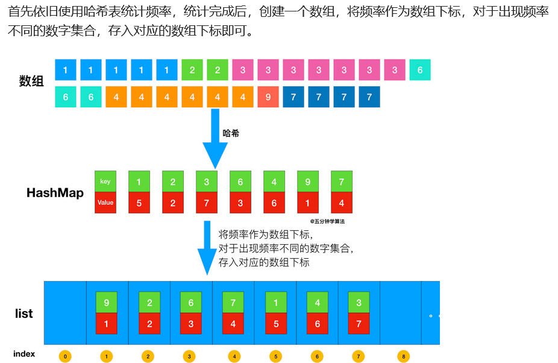


# 394.字符串解码

思路是对的，用两个栈，分别放数字和字母，但是具体实现还是出了一些差错

字符串的拼接处理，可以用push_back, 入栈是push不是push_back

数字字符串转换成数字：(可能多位数字)

```C++
if (c >= '0' && c <= '9') {
                // 如果是数字，构建 num（处理多位数情况）
                num = num * 10 + (c - '0');
            }
假设我们要解析字符串 "1234"：

    初始时：num = 0

    第一个字符是 '1'：
        num = 0 * 10 + (1 - '0') = 1

    第二个字符是 '2'：
        num = 1 * 10 + (2 - '0') = 12

    第三个字符是 '3'：
        num = 12 * 10 + (3 - '0') = 123

    第四个字符是 '4'：
        num = 123 * 10 + (4 - '0') = 1234

最终，num 的值就成了 1234。
```


### 关键：遍历字符串遇到（数字/[/字母/]四种处理方式）：

1. **数字处理**：

   - 使用 `num = num * 10 + (c - '0')` 处理多位数的情况，避免了只取单个字符数字的问题。

2. **栈的使用**：

   - 栈`s1` 用来存储重复的次数（数字），栈`s2` 用来存储之前的字符串部分，暂存结果。
   - 遇到 `[` 时，保存当前这轮的 `num` 和 `ans`（即之前的字符串）分别入栈s1,s2。同时清空num和ans来接收括号里的数字和新字母，准备开始下一轮
   - 遇到 `]` 时，根据栈中的数字来决定重复的次数，然后拼接字符串。.
   - 遇到字母直接拼接到临时字符串ans里面

   

### 解释：

- 我们从左到右遍历字符串，遇到数字时构建当前的数字，遇到 `[` 时将当前字符串和数字存入栈，遇到 `]` 时根据栈中的信息构建出解码后的字符串部分。
- 最后，我们将解码后的字符串返回。


```C++
    string decodeString(string s) {
        stack<int> s1;  // 存储重复次数
        stack<string> s2;  // 存储已经处理的字符串
        string ans = "";  // 当前的结果字符串
        int num = 0;  // 用于构建数字（可能有多位）

        for (char c : s) {
            if (isdigit(c)) {
                // 如果是数字，构建 num（处理多位数情况）
                num = num * 10 + (c - '0');
            }
            else if (c == '[') {
                // 遇到 '[' 时，保存当前的 num 和 ans
                s1.push(num);  // 将当前的数字入栈（重复次数）
                s2.push(ans);  // 将当前的字符串部分入栈
                num = 0;  // 重置 num
                ans = "";  // 重置 ans，准备开始构建新的部分
            }
            else if (c == ']') {
                // 遇到 ']' 时，完成当前部分的解码
                string temp = ans;
                int repeatCount = s1.top(); s1.pop();  // 获取重复次数
                for (int i = 1; i < repeatCount; i++) {
                    ans += temp;  // 将字符串重复 repeatCount 次
                }
                ans = s2.top() + ans;  // 将栈中保存的前部分字符串加回
                s2.pop();  // 弹出之前保存的字符串部分
            }
            else {
                // 如果是字母，直接加入当前的 ans 字符串
                ans += c;
            }
        }

        return ans;
    }
```

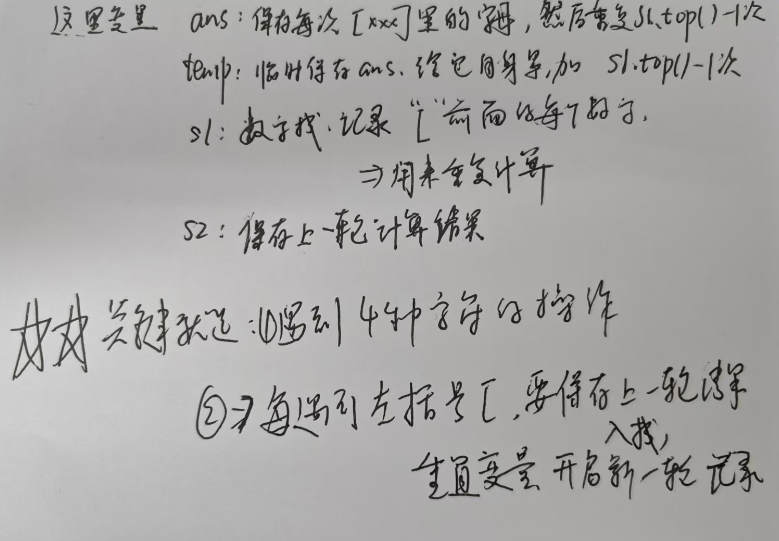

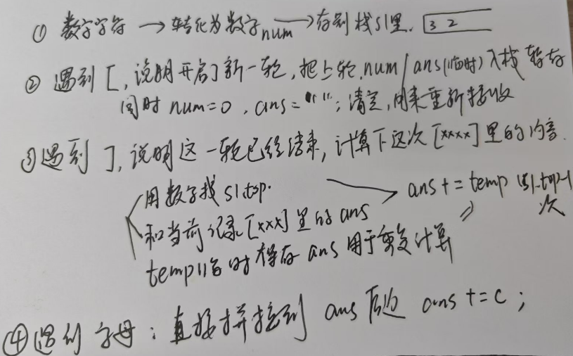


# 399.除法

题解评论里大家都说很难

两种方法：构建有向图+DFS   并查集


下面是并查集的方法，我觉得很复杂，还是用有向图DFS，可以背下来

```c++
class Solution {
public:
unordered_map<string,string> ump;
unordered_map<string,double> value_ump;
string find(string s){
    if(ump[s] != s){
        string s1 = find(ump[s]);
        value_ump[s] *= value_ump[ump[s]];
        ump[s] = s1;
    }  
    return ump[s];
}

void join(string a ,string b,double value){
    string f1 = find(a);
    string f2 = find(b);
    ump[f1] = f2;
    value_ump[f1] = value * value_ump[b] / value_ump[a];
}
vector<double> calcEquation(vector<vector<string>>& equations, vector<double>& values, vector<vector<string>>& queries) {
    int n = equations.size();
    for(vector<string> a:equations){
        for(string b:a){
           ump[b] = b;
        }
    }
    for(int i = 0;i<n;i++){
        value_ump[equations[i][0]] = 1;
        value_ump[equations[i][1]] = 1;

    }
    for(int i = 0;i<n;i++){
        vector<string> a = equations[i];
        double value1 = values[i];
        join(a[0],a[1],value1);
    }

    vector<double> ans;
    int m = queries.size();
    for(int i=0;i<m;i++){
        string a1 = queries[i][0];
        string a2 = queries[i][1];
        double result = -1;

        if(ump.count(a1)&&ump.count(a2)){
            if(find(a1) == find(a2)){
                result = value_ump[a1]/value_ump[a2];
            }
        }
        ans.push_back(result);
    }
    return ans;
}
};
```

这段代码使用 **并查集** 来解决 LeetCode 399 题（Evaluate Division）。以下是它的主要思想、逻辑实现和详细讲解。

---

### 代码逻辑

1. **并查集思想**：
   - 每个变量看作一个节点，用并查集维护变量之间的连通关系。
   - 同时，`value_ump` 存储每个变量到其根节点的权重。

2. **核心函数**：
   - `find`：递归寻找节点的根节点，并在路径压缩的同时更新权重。
   - `join`：合并两个变量，建立连通关系，同时更新权重。

3. **解题步骤**：
   - 初始化 `ump` 和 `value_ump`，为每个变量设置初始值。
   - 遍历 `equations`，调用 `join` 合并变量，维护变量之间的关系和权重。
   - 遍历 `queries`，通过 `find` 判断查询变量是否连通。如果连通，计算结果；否则返回 `-1`。

---

### 代码分步讲解

#### **成员变量和 `find` 函数**
```cpp
unordered_map<string, string> ump;       // 存储并查集的父节点
unordered_map<string, double> value_ump; // 存储从当前节点到父节点的权重
```
- `ump`：维护并查集关系。
- `value_ump`：记录变量之间的权重。

**路径压缩的 `find` 函数**：
```cpp
string find(string s) {
    if (ump[s] != s) {
        string s1 = find(ump[s]);  // 找到根节点
        value_ump[s] *= value_ump[ump[s]];  // 更新到根节点的权重
        ump[s] = s1;  // 路径压缩，将父节点直接设为根节点
    }
    return ump[s];  // 返回根节点
}
```
**路径压缩作用**：
- 加快查找效率。
- 同时更新从当前节点到根节点的权重。

---

#### **合并函数 `join`**
```cpp
void join(string a, string b, double value) {
    string f1 = find(a);  // 找到变量 a 的根节点
    string f2 = find(b);  // 找到变量 b 的根节点
    ump[f1] = f2;  // 将 a 的根节点 f1 连到 b 的根节点 f2
    value_ump[f1] = value * value_ump[b] / value_ump[a];  // 更新权重
}
```
**合并逻辑**：
- 将 `a` 的根节点 `f1` 连到 `b` 的根节点 `f2`。
- 根据 `value = a / b` 公式更新权重：`value_ump[f1] = value * value_ump[b] / value_ump[a]`。

---

#### **主函数 `calcEquation`**
```cpp
vector<double> calcEquation(vector<vector<string>>& equations, vector<double>& values, vector<vector<string>>& queries) {
    int n = equations.size();
    // 初始化每个变量
    for (vector<string> a : equations) {
        for (string b : a) {
            ump[b] = b;  // 初始父节点为自身
        }
    }
    for (int i = 0; i < n; i++) {
        value_ump[equations[i][0]] = 1;  // 初始化权重为 1
        value_ump[equations[i][1]] = 1;  // 初始化权重为 1
    }
    // 合并所有变量
    for (int i = 0; i < n; i++) {
        vector<string> a = equations[i];
        double value1 = values[i];
        join(a[0], a[1], value1);  // 合并两个变量
    }

    // 查询计算结果
    vector<double> ans;
    int m = queries.size();
    for (int i = 0; i < m; i++) {
        string a1 = queries[i][0];
        string a2 = queries[i][1];
        double result = -1;

        if (ump.count(a1) && ump.count(a2)) {  // 如果两个变量都存在
            if (find(a1) == find(a2)) {  // 如果属于同一连通分量
                result = value_ump[a1] / value_ump[a2];  // 计算结果
            }
        }
        ans.push_back(result);  // 存储结果
    }
    return ans;
}
```

1. **初始化**：
   - 遍历 `equations`，将所有变量初始化到 `ump` 和 `value_ump` 中。
   - 初始时，所有变量的父节点是自身，权重为 1。

2. **合并变量**：
   - 遍历 `equations`，调用 `join` 函数，建立变量之间的关系。

3. **处理查询**：
   - 遍历 `queries`，判断两个变量是否连通：
     - 如果连通，计算结果。
     - 如果不连通，返回 `-1.0`。

---

### 示例运行

以示例输入为例：
```cpp
equations = [["a", "b"], ["b", "c"]],
values = [2.0, 3.0],
queries = [["a", "c"], ["b", "a"], ["a", "e"], ["a", "a"], ["x", "x"]]
```

1. **初始化**：
   - `ump = {"a": "a", "b": "b", "c": "c"}`
   - `value_ump = {"a": 1.0, "b": 1.0, "c": 1.0}`

2. **合并**：
   - 处理 `a / b = 2.0`：
     - `find("a") = "a"`，`find("b") = "b"`。
     - `ump["a"] = "b"`，`value_ump["a"] = 2.0 / 1.0 = 2.0`。
   - 处理 `b / c = 3.0`：
     - `find("b") = "b"`，`find("c") = "c"`。
     - `ump["b"] = "c"`，`value_ump["b"] = 3.0 / 1.0 = 3.0`。

3. **查询**：
   - 查询 `a / c`：
     - `find("a") = "c"`，`find("c") = "c"`。
     - `value_ump["a"] / value_ump["c"] = 2.0 * 3.0 = 6.0`。
   - 查询 `b / a`：
     - `find("b") = "c"`，`find("a") = "c"`。
     - `value_ump["b"] / value_ump["a"] = 3.0 / 2.0 = 0.5`。
   - 其他查询类似。

---

### 时间复杂度

1. **初始化**：O(N)，其中 `N` 是 `equations` 的大小。
2. **路径压缩查找**：接近 O(1)（均摊）。
3. **查询**：O(Q)，其中 `Q` 是 `queries` 的大小。

总复杂度：O(N + Q)。

---

### 输出结果

```cpp
[6.0, 0.5, -1.0, 1.0, -1.0]
```

此代码实现了高效的并查集解法，适合处理连通性问题，非常值得学习！如果有其他问题，随时问我！


# 406.根据身高重新排序

`people[i] = [hi, ki]` 表示第 `i` 个人的身高为 `hi` ，前面 **正好** 有 `ki` 个身高大于或等于 `hi` 的人

**一般这种数对，还涉及排序的，根据第一个元素正向排序，根据第二个元素反向排序，或者根据第一个元素反向排序，根据第二个元素正向排序，往往能够简化解题过程**

这个问题的核心在于贪心思想。

1. **排序**：
   - 先按身高从大到小排序，如果身高相同，则按 `k` 值从小到大排序。
   - 为什么这么做？因为高个子不会受到低个子的影响，所以可以先安排高个子的位置。
2. **插入**：
   - 按照排序后的顺序，将每个人插入到结果列表中。
   - 由于 `k` 表示前面有多少人，所以直接将当前人插入到结果列表的第 `k` 个位置即可。

     // [7,0], [7,1], [6,1], [5,0], [5,2], [4,4]
            // 再按k一个一个插入到result。
            // [7,0]
            // [7,0], [7,1]
            // [7,0], [6,1], [7,1]
            // [5,0], [7,0], [6,1], [7,1]
            // [5,0], [7,0], [5,2], [6,1], [7,1]
            // [5,0], [7,0], [5,2], [6,1], [4,4], [7,1]
   
   
     * 解题思路：先排序再插入
     * 1.排序规则：按照先H高度降序，K个数升序排序
     * 2.遍历排序后的数组，根据K插入到K的位置上
       *
     * 核心思想：高个子先站好位，矮个子插入到K位置上，前面肯定有K个高个子，矮个子再插到前面也满足K的要求

```reasonml
    // 对于数对排序问题
    // 一般是先按key1正序、key2逆序，或者key1逆序、key2正序的方式，先进行一轮排序，以简化解题过程
    
        // 按h倒序，这样每个元素前面元素的个数，正好就是大于它的元素个数
        // 按k正序，这样h相同时，k越大肯定越靠后，因为只有靠后才能保证前面大于等于h的元素更多
        // 按照此顺序排队后，每个位置前面比它高或等高的(>=j)的一定是>=k的，
        // 因为比它高的已经都排到前面，相等也按照个数大小保持到了极致
```

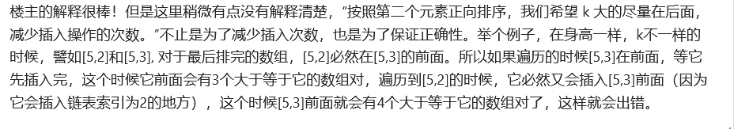

```C++
vector<vector<int>> reconstructQueue(vector<vector<int>>& people) {
        // 排序规则：按身高降序排，如果身高相同则按 k 升序排
        sort(people.begin(), people.end(), [](const vector<int>& a, const vector<int>& b) {
            return a[0] > b[0] || (a[0] == b[0] && a[1] < b[1]);
        });

        vector<vector<int>> result; // 最终队列

        // 按顺序插入到队列中
        for (const auto& p : people) {
            result.insert(result.begin() + p[1], p); // 插入到指定位置
        }

        return result;
    }
```


# 416.分割等和子集

这是一道经典的动态规划问题，重点在于将问题转化为 **01背包问题**：

- 背包容量为 `sum / 2`。
- 数组元素就是物品，目标是判断是否可以正好装满背包。

想到了找子集的和=总和/2；但是不知道怎么去做这种这种非连续的子集的dp：

怎么定义状态，怎么找状态转移方程

1.定义一个**布尔数组** `dp`，其中：

- 定义 `dp[j]` 表示是否可以找到和为 `j`一个子集。 

  ```C++
   vector<bool> dp(target + 1, false);  // 初始化 dp 数组
  ```

  

- 初始化时，`dp[0] = true`其他 `dp[j]` 默认为 `false`。（空集的和为 0）。

- 动态规划转移方程：`dp[j - num]` 为 `true` 意味着可以用前面的某些数字凑出 `j - num`。如果 `dp[j - num]` 为 `true`，那么将 `num` 加入这个子集，就可以凑出和为 `j`。dp[j]此时就为true

- 遍历数组，检查每个元素nums(外层循环)是否能参与凑出 **nums~target（内存循环）**，使用双重循环★★★**检查每个nums去凑从nums到target**

  1. **外层循环**：遍历数组 `nums`，逐个处理每个数字 `num`。
     - 每个数字 `num` 表示当前可以用这个数字来更新状态。
     - 我们需要将 `num` 的影响应用到所有可能的目标和 `j` 上。
  2. **内层循环**：针对当前数字 `num`，从 `target`（总目标值）向前尝试更新每个可能的子集和 `j`。
     - 内层循环的作用是检查，如果之前可以构造出和 `j - num` 的子集，是否可以通过加上 `num` 来构造出和 `j` 的子集。

- 

  ```C++
  dp[j] = dp[j] || dp[j - nums[i]];//初始化dp[j]都=false，所以这个式子dp[j - nums[i]]为ture，dp[j]就是true
  或者写成下面这种：
  if (dp[j - num]) dp[j] = true;
  
  ```

- 对于数组中的每个数字 num，从 target 开始向前遍历如果 dp[j-num]为 true ，则说明可以用当前数字 num 凑出和为 j的子集更新 dp[j]的状态。
- 每次遍历数组元素时，从后向前更新 `dp`，避免重复使用元素。

返回 `dp[target]`，表示是否可以找到一个子集，其和为目标值 `target = sum / 2`。


```c++
    bool canPartition(vector<int>& nums) {
        int sum = 0;
        for (int num : nums) {
            sum += num;  // 计算数组总和
        }

        // 如果总和是奇数，直接返回 false
        if (sum % 2 != 0) return false;

        int target = sum / 2;  // 目标值：总和的一半
        vector<bool> dp(target + 1, false);  // 初始化 dp 数组
        dp[0] = true;  // 空集的和为 0
        //★★★检查每个nums去凑从nums到target★★★
        for (int num : nums) {
            for (int j = target; j >= num; j--) {
                dp[j] = dp[j] || dp[j - num];  // 动态规划转移方程
            }
        }

        return dp[target];  // 判断是否能凑出目标和
    }
```

### 内层从后往前遍历的关键原因

- **避免重复使用同一个数字**，保证动态规划的正确性。
- 确保更新 `dp[j]` 的时候，只依赖于之前的状态（即当前数字未被使用的状态）。

**若从前往后更新：**

比如 `nums = [1, 3, 99]`，处理 `num = 3` 时：

- 当 `j = 3` 时，`dp[3]` 被更新为 `true`。
- 接着，当 `j = 6` 时，`dp[6]` 会错误地利用刚刚更新的 `dp[3]`，导致一个数字被重复使用。

# 437.路径总和

**递归很迷茫的时候，手动画棵树，模拟一下递归过程！！！！！，左右兄弟切换的时候要不要回溯，记录什么值，返回什么给上一层**


### 思路

#### **先序遍历的特点**

先序遍历的顺序是：

1. 访问当前节点。
2. 递归遍历左子树。
3. 递归遍历右子树。

先序遍历的特点是 **优先处理当前节点**，然后再递归处理子树。这种顺序非常适合路径和的计算，因为路径的和需要从上到下逐步累加，而不是从下到上或按某种无序方式。

#### 方法一：朴素递归

这是一种暴力的解法：①辅助函数：从一个节点开始，计算这一个节点路径数。实现递归实现，目标值自上往下递减，终点节点的值==目标值，就是一条路径②再遍历树，把所有节点的路径数累加起来即可，

1. **核心逻辑**：
   - 从树的每个节点开始，计算以该节点为起点的路径数。
   - 然后递归计算左右子树。

2. **实现**：
   - 定义一个辅助函数 `countPathsFromNode`，计算以当前节点为起点的路径数。
   - 在主函数中递归调用左右子树。

3. **时间复杂度**：O(N²)，因为每个节点都要递归遍历其所有子节点。

---

#### 方法二：**利用前缀和的差值** 来判断是否存在满足条件的路径和——用哈希表记录①计算每个节点前缀和，存入哈希表②检查当前节点前缀和-目标值的结果是否在哈希表，在的话说明中间有条路径和满足目标值


**计算对于一个节点，他的前缀和-目标值=你要找的前缀和，因为要保持向下，所以用先序遍历**

**举个例子   自上而下：根到a到b，目标值8     根到a 前缀和15   ，  根到b前缀和23,23-8=15，查哈希表15存在， 说明 a到b的路径和是8**


**要注意的是前缀和唯一：在前缀和算法中，前缀和的唯一性 是由它的定义决定的。前缀和是从树的根节点到当前节点路径上所有节点值的累加和，而路径是 单一的、连续的。只要树的节点值是固定的，前缀和的值在每个节点都是唯一的。**

时间复杂度降为 O(N)：

1. **前缀和定义**：
   - 前缀和是从树的根节点到当前节点路径的和。
   - 假设当前路径的前缀和为 `currentSum`，如果 `currentSum - targetSum` 在之前的路径中出现过，则说明存在一条路径，其和为 `targetSum`。

2. **哈希表记录前缀和**：
   - 使用哈希表 `prefixSumCount` 存储每个前缀和出现的次数。
   - 遍历树的过程中，实时更新 `prefixSumCount`，并通过查找快速计算路径数。

3. **时间复杂度**：O(N)，因为每个节点只遍历一次。

---

### C++ 实现

#### 方法一：朴素递归

```cpp
//1.从一个节点开始，计算所有以当前节点为起点，且路径和等于 targetSum 的路径数。
int countPathsFromNode(TreeNode* node, int targetSum) {
    if (!node) return 0; // 如果当前节点为空，返回 0，表示没有路径。
    int count = 0; // 用于记录从当前节点开始的路径数。
    // 如果当前节点值等于目标值，则当前节点本身就是一条合法路径。
    if (node->val == targetSum) count++;
    // 递归计算以左子节点和右子节点为起点的路径数。
    count += countPathsFromNode(node->left, targetSum - node->val);
    count += countPathsFromNode(node->right, targetSum - node->val);
    return count; // 返回路径总数。
}
//2.递归树，以每个节点为起点的路径数目累加起来
int pathSum(TreeNode* root, int targetSum) {
        if (!root) return 0;

        // 当前节点为起点的路径数
        int count = countPathsFromNode(root, targetSum);

        // 左右子树为起点的路径数
        count += pathSum(root->left, targetSum);
        count += pathSum(root->right, targetSum);

        return count;
    }


```


#### 方法二：前缀和优化

```cpp
int dfs(TreeNode* node, int currentSum, int targetSum, unordered_map<int, int>& prefixSumCount) {
        if (!node) return 0;

        // 更新当前路径和
        currentSum += node->val;

        // 查看有多少条路径的和等于 targetSum
        int count = prefixSumCount[currentSum - targetSum];

        // 更新当前路径和的计数
        prefixSumCount[currentSum]++;

        // 递归处理左右子树
        count += dfs(node->left, currentSum, targetSum, prefixSumCount);
        count += dfs(node->right, currentSum, targetSum, prefixSumCount);

        // 恢复状态（回溯）换到当前节点的兄弟去了
        prefixSumCount[currentSum]--;

        return count;
    }
int pathSum(TreeNode* root, int targetSum) {
        unordered_map<int, int> prefixSumCount;
        prefixSumCount[0] = 1; // 初始前缀和为 0

        return dfs(root, 0, targetSum, prefixSumCount);
    }

```

---

### 示例运行

#### 输入：
```cpp
root = [10,5,-3,3,2,null,11,3,-2,null,1]
targetSum = 8
```

#### 解法二运行过程：
1. **初始状态**：
   - `currentSum = 0`，`prefixSumCount = {0: 1}`。

2. **遍历节点 10**：
   - 更新 `currentSum = 10`。
   - 查找 `prefixSumCount[10 - 8] = 1`，找到一条路径。
   - 更新 `prefixSumCount = {0: 1, 10: 1}`。

3. **遍历节点 5**：
   - 更新 `currentSum = 15`。
   - 查找 `prefixSumCount[15 - 8] = 0`。
   - 更新 `prefixSumCount = {0: 1, 10: 1, 15: 1}`。

4. **遍历节点 3**：
   - 更新 `currentSum = 18`。
   - 查找 `prefixSumCount[18 - 8] = 1`，找到一条路径。
   - 更新 `prefixSumCount = {0: 1, 10: 1, 15: 1, 18: 1}`。

5. **继续递归遍历**，统计所有路径。

---

### 时间复杂度分析

#### 方法一：
- **时间复杂度**：O(N²)
  - 对每个节点调用递归，最坏情况下每个节点都会遍历所有子节点。

#### 方法二：
- **时间复杂度**：O(N)
  - 每个节点只访问一次。

---

### 总结

1. **方法一（朴素递归）**：
   - 代码直观易懂，适合小规模输入。

2. **方法二（前缀和优化）**：
   - 使用哈希表记录前缀和，效率高，适合大规模输入。

希望这个解答能帮助你理解这道题！如果还有问题，欢迎随时提问！


# 438.字母异位词

我的想法是，以每个位置为起始点检查，用map来加速查找子串，若在map中的value(频率）>0，就是存在，同时value-1;顺序检查下一个，同时我想用map查找不存在的位置来做下一次查找点，但这样是不行的，因为不存在时value为0，这个0可能是之前存在过的次数刚好减到0，不一定是不存在，不能用这个做标识

所以你只能老老实实遍历每个位置，这样很慢，而且每次检查完map都要复原，要用一个额外临时map保存

下面i=j是我明显的错误，若这个0可能是之前存在过的次数刚好减到0，可以这样子，若这个0是不存在的字母，则会陷入死循环，就算你改成i+1也没用，这样i可能是之前存在过的次数刚好减到0，这个字母是在p中存在的，错过检查


```C++
    
//错误代码
vector<int> findAnagrams(string s, string p) {
        vector<int> ans;
        unordered_map<char,int>mymap;
        for(char c : p){
            mymap[c]++;
        }
        int i=0;
        while(i<s.size()){
            unordered_map<char,int>currmap=mymap;
            bool tag=true;
            if (i + p.size() > s.size()) break;//防止访问主串越界
            for(int j=i;j<i+p.size();j++){
                if(currmap[s[j]]>0) {
                    currmap[s[j]]--;
                }
                else{
                    tag=false;
                    i=j;//如果这个位置是
                    break;
                }
            }
            if(tag) ans.push_back(i),i++;

        }
        return ans;
    }

//下面老老实实for循环每个i的位置，会通过样例，但是会超时
    vector<int> findAnagrams(string s, string p) {
        vector<int> ans;
        unordered_map<char,int>mymap;
        for(char c : p){
            mymap[c]++;
        }
        
        for(int i=0;i<s.size();i++){
            unordered_map<char,int>currmap=mymap;
            bool tag=true;
            if (i + p.size() > s.size()) break;//防止访问主串越界
            for(int j=i;j<i+p.size();j++){
                if(currmap[s[j]]>0) {
                    currmap[s[j]]--;
                }
                else{
                    tag=false;
                    break;
                }
            }
            if(tag) ans.push_back(i);

        }
        return ans;
    }
```

## 题解：滑动窗口

像这种连续的子串，子数组问题，考虑滑动窗口

### 思路一：滑动窗口 + 数组

    因为字符串中的字符全是小写字母，可以用长度为26的数组记录字母出现的次数
    设n = len(s), m = len(p)。记录p字符串的字母频次p_cnt，和s字符串前m个字母频次s_cnt
    若p_cnt和s_cnt相等，则找到第一个异位词索引 0
    继续遍历s字符串索引为[m, n)的字母，在s_cnt中每次增加一个新字母，去除一个旧字母
    判断p_cnt和s_cnt是否相等，相等则在返回值res中新增异位词索引 i - m + 1


链接：https://leetcode.cn/problems/find-all-anagrams-in-a-string/solutions/645290/438-zhao-dao-zi-fu-chuan-zhong-suo-you-z-nx6b/

### 思路二：滑动窗口 + 双指针

除了直接比较数组是否相等外，其实还可以用双指针来表示滑动窗口的两侧边界，当滑动窗口的长度等于p的长度时，表示找到一个异位词，两种方式的时间复杂度都是O(n)级别的
先说结论，Python用数组更快一点点（差不太多其实），Java用双指针更快一点，下面是具体步骤：

    定义滑动窗口的左右两个指针left，right
    right一步一步向右走遍历s字符串
    right当前遍历到的字符加入s_cnt后不满足p_cnt的字符数量要求，将滑动窗口左侧字符不断弹出，也就是left不断右移，直到符合要求为止。
    当滑动窗口的长度等于p的长度时，这时的s子字符串就是p的异位词。

其中，left和right表示滑动窗口在字符串s中的索引，cur_left和cur_right表示字符串s中索引为left和right的字符在数组中的索引

链接：https://leetcode.cn/problems/find-all-anagrams-in-a-string/solutions/645290/438-zhao-dao-zi-fu-chuan-zhong-suo-you-z-nx6b/


# 448.找到所有数组中消失的数字

我的方法简单粗暴，用map把数组里的频率统计一下，然后再检查每个数字，因为是1~n，可以遍历检查，其中哪个数字不存在，效率很低不过

## 题解

用负数标记法进行标记

1.把出现过的数字转化成对应的下标，把下标对应的位置数组元素标记为负数。这样就能证明这个位置上的数字出现过，有重复数字的时候不用重复标记，只有为正数才要标记，因为初始都是正数

2.然后再遍历标记好的数组，如果发现某一个数是正数，就说明该数组元素的下标对应的元素没有出现过，加入结果数组

# 494.目标和

---

和416一样，背包问题，但是转换这一步我也没想到，代码我没看，

### 解题思路

#### 方法：动态规划

这个问题可以转换为一个 **背包问题**。

1. **数学推导**：
   - 假设数组中数字被分成两部分，`P` 是正号部分的和，`N` 是负号部分的和：
     ```
     P - N = target
     P + N = sum(nums)
     ```
   - 根据以上两式，可以得到：
     ```c++
     P = (target + sum(nums)) / 2 //P必是偶数，若是奇数则无解
     ```
   - 问题转化为：在数组中找到一个子集，其和等于 `P`，求有多少种方法。

2. **动态规划定义**：
   - 定义 `dp[j]` 表示从数组中选取若干个数，和等于 `j` 的方案数。
   - 目标是求出 `dp[P]`。

3. **状态转移方程**：
   
   - 遍历数组中的每个数 `num`，从后向前更新 `dp[j]`：
     ```
     dp[j] = dp[j] + dp[j - num]
     ```
   - 表示对于当前数 `num`，我们既可以选择不加它（`dp[j]` 保持不变），也可以选择加上它（`dp[j - num]` 的方案数加入到 `dp[j]` 中）。
   
4. **初始状态**：
   
   - `dp[0] = 1`：和为 0 的方案数为 1（空集）。
   
5. **边界条件**：
   - 如果 `(target + sum(nums)) % 2 != 0`，或者目标和小于 0，直接返回 0。

---

### C++ 实现

```cpp
    int findTargetSumWays(vector<int>& nums, int target) {
        int sum = accumulate(nums.begin(), nums.end(), 0); // 计算数组总和

        // 如果目标和无解，返回 0
        if ((target + sum) % 2 != 0 || target > sum || target < -sum) {
            return 0;
        }

        int P = (target + sum) / 2; // 转化为子集和问题
        vector<int> dp(P + 1, 0);
        dp[0] = 1; // 初始化，和为 0 的方案数为 1

        // 动态规划求解
        for (int num : nums) {
            for (int j = P; j >= num; j--) { // 从后向前遍历
                dp[j] += dp[j - num];
            }
        }

        return dp[P]; // 结果为和为 P 的方案数
    }
};
```

---

### 示例运行

#### 输入：
```cpp
nums = [1, 1, 1, 1, 1], target = 3
```

#### 动态规划过程：

1. **数组总和**：
   ```
   sum = 5
   P = (3 + 5) / 2 = 4
   ```

2. **初始化**：
   ```
   dp = [1, 0, 0, 0, 0]
   ```

3. **遍历数组**：
   - 处理 `1`：
     ```
     dp[4] += dp[3]; dp[3] += dp[2]; dp[2] += dp[1]; dp[1] += dp[0]
     dp = [1, 1, 0, 0, 0]
     ```
   - 再次处理 `1`：
     ```
     dp[4] += dp[3]; dp[3] += dp[2]; dp[2] += dp[1]; dp[1] += dp[0]
     dp = [1, 2, 1, 0, 0]
     ```
   - 继续处理 `1`，直到遍历完成。

最终结果：
```
dp = [1, 5, 10, 10, 5]
```

答案为：
```
dp[4] = 5
```

---

### 时间和空间复杂度

1. **时间复杂度**：
   - 遍历数组 `nums` 和目标值范围 `P`，时间复杂度为 O(N × P)。

2. **空间复杂度**：
   - 使用了一维数组 `dp`，空间复杂度为 O(P)。

---

### 总结

1. **数学转换**：通过数学公式，将问题转换为一个子集和问题。
2. **动态规划**：用一维数组记录方案数，通过状态转移求解。
3. **关键点**：
   - 目标值是否能转化为子集和问题。
   - 从后向前遍历避免覆盖状态。

# 538.累加树

我傻逼了，想着每个节点的新值=总和-他的左子树，这样太复杂了

为了算出根节点修改后的值，应当先把右子树的所有点遍历一遍（因为二叉搜索树右子树的节点值都大于根节点的值），得到右子树所有点的节点值之和，再加上根节点的值，

 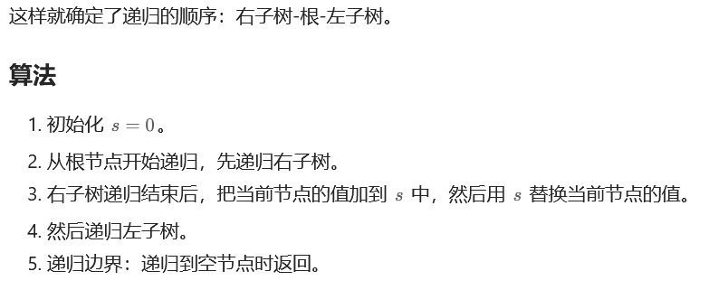


# 543.二叉树直径

想错了，不一定都经过根节点，所以不是，根左右子树高度之和，当然你可遍历树上所有节点，以他为根时的左右子树高度之和，找到最大的，这样复杂度就是递归里面嵌套递归，类似双重for循环，ON2，太复杂了

我的代码662ms

```c++
    int dfs(TreeNode* root){
        if(!root) return 0;
        
        return max(dfs(root->left),dfs(root->right))+1;
    }
    int diameterOfBinaryTree(TreeNode* root) {
        //根节点左右孩子深度
        if(!root) return 0;
        int max1=dfs(root->left)+dfs(root->right);
        int maxleft=diameterOfBinaryTree(root->left);
        int maxright=diameterOfBinaryTree(root->right);
        int max2=max(maxleft,maxright);
        return max(max1,max2);
    }
```

我的脑袋抽了，无限接近题解了：只在求高度的dfs一次性求解出来就可以了，只要一个变量来维护最大的直径，求出每个节点左右子树高度相加即可

因为你求二叉树的深度的时候就是在自底向上返回当前节点的最大深度，所以用一个全局变量或者引用参数来记录最大直径maxd，来记录这过程中的最大直径即可（所谓最大直径也就是某节点的左右子树高度相加）

```C++
//在这上面修改：
    int dfs(TreeNode* root){
        if(!root) return 0;
        
        return max(dfs(root->left),dfs(root->right))+1;
    }
//修改结果：
    //全局变量写法
    int max_diameter = 0; // 全局变量，用于记录最大直径
    int dfs(TreeNode* root) {
        if (!root) return 0; // 空节点深度为 0
        // 递归计算左右子树的深度
        int left_depth = dfs(root->left);
        int right_depth = dfs(root->right);
        // 更新最大直径
        max_diameter = max(max_diameter, left_depth + right_depth);
        // 返回当前节点的深度
        return max(left_depth, right_depth) + 1;
    }
    int diameterOfBinaryTree(TreeNode* root) {
        dfs(root); // 一次递归计算深度和直径
        return max_diameter;
    }
    //引用参数写法
    int dfs(TreeNode* root,int &maxd){
        if(!root) return 0;
        int left_depth=dfs(root->left,maxd);
        int right_depth=dfs(root->right,maxd);
        
        maxd=max(maxd,left_depth+right_depth);
        return max(left_depth,right_depth)+1;
    }
    int diameterOfBinaryTree(TreeNode* root) {
        //下面这样写是错的
         return dfs(root, 0); // 错误：传递一个临时变量
        
        //下面这样写还是错的
        int maxd=0;
        return dfs(root, maxd);//如果直接写 return dfs(root, maxd);，而 dfs 的设计返回值是树的深度而非直径，导致最终的返回值是只能得到树的深度，而不是最大直径。，而非直径。你要返回的是maxd
         //正确写法：
            int maxd = 0;
            dfs(root, maxd); // 调用递归函数，更新 maxd
            return maxd;     // 返回最大直径
    }

```

# 560.和为K的子数组

乍一看以为是背包问题，很快啊，写出来了，写出了一点小BUG，要注意用的是j-nums[i]，而不是j-i，减去的下表对应的元素，而非减去下标

```C++
  //背包代码，可惜不适用这道题
int subarraySum(vector<int>& nums, int k) {
        vector<int>dp(k+1,0);
        dp[0]=1;
        for(int i=0;i<nums.size();i++){
            for(int j=k;j>=nums[i];j--){
                dp[j]+=dp[j-nums[i]];
            }
        }
        return dp[k];
    }
//想到前缀和相减来做，ON2,
//哈希表来优化，看后面的j>i,前缀和[j]-前缀和[i]=k 等价于 前缀和[j] =前缀和[i]+k，遍历到i位置时，查找后面的（下标＞i）是否有前缀和为前缀和[i]+k，
这种思路还是错的，因为你要找后面的前缀和，他根本不好算，得所有前缀和都算完，还要遍历去查哈希表，这样还是On2复杂度，
应该看前面的，而不是后面的
    前缀和[i]-前缀和[j]=k 等价于 前缀和[j] =前缀和[i]-k，一次遍历，一遍计算前缀和，都是前面的前缀和也计算完毕，可以用来查找
    //正确代码：
    int subarraySum(vector<int>& nums, int k) {
        unordered_map<int, int> prefixCount; // 前缀和计数
        prefixCount[0] = 1; // 初始前缀和为 0 的次数为 1

        int sum = 0;  // 当前前缀和
        int count = 0; // 满足条件的子数组个数

        for (int num : nums) {
            sum += num; // 更新前缀和

            // 查找是否存在前缀和为 sum - k
            if (prefixCount.find(sum - k) != prefixCount.end()) {
                count += prefixCount[sum - k];
            }

            // 更新当前前缀和的出现次数
            prefixCount[sum]++;
        }

        return count;
    }
```


# 581.最短无序连续子数组

想到了分成三段，（有序递增，乱序，有序递增），分左右指针来限定乱序部分，但后面思路出问题了

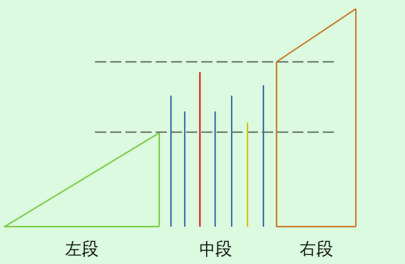

记中段的最大最小值max ,min

**从左往右遍历**，max是遍历过程中最大值，一旦进入了右端全是比max大的，没有比max小的了，**所以比max小的数到右边界为止(每遍历一个数检查<max,更新r，最后一次更新的时候r停在了右边界，>max更新max)**

从右往左遍历，min是遍历过程中最小值，一旦进入了左端全是比min小的，没有比min大的了，**所以比min大的数到左边界为止(每遍历一个数检查>min,更新l，最后一次更新的时候l停在了左边界，<min更新min)**


进入左段，就不会出现比最小值更大的情况，所以最后一个出现就视为中段左边界

## 题解：

- ### 完整总结

  1. **右边界 r：从左到右确定**：
     - `max` 是遍历中的最大值。
     - 进入右段后，所有元素都大于等于 `max`，没有比 `max` 小的元素了。
     - 最后一次更新 `r` 的位置就是无序子数组的右边界。
  2. **左边界 l：从右到左确定**：
     - `min` 是遍历中的最小值。
     - 进入左段后，所有元素都小于等于 `min`，没有比 `min` 大的元素了。
     - 最后一次更新 `l` 的位置就是无序子数组的左边界。


# 617.合并二叉树

我的想法是新建一棵树，然后插入新节点，占用额外空间

我忽略了，1.值传递进去的TreeNode* root3，意味着在递归中对 `root3` 的任何更改都不会影响外部的 `root3`，要用引用传递

使用 `TreeNode*& root3` 确保 `root3` 在递归中被正确更新。

2.写多个if，看看会不会覆盖前面的if，会覆盖要用else if

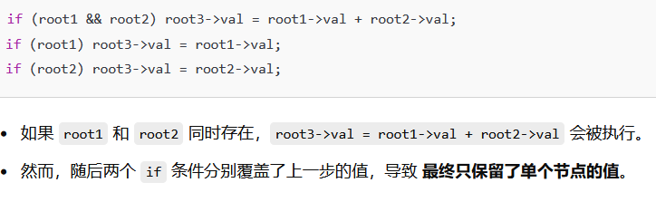

3..其中一个节点为空时，比如root1,会继续执行计算，然后又调用root1->left root1->right,这样只发生空指针错误，所以root1为空的时候，不传root1->left root1->right，而是直接传NULL

下面是我的代码：

```C++
    void dfs(TreeNode* root1, TreeNode* root2,TreeNode* &root3){
        if(!root1 && !root2) return ;
        root3=new TreeNode(0);
        // 合并当前节点的值
        if (root1 && root2) {
            root3->val = root1->val + root2->val;
        } else if (root1) {
            root3->val = root1->val;
        } else if (root2) {
            root3->val = root2->val;
        }
        // 递归处理左右子树
        dfs(root1 ? root1->left : nullptr, root2 ? root2->left : nullptr, root3->left);
        dfs(root1 ? root1->right : nullptr, root2 ? root2->right : nullptr, root3->right);
    }
    TreeNode* mergeTrees(TreeNode* root1, TreeNode* root2) {
        TreeNode* root3=NULL;
        dfs(root1,root2,root3);
        return root3;
    }
```

题解：一次性完成，返回节点，构建新的左右孩子，左右子树的合并是独立的，所以不用像反转二叉树一样来用中间变量

```C++
    TreeNode* mergeTrees(TreeNode* root1, TreeNode* root2) {
        // 如果某个节点为空，直接返回另一个节点
        if (!root1) return root2;
        if (!root2) return root1;

        // 合并当前节点
        root1->val += root2->val;

        // 递归处理左右子树
        root1->left = mergeTrees(root1->left, root2->left);
        root1->right = mergeTrees(root1->right, root2->right);

        return root1;
    }
```

# 621.任务调度器

想错了一直死磕，浪费时间

# 647.回文子串数目	

想法是对的，但是执行的时候出了点差错，遍历每个位置，每个位置有两种情况，奇数个回文串和偶数个回文串，要判断两次，

对与会文段判断我出了个错：当匹配失败的时候应该立马结束匹配，而不是继续下去了，两个字符匹配成功，count+1，继续匹配，只有匹配成功的时候才能继续匹配，一旦失败返回count

```C++
        //错误的想法：匹配失败未结束匹配还接着匹配：
while(i>=0 && j<s.size()){
            if(s[i]==s[j]) count++;
            i--;
            j++;
        }
        return count;
    }
//正确做法，匹配成功的时候才接着匹配，匹配失败了立马结束匹配返回结果
while(i>=0 && j<s.size()){
            if(s[i]==s[j]) {
                count++;
                i--;
                j++;
            }
            else{ return count;}
        }
```


# 739.每日温度

我的想法是对的 ， 单调栈，
        //用单调栈来记录单调递减的温度的下标，不是温度，如果当前温度比栈顶低，一直出栈（所有比当前温度低的都能计算了）到不能出栈位置，也就是比当前温度高的

但是在处理结果的时候出了明显的错误：

1.不能对栈顶赋值

2.直接把时间存到结果数组里对应下标就好了，注意这里结果数组要初始化才能下标操作

3.判断条件不对，在你使用top()之前一定要先判空 !empty() ，不管是在判断语句的里面还是外面

while(!dec.empty()&&temperatures[dec.top()]<temperatures[i]) ，这里面empty()也要在top()前面

4.等于，温度相等的时候也要入栈，出栈是比栈顶还要大的时候


```c++
我的错误代码，发生未定义行为报错
我的代码哪里错了？
    vector<int> dailyTemperatures(vector<int>& temperatures) {
        vector<int>ans;//下标差
        stack<int>dec;//下标
        dec.top()=0;//不能对栈顶初始化赋值★
        //用单调栈来记录单调递减的温度的下标，不是温度，如果当前温度比栈顶低，一直出栈（所有比当前温度低的都能计算了）到不能出栈位置，也就是比当前温度高的
        //每次出栈记录的结果是逆序的，用个临时vector保存，要reverse一下再放到ans里(★没必要)
        for(int i=0;i<temperatures.size();i++){

            if(temperatures[i]<temperatures[dec.top()]) dec.push(i);//★这句两个错误，没判空empty就用top，而且漏了等于也要入栈<=
            else{
                vector<int>curr;
                while(temperatures[dec.top()]<temperatures[i]&& !dec.empty()){
                    curr.push_back(i-dec.top());
                    dec.pop();
                }
                dec.push(i);
                reverse(curr.begin(),curr.end());
                ans.insert(ans.end(),curr.begin(),curr.end());
            }
        }
        return ans;
    }
//正确代码
vector<int> dailyTemperatures(vector<int>& temperatures) {
    vector<int> ans(temperatures.size(), 0); // 初始化结果数组
    stack<int> dec; // 用于存储下标的栈

    for (int i = 0; i < temperatures.size(); i++) {
        // 如果栈非空，并且当前温度大于栈顶温度
        while (!dec.empty() && temperatures[i] > temperatures[dec.top()]) {
            ans[dec.top()] = i - dec.top(); // 计算下标差
            dec.pop(); // 弹出栈顶元素
        }
        // 将当前下标入栈
        dec.push(i);
    }

    return ans;
}

```

#### 你的疑问：

- 初始栈为空时，为什么第一个元素入栈不会出错？

#### 答案：

第一个元素入栈时，不会访问栈顶，因为 `while (!st.empty() && temperatures[i] > temperatures[st.top()])` 中的 `st.empty()` 会优先判断。如果栈为空，`!st.empty()` 为 `false`，整个条件短路，不会进入 `while`。

### 防止空栈访问的机制

条件 `!st.empty()` 是关键：

1. **判断优先级**：
   - `while` 循环会先检查 `!st.empty()`，只有当栈非空时，才会执行 `st.top()`。
   - 短路逻辑避免了空栈的非法访问。
2. **栈空的情况下**：
   - 如果栈为空，`while` 条件短路，直接跳过循环。
